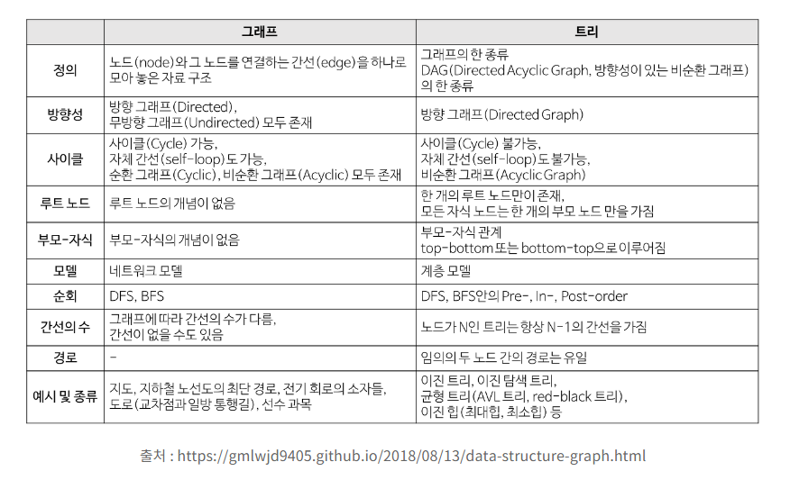
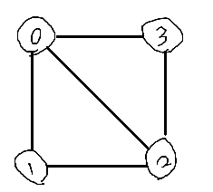
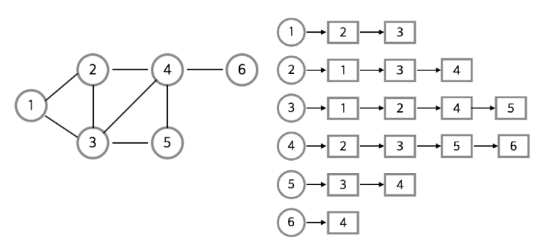
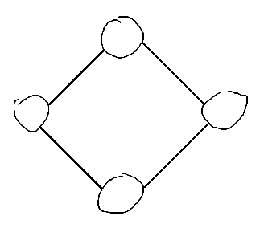
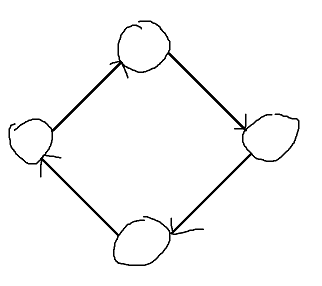
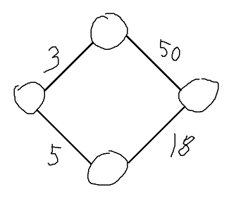
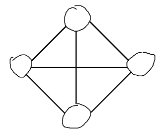
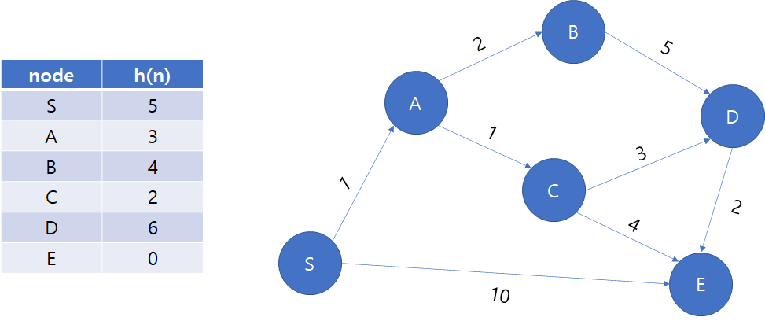

# 그래프 알고리즘

## 그래프란?

정점과 간선으로 이루어진 자료구조, 정점 간의 관계를 나타내는 자료구조, G = (V, E)

트리는 그래프의 일종이라고 볼 수 있으나 그래프는 싸이클을 가질 수 있음

객체와 이에 대한 관계를 나타내는 네트워크 모델

실생활에서 지하철 노선도, 도심의 도로 등이 그래프로 표현됨 </br></br>

## 그래프 vs 트리

 </br></br>

## 그래프 용어



- 정점(Vertex) : 노드(node), 정점에 데이터가 저장됨
- 간선(Edge) : 링크(link), 정점간의 관계를 나타냄
- 인접 정점(Adjacent Vertex) : 간선에 의해 연결된 정점(정점 0과 정점 1)
- 단순 경로(Simple Path) : 경로 중 반복되는 정점이 없는 것(같은 간선을 지나지 않음)
- 차수(Degree) : 무방향 그래프에서 하나의 정점에 인접한 정점 수(정점 2는 차수가 3)
- 진출 차수(Out Degree) : 방향 그래프에서 한 정점에 외부로 향하는 간선의 수
- 진입 차수(In Degree) : 방향 그래프에서 외부 정점에서 들어오는 간선의 수 </br></br>

## 그래프 구현 방법

### 인접 행렬


- 그래프의 노드를 2차원 배열로 표현한 것
- 두 노드가 간선을 만들면 1로, 아니라면 0으로 표시
- 장점
  - 2차원 배열 안에 모든 정점들의 간선 정보를 담기 때문에 조회할 때 시간 복잡도가 O(1)
  - 구현이 비교적 간단함
- 단점
  - 모든 정점에 대해 간선 정보를 대입해야 하므로 시간 복잡도가 O(N^2)
  - 무조건 2차원 배열이 필요하므로 필요 이상의 공간 낭비

**구현**

```cpp
// 입력 값
6 8 // 정점, 간선 개수
1 2 // 간선을 이루는 정점
1 3
2 3
2 4
3 4
3 5
4 5
4 6

#include <iostream>
using namespace std;

int map[11][11], N, M;

int main(void) {
    ios_base::sync_with_stdio(false);
    cin.tie(0);
    freopen("input.txt", "r", stdin);

    cin >> N >> M;
    for(int i = 0; i < M; i++) {
    	int x, y;
    	cin >> x >> y;
    	map[x][y] = 1;
    	map[y][x] = 1;
	}

	for(int i = 1; i <= N; i++) {
		for(int j = 1; j <= N; j++) {
			cout << map[i][j] << " ";
		}
		cout << "\n";
	}
}
```

</br></br>

### 인접 리스트



- 그래프의 노드를 연결 리스트로 표현한 것
- 장점
  - 정점들의 연결 정보를 탐색할 때 시간 복잡도가 O(N)
  - 필요한 만큼의 공간만 사용할 수 있음
- 단점
  - 특정 두 정점이 간선을 가지는지 확인하려면 인접 행렬보다 시간 복잡도가 더 소요
  - 구현이 비교적 어려움(?)

**구현**

```cpp
// 입력 값
6 8 // 정점, 간선 개수
1 2 // 간선을 이루는 정점
1 3
2 3
2 4
3 4
3 5
4 5
4 6

#include <iostream>
#include <vector>
using namespace std;

int N, M;
vector<int> graph[11];

int main(void) {
    ios_base::sync_with_stdio(false);
    cin.tie(0);
    freopen("input.txt", "r", stdin);

    cin >> N >> M;
    for(int i = 0; i < M; i++) {
    	int x, y;
    	cin >> x >> y;
    	graph[x].push_back(y);
    	graph[y].push_back(x);
	}

	for(int i = 1; i <= N; i++) {
		cout << i << " : ";
		for(int j = 0; j < graph[i].size(); j++) {
			cout << graph[i][j] << " ";
		}
		cout << "\n";
	}
}
```

</br></br>

## 그래프 종류

### 무방향 그래프



두 정점을 연결하는 간선에 방향이 없는 그래프

### 방향 그래프



두 정점을 연결하는 간선에 방향이 존재, 간선의 방향으로만 이동 가능

### 가중치 그래프



두 정점을 이동할 때 비용이 드는 그래프, 무방향, 방향 둘다 존재

### 완전 그래프



모든 정점이 간선으로 연결되어 있는 그래프 </br></br>

## 그래프 탐색

 </br></br>

### 깊이 우선 탐색 - DFS(Depth First Search)

갈 수 있는 만큼 최대한 깊이 가고, 더 이상 갈 곳이 없다면 이전 정점으로 돌아가는 방식으로 그래프를 순회하는 방식

재귀호출을 사용하여 구현하거나 스택을 사용하여 구현 </br></br>

### 너비 우선 탐색 - BFS(Breadth First Search)

시작 정점을 방문한 후, 인접한 모든 정점을 우선 방문하는 방식

현재 위치에서 갈 수 있는 것들을 모두 큐에 넣는 방식으로 구현

**구현**

```cpp
// https://www.acmicpc.net/problem/1260

#include <iostream>
#include <vector>
#include <queue>
#include <cstring>
#include <algorithm>
using namespace std;

vector<int> graph[1001];
bool visit[1001];
int N, M, V;

void BFS() {
	queue<int> q;
	q.push(V);
	visit[V] = true;

	while(!q.empty()) {
		int now = q.front();
		q.pop();
		cout << now << " ";

		for(int i = 0; i < graph[now].size(); i++) {
			int next = graph[now][i];
			if(!visit[next]) {
				visit[next] = true;
				q.push(next);
			}
		}
	}

}

void DFS(int node) {
	cout << node << " ";

	for(int i = 0; i < graph[node].size(); i++) {
		int next = graph[node][i];
		if(!visit[next]) {
			visit[next] = true;
			DFS(next);
		}
	}
}

int main(void) {
    ios_base::sync_with_stdio(false);
    cin.tie(0);

    cin >> N >> M >> V;
    for(int i = 0; i < M; i++) {
    	int x, y;
    	cin >> x >> y;
    	graph[x].push_back(y);
    	graph[y].push_back(x);
	}

	for(int i = 1; i <= N; i++) {
		sort(graph[i].begin(), graph[i].end());
	}

	visit[V] = true;
	DFS(V);
	cout << "\n";

	memset(visit, false, sizeof(visit));
	BFS();
}
```

</br></br>

## 최소 신장 트리(Minimum Spanning Tree)

그래프에서 가장 적은 비용으로 모든 노드를 연결해 트리를 만들어내는 것 </br></br>

### 크루스칼 알고리즘(Kruskal Algorithm)

간선 선택 기반의 알고리즘

간선을 오름차순으로 정렬하고, 사이클을 형성하지 않는 간선을 차례대로 선택

Union-Find(Disjoint-Set) 자료 구조를 이용

**구현**

```cpp
// https://www.acmicpc.net/problem/1197

#include <iostream>
#include <algorithm>
using namespace std;

int unf[10001];
int V, E, answer;

struct Info {
    int v1, v2, e;

    bool operator < (const Info &i) const {
        return e < i.e; // 가중치를 기준으로 오름차순 정렬
    }
};

int Find(int v) {
    if(v == unf[v]) return v;
    else return unf[v] = Find(unf[v]);
}

void Union(int v1, int v2) {
    unf[v1] = v2;
}

int main(void) {
    ios_base::sync_with_stdio(false);
    cin.tie(0);

		vector<Info> info;
    cin >> V >> E;

    for(int i = 1; i <= V; i++) {
        unf[i] = i;
    }

    for(int i = 0; i < E; i++) {
        int a, b, c;
        cin >> a >> b >> c;
        info.push_back({ a, b, c });
    }

    sort(info.begin(), info.end());

    for(int i = 0; i < E; i++) {
        int fa = Find(info[i].v1);
        int fb = Find(info[i].v2);

        if(fa != fb) {
            answer += info[i].e;
            Union(fa, fb);
        }
    }

    cout << answer;
}
```

</br></br>

### 프림 알고리즘(Prim Algorithm)

정점 선택 기반 알고리즘

정점을 하나 선택한 후, 정점에 연결된 간선 중 가장 가중치가 작은 간선을 선택

우선순위 큐(최소 힙) 자료 구조를 이용

**구현**

```cpp
// https://www.acmicpc.net/problem/1197

#include <iostream>
#include <queue>
using namespace std;

int V, E, answer;
bool check[10001];

int main(void) {
    ios_base::sync_with_stdio(false);
    cin.tie(0);

    vector<pair<int, int> > graph[10001];
    priority_queue<pair<int, int>, vector<pair<int, int> >, greater<pair<int, int> > > pq;

    cin >> V >> E;
    for(int i = 0; i < E; i++) {
        int a, b, c;
        cin >> a >> b >> c;
        graph[a].push_back({ b, c });
        graph[b].push_back({ a, c });
    }

    pq.push({ 0, 1 });
    while(!pq.empty()) {
        int v = pq.top().second;
        int e = pq.top().first;
        pq.pop();

        if(!check[v]) {
            check[v] = true;
            answer += e;

            for(int i = 0; i < graph[v].size(); i++) {
                int adj_v = graph[v][i].first;
                int adj_e = graph[v][i].second;
                pq.push({ adj_e, adj_v });
            }
        }
    }

    cout << answer;
}
```

</br></br>

## 최단 경로 탐색

### 플로이드 와샬 알고리즘(Floyd Warshall Algorithm)

모든 정점에서 다른 모든 정점으로의 최단 경로를 구하는 알고리즘

시간 복잡도 : O(N^3)

**구현**

```cpp
https://www.acmicpc.net/problem/11404

#include <iostream>
using namespace std;

int N, M;
int dp[101][101];

void Floyd() {
    for(int k = 1; k <= N; k++) {
        for(int i = 1; i <= N; i++) {
            for(int j = 1; j <= N; j++) {
                dp[i][j] = min(dp[i][j], dp[i][k] + dp[k][j]);
            }
        }
    }
}

int main(void) {
    ios_base::sync_with_stdio(false);
    cin.tie(0);

    cin >> N >> M;
    for(int i = 1; i <= N; i++) {
        for(int j = 1; j <= N; j++) {
            if(i != j) dp[i][j] = 10000000; // 100000 x 100
        }
    }

    for(int i = 0; i < M; i++) {
        int a, b, c;
        cin >> a >> b >> c;
        if(dp[a][b] == 0) dp[a][b] = c;
        else dp[a][b] = min(dp[a][b], c);
    }

    Floyd();

    for(int i = 1; i <= N; i++) {
        for(int j = 1; j <= N; j++) {
            if(dp[i][j] == 10000000) dp[i][j] = 0;
            cout << dp[i][j] << " ";
        }
        cout << "\n";
    }
}

```

</br></br>

### 다익스트라 알고리즘(Dijkstra Algorithm)

한 정점에서 모든 정점까지의 최단 경로를 구하는 알고리즘

시간 복잡도 : O((V+E)logV)

**구현**

```cpp
https://www.acmicpc.net/problem/1753

#include <iostream>
#include <queue>
using namespace std;

int V, E, K;
int dist[20001];
vector<pair<int, int> > graph[20001];

void Dijk() {
	priority_queue<pair<int, int>, vector<pair<int, int> >, greater<pair<int, int> > > pq;
	pq.push({ 0, K });
	dist[K] = 0;

	while(!pq.empty()) {
		int v = pq.top().second;
		int e = pq.top().first;
		pq.pop();

		if(dist[v] < e) continue;

		for(int i = 0; i < graph[v].size(); i++) {
			int next = graph[v][i].first;
			int nextVal = graph[v][i].second + e;
			if(nextVal < dist[next]) {
				dist[next] = nextVal;
				pq.push({ nextVal, next });
			}
		}
	}
}

int main(void) {
    ios_base::sync_with_stdio(false);
    cin.tie(0);

    cin >> V >> E >> K;
    for(int i = 0; i < E; i++) {
    	int a, b, c;
    	cin >> a >> b >> c;
    	graph[a].push_back({ b, c });
	}

	for(int i = 1; i <= V; i++) {
		dist[i] = 2147000000;
	}

	Dijk();

	for(int i = 1; i <= V; i++) {
		if(dist[i] == 2147000000) cout << "INF\n";
		else cout << dist[i] << "\n";
	}
}
```

</br></br>

### A* 알고리즘(A* Algorithm)

주어진 출발지에서, 목적지까지 가는 최단 경로를 찾아내기 위해 고안된 알고리즘

다익스트라와 차이점은, 완전한 최단 경로를 찾지 않고 최단 경로의 근사값을 찾아내는 것을 목표

현재 상태의 비용을 g(x), 현재 상태에서 다음 상태로 이동할 때의 휴리스틱 함수를 h(x)라고 할 때, 둘을 더한 f(x) = g(x) + h(x)가 최소가 되는 지점을 우선적으로 탐색

정확한 정답을 포기한 대신, 탐색 속도는 다익스트라 알고리즘에 비해 훨씬 빠른 편
</br></br>


</br></br>

> Reference
>
> - [https://coding-factory.tistory.com/610](https://coding-factory.tistory.com/610)
> - [https://devje8.tistory.com/22](https://devje8.tistory.com/22)
> - [https://namu.wiki/w/A\* 알고리즘](https://namu.wiki/w/A*%20%EC%95%8C%EA%B3%A0%EB%A6%AC%EC%A6%98)
> - [https://www.geeksforgeeks.org/a-search-algorithm/](https://www.geeksforgeeks.org/a-search-algorithm/)
