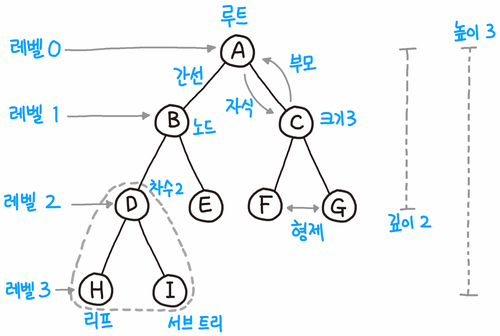
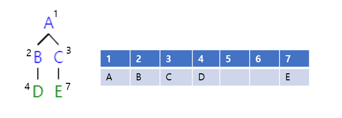
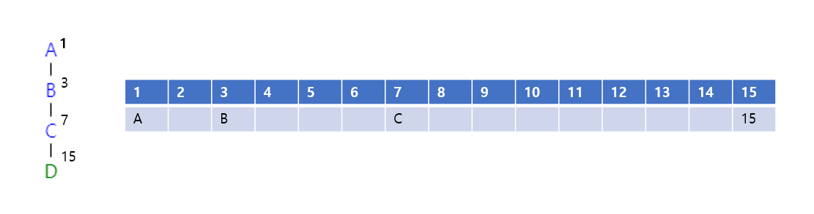
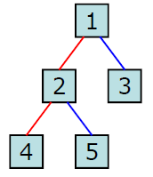
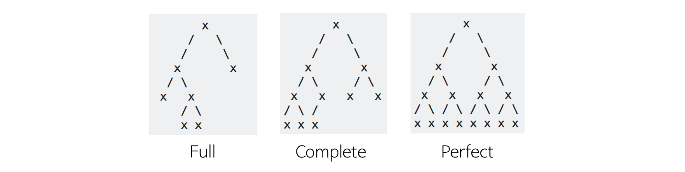
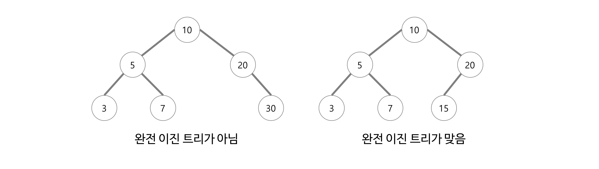
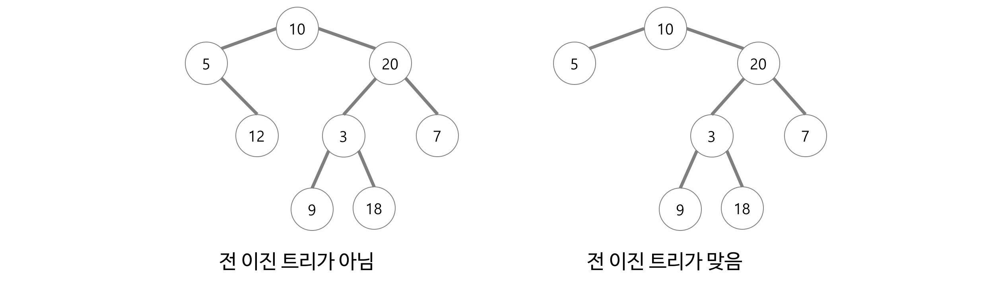

# 트리(Tree)

## 트리의 개념

- 데이터 요소를 계층적으로 연관되도록 구조화시키고자 할 때 사용하는 비선형 자료구조
- 부모-자식 관계로 정의하고, 부모와 자식이 간선으로 이어져 있음
- 싸이클이 존재하지 않는 그래프를 트리라고도 부름

트리에 방향이 존재하나? NO
트리 자료구조가 쓰이는 예는? 디렉토리 구조, HTML 구조

## 관련 용어



- 루트(Root): 최상위 계층에 존재하는 노드
- 간선(Edge): 노드와 노드를 연결하는 선
- 형제(Siblings): 같은 부모 노드를 갖고있는 노드
- 레벨(Level): 위에서 부터 각 층별로 매기는 숫자
- 차수(Degree): 자식 노드의 개수
- 크기(Size): 자신을 포함한 모든 자식 노드의 개수
- 리프 노드(Leaf Node): 자식이 없는 노드
- 높이(Height): 트리의 최고 레벨

## 트리의 특징

- 사이클이 존재하지 않음
- 노드가 N개인 트리는 항상 N-1개의 간선을 가짐
- 루트에서 어떤 노드로 가는 경로는 유일함
- 모든 자식 노드는 한 개의 부모 노드만을 가짐

## 트리의 종류

### 이진 트리(Binary Tree)

- 노드들의 최대 차수가 2인 노드들로 구성되는 트리
- 레벨 i에서 가질 수 있는 최대 노드 수 == 2^i (i >= 0)
- 깊이가 k인 이진 트리에서 가질 수 있는 최대 노드 수 == 2^k-1 (k >= 1)

#### 배열을 이용한 구현법




- 자식 노드는 부모 노드 인덱스 * 2와 * 2 + 1
- 빈 노드는 사용하지 않아서 공간 낭비

#### 포인터를 이용한 구현법

```c++
struct Node {
    int data;
    Node *left;
    Node *right;
}
```

#### 이진 트리 순회



1. 중위 순회(in-order traversal): 왼쪽 서브트리 -> 루트 -> 오른쪽 서브트리<br>
4-2-5-1-3

```c++
void inOrderTraversal(Node node) {
    if (node != null) {
        inOrderTraversal(node.left);
        visit(node);
        inOrderTraversal(node.right);
    }
}
```

2. 전위 순회(pre-order traversal): 루트 -> 왼쪽 서브트리 -> 오른쪽 서브트리<br>
1-2-4-5-3

```c++
void preOrderTraversal(Node node) {
    if (node != null) {
        visit(node);
        preOrderTraversal(node.left);
        preOrderTraversal(node.right);
    }
}
```

3. 후위 순회(post-order traversal): 왼쪽 서브트리 -> 오른쪽 서브트리 -> 루트<br>
4-5-3-2-1

```c++
void postOrderTraversal(Node node) {
    if (node != null) {
        postOrderTraversal(node.left);
        postOrderTraversal(node.right);
        visit(node);
    }
}
```

#### 균형 트리 vs. 편향 트리

- 균형 트리
  - O(log N) 시간에 탐색이 가능한 균형 잡힌 트리
  - ex) 레드 블랙 트리, AVL 트리

- 편향 트리
  - 노드가 한쪽으로 편향되어 생성된 이진 트리
  - 연결 리스트와 다를바가 없게 되어 O(N)의 탐색 시간을 가지게 됨

#### 완전 이진 트리 vs. 전 이진 트리 vs. 포화 이진 트리



##### 완전 이진 트리(Complete Binary Tree)



- 트리가 모든 레벨에서 마지막 레벨을 제외하고 꽉 차있음
- 마지막 레벨은 꽉 안차도 되지만 만약 하나 차있다면 왼쪽부터 채워져야 함

##### 전 이진 트리(Full Binary Tree)



- 모든 노드가 0개 또는 2개의 자식 노드를 가지는 트리

##### 포화 이진 트리(Perfect Binary Tree)


- 전 이진 트리 && 완전 이진 트리
- 모든 레벨이 꽉 차있음
- 모든 말단 노드가 동일한 레벨을 가짐

### 힙(Heap)


- 완전 이진 트리를 기본으로 한 자료구조
- 최대 값 또는 최소 값을 빠르게 찾을 수 있음(루트 노드가 가장 큰 값 or 작은 값)
- 삽입 및 삭제 시간복잡도: O(log N)
- 우선순위 큐 기능을 함 -> 다익스트라 최단 경로 알고리즘에 사용
- 배열로 구현하고 인덱스 0은 사용하지 않음

```
왼쪽 자식 인덱스 == 부모 인덱스 * 2
오른쪽 자식 인덱스 == 부모 인덱스 * 2 + 1
부모 인덱스 == 자식 인덱스 / 2
```

질문: 파이썬 heapq 모듈은 최소 힙 기능만 제공한다. 최대 힙으로 쓰고 싶으면 어떻게 해야할까?


#### 삽입 코드

```c++
void insert_max_heap(int x) {
    
    maxHeap[++heapSize] = x; 
    // 힙 크기를 하나 증가하고, 마지막 노드에 x를 넣음
    
    for( int i = heapSize; i > 1; i /= 2) {
        
        // 마지막 노드가 자신의 부모 노드보다 크면 swap
        if(maxHeap[i/2] < maxHeap[i]) {
            swap(i/2, i);
        } else {
            break;
        }
        
    }
}
```

#### 삭제 코드
```c++
int delete_max_heap() {
    
    if(heapSize == 0) // 배열이 비어있으면 리턴
        return 0;
    
    int item = maxHeap[1]; // 루트 노드의 값을 저장
    maxHeap[1] = maxHeap[heapSize]; // 마지막 노드 값을 루트로 이동
    maxHeap[heapSize--] = 0; // 힙 크기를 하나 줄이고 마지막 노드 0 초기화
    
    for(int i = 1; i*2 <= heapSize;) {
        
        // 마지막 노드가 왼쪽 노드와 오른쪽 노드보다 크면 끝
        if(maxHeap[i] > maxHeap[i*2] && maxHeap[i] > maxHeap[i*2+1]) {
            break;
        }
        
        // 왼쪽 노드가 더 큰 경우, swap
        else if (maxHeap[i*2] > maxHeap[i*2+1]) {
            swap(i, i*2);
            i = i*2;
        }
        
        // 오른쪽 노드가 더 큰 경우
        else {
            swap(i, i*2+1);
            i = i*2+1;
        }
    }
    
    return item;
    
}
```

### 트라이(Trie)


- 문자열을 저장하고 효율적으로 탐색하기 위한 트리 형태의 자료 구조
- 단순하게 단어 하나하나 비교하면서 탐색을 하는 것 보다 효율적(m의 길이를 가진 단어를 탐색하면 O(m))
- 그러나 포인터 배열 때문에 공간 복잡도에서 불리함


> Reference
> - https://gmlwjd9405.github.io/2018/08/12/data-structure-tree.html
> - https://velog.io/@adam2/TREE
> - https://monsieursongsong.tistory.com/6
> - https://namu.wiki/w/%ED%8A%B8%EB%A6%AC(%EA%B7%B8%EB%9E%98%ED%94%84)#fn-1
> - https://twpower.github.io/187-trie-concept-and-basic-problem
> - https://gmlwjd9405.github.io/2018/05/10/data-structure-heap.html
> - https://github.com/gyoogle/tech-interview-for-developer/blob/master/Computer%20Science/Data%20Structure/Heap.md
