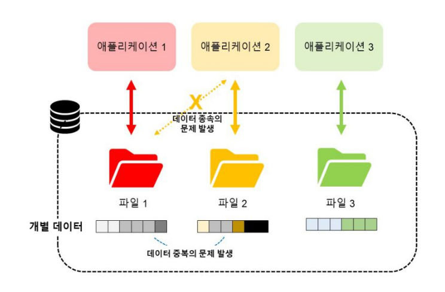
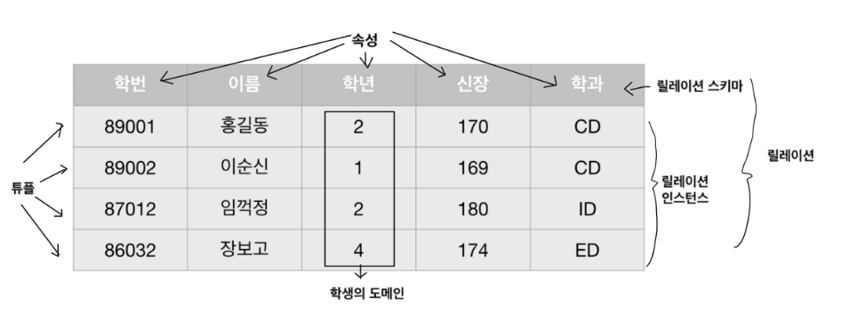
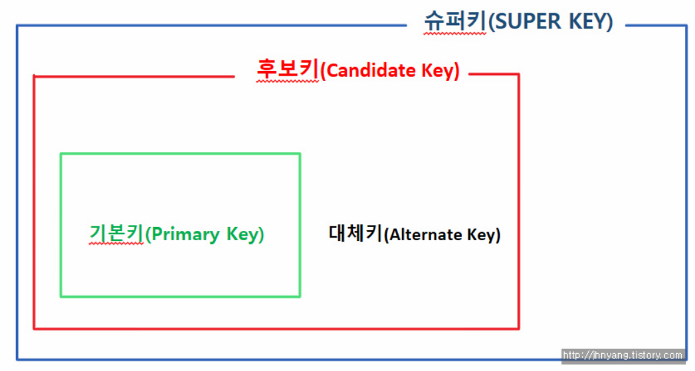
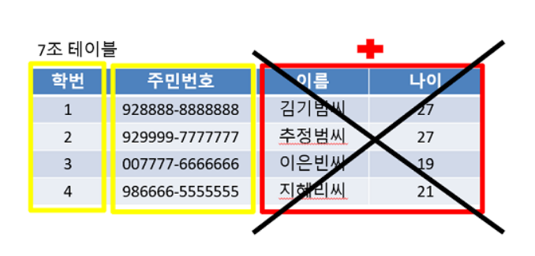
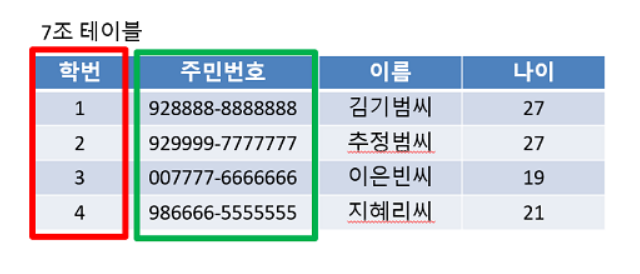
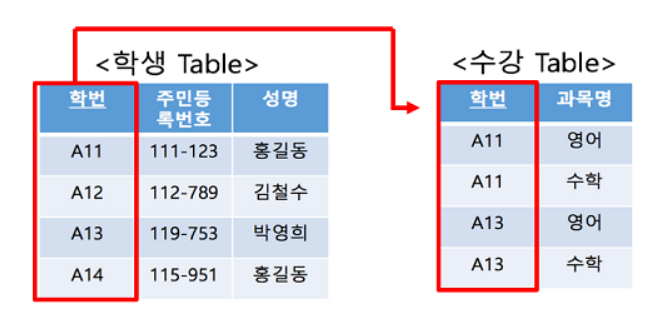
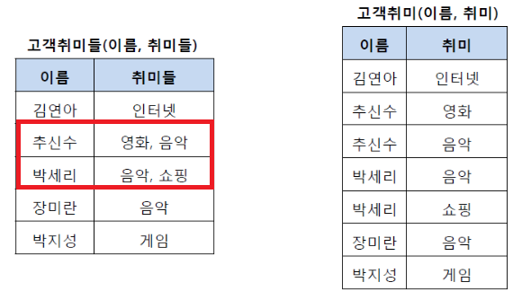
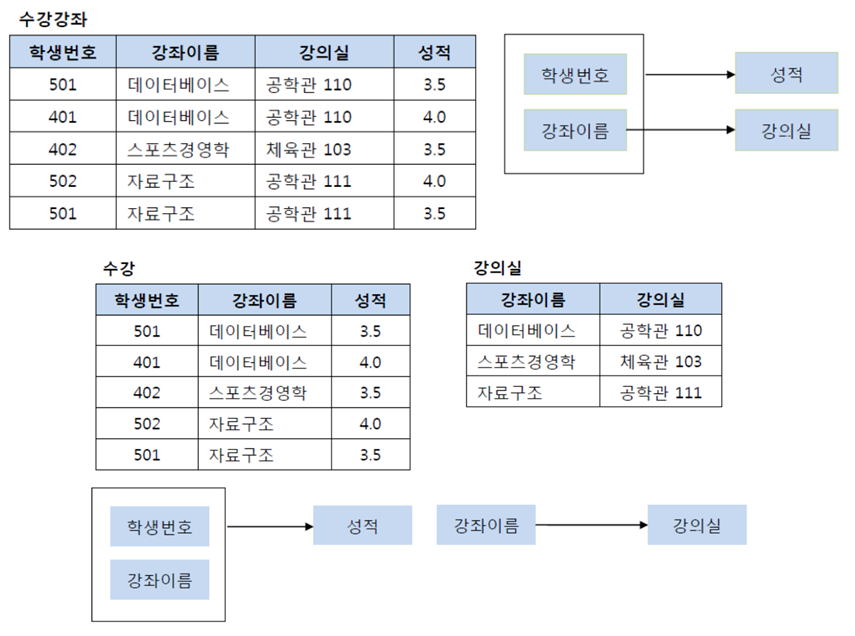
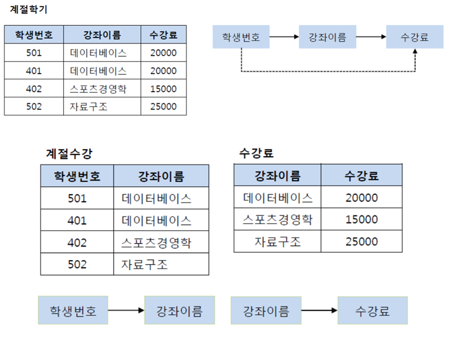
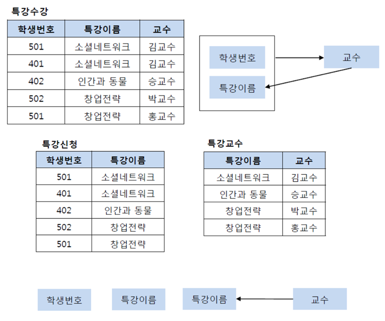

# DBMS ~ 외래키, 정규화

## DBMS(DataBase Management System)

- 데이터베이스를 관리하는 시스템
- 응용 프로그램들이 데이터베이스를 공유하며 사용할 수 있는 환경을 제공
- DDL(정의), DML(조작), DCL(제어)   

## DB를 사용하는 이유

- 데이터베이스가 나오기 전 시스템 : 파일 시스템
- 폴더별(애플리케이션)로 묶어 데이터를 개별 관리
- 사용하고자하는 애플리케이션이 직접 데이터를 관리
  - 데이터 종속, 중복, 무결성 훼손, 동시 접근의 문제 발생
  - 이를 해결하기 위해 DB 사용   

## 테이블 구조

- 테이블(릴레이션)
  - 행과 열로 이루어진 데이터의 집합
  - 릴레이션 스키마와 인스턴스로 구성
- 스키마
  - 테이블의 이름과 속성들의 나열, 테이블의 첫 행 헤더
  - 데이터 구조와 구성을 설명
- 튜플
  - 릴레이션을 구성하는 행
  - 속성의 모임
  - 튜플의 수 = 카디널리티 = 기수
- 속성
  - DB를 구성하는 가장 작은 논리적 단위
  - 개체의 특성
  - 속성의 수 = 디그리 = 차수
- 도메인
  - 속성 하나가 취할 수 있는 같은 타입의 원자값들의 집합   

## 뷰

- 데이터베이스에 존재하는 일종의 가상 테이블
- 실제 테이블처럼 행과 열을 가지고 있지만, 실제로 데이터를 저장하지 않음
- MySQL에서 뷰는 다른 테이블이나 다른 뷰에 저장되어 있는 데이터를 보여주는 역할만 수행
- 뷰를 사용하면 여러 테이블이나 뷰를 하나의 테이블처럼 볼 수 있음
- 뷰의 장점
  - 특정 사용자에게 테이블 전체가 아닌 필요한 컬럼만 보여줄 수 있음
  - 복잡한 쿼리를 단순화해서 사용 가능
  - 쿼리 재사용 가능
- 뷰의 단점
  - 한번 정의된 뷰는 변경할 수 없음
  - 삽입, 삭제, 갱신 작업에 많은 제한 사항을 가짐
  - 자신만의 인덱스를 가질 수 없음   

## 키(Key)

DB에서 조건에 만족하는 튜플을 찾거나 순서대로 정렬할 때 다른 튜플들과 **구별할 수 있는 유일한 기준이 되는 속성**

   

### 슈퍼키

- 테이블에서 **각 행을 유일하게 식별할 수 있는 하나 또는 그 이상의 속성들의 집합**
- 유일성을 만족 → 하나의 키로 특정 행을 찾아낼 수 있음   

### 후보키

- **테이블에서 각 행을 유일하게 식별할 수 있는 최소한의 속성들의 집합**
- 최소성과 유일성 만족   

### 기본키

- 후보키들 중에서 하나를 선택한 키
- **기본키는 null값을 절대 가질 수 없고 중복된 값을 가질 수 없음**
- 최소성과 유일성 만족   

### 대체키

- 후보키가 두개 이상일 경우, 어느 하나를 기본키로 지정하고 남은 후보키들이 대체키
- 대체키는 기본키로 선정되지 않은 후보키   

### 외래키

- 다른 테이블의 기본키를 참조하는 키
- **외래키는 중복값을 가질 수 있으며 null값을 허용**   

## 정규화

### 배경

- 한 릴레이션에 여러 엔티티의 애트리뷰트들을 혼합하게 되면
  - 중복 저장
  - 저장 공간 낭비
- 이상현상 발생
  - 삽입 이상 : 튜플 삽입 시 특정 속성에 해당하는 값이 없어 null을 입력해야 하는 현상
  - 수정 이상 : 튜플 수정 시 중복된 데이터의 일부만 수정되어 일어나는 데이터 불일치
  - 삭제 이상 : 튜플 삭제 시 같이 저장된 다른 정보까지 연쇄적으로 삭제되는 현상
- 이러한 문제를 해결하기 위해 정규화 과정을 진행   

### 정의

- 관계형 DB에서 중복을 최소화하기 위해 데이터를 구조화하는 작업
- 불만족스러운 나쁜 릴레이션의 속성들을 나누어 좋은 작은 릴레이션으로 분해하는 작업
- 정규형이란 정규화 과정을 통해 특정 조건을 만족하는 릴레이션의 스키마 형태

**Q. 나쁜 릴레이션?**

- 엔티티를 구성하고 있는 속성 간의 함수적 종속을 판단
- 함수적 종속성은 좋은 릴레이션 설계의 정형적 기준
- 어떠한 함수적 종속성을 만족하는지에 따라 정규형이 결정
- 이를 만족하지 못하면 나쁜 릴레이션

**Q. 함수적 종속성?**

- 어떤 속성 A의 값을 알면 다른 속성 B의 값을 유일하게 정해지는 관계
- A → B 라고 표기하며 A를 B의 결정자라는 의미

**Q. 각각의 정규형은 어떤 조건을 만족?**

- 하나의 릴레이션을 분해하고 다시 조인 연산을 했을 때, 데이터 손실이 없어야 함(무손실 조인)
- 함수적 종속성을 보존   

### 제1 정규형

테이블 컬럼이 원자값(하나의 값)을 갖도록 테이블을 분해

   

### 제2 정규형

제1 정규화를 진행한 테이블에 대해 완전 함수 종속을 만족하도록 테이블을 분해

완전 함수 종속이란 기본키의 부분집합이 결정자가 되어서는 X

   

### 제3 정규형

제2 정규화를 진행한 테이블에 대해 이행적 종속을 없애도록 테이블을 분해

이행적 종속이란 A → B, B → C가 성립할 때 A → C가 성립

   

### BCNF 정규형

제3 정규화를 진행한 테이블에 대해 모든 결정자가 후보키가 되도록 테이블을 분해

   

### 장점

- 이상현상 문제 해결
- 저장 공간의 최소화
- 데이터베이스 변경 시 재구성 최소화
- 정규화된 테이블들 간의 관계 → 현실 세계의 개념들을 반영   

### 단점

- 릴레이션이 분해될 수록 릴레인션 간의 조인 연산이 많아짐 → 성능 저하
- 이를 해결하기 위해 반정규화 작업 수행   

> Reference
>
> - https://jerryjerryjerry.tistory.com/49
> - https://github.com/yoonje/developer-interview-questions-and-answers/blob/master/Database/README.md
> - https://velog.io/@amuse_on_01/%EB%8D%B0%EC%9D%B4%ED%84%B0%EB%B2%A0%EC%9D%B4%EC%8A%A4-%EA%B4%80%EA%B3%84-%EB%8D%B0%EC%9D%B4%ED%84%B0%EB%B2%A0%EC%9D%B4%EC%8A%A4-%EB%AA%A8%EB%8D%B8%EA%B3%BC-%EC%96%B8%EC%96%B4
> - https://jhnyang.tistory.com/71
> - https://mangkyu.tistory.com/110
