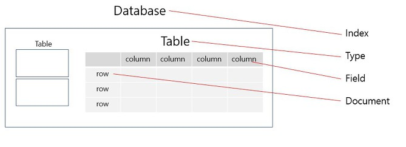
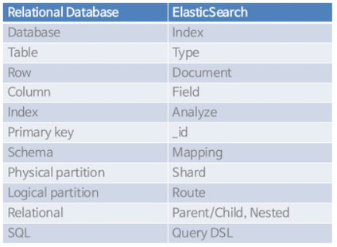

# Elasticsearch(엘라스틱서치)

- 아파치 루신 기반 오픈소스 분산 검색 엔진
- 색인 기능이 추가된 NoSQL DBMS
- JSON 기반의 비정형 데이터 및 정형 데이터 검색 지원
- 준실시간으로 데이터를 저장, 검색, 분석 가능

## Elasticsearch 구성

관계형 DB와 비교하면 다음과 같이 대응시킬 수 있다.

- 노드(Node): 클러스터의 일부로 단일 서버를 의미

- 클러스터(Cluster): 한 개 이상의 노드 집합

- 샤드(Shards): 인덱스를 여러 개의 조각으로 나눈 것. 분산 처리를 통해 검색 속도를 향상 시킬 수 있음

- 레플리카(Replica): 샤드의 복사본. 데이터를 여러 공간에 저장하여 안정성 보장

## Elasticsearch 장점
- Scale out
  - 샤드를 통해 수평적 확장 가능
- 고가용성
  - 레플리카를 통해 데이터 안정성 보장
- Schema Free
  - Json 문서 형식을 사용
- Restful
  - Rest API 호출 지원
- 역인덱스 지원
  - 책 뒤에 키워드로 정리되어 있는 인덱스 페이지와 같음
  - 텍스트를 파싱하여 토근화를 하고 특정 단어가 얼마나 어디에 쓰였는지 저장

> Reference
> - https://m.blog.naver.com/shakey7/221743977964
> - https://victorydntmd.tistory.com/308