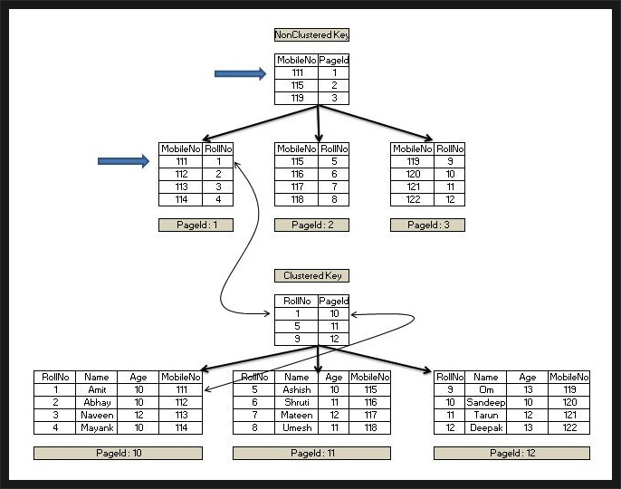
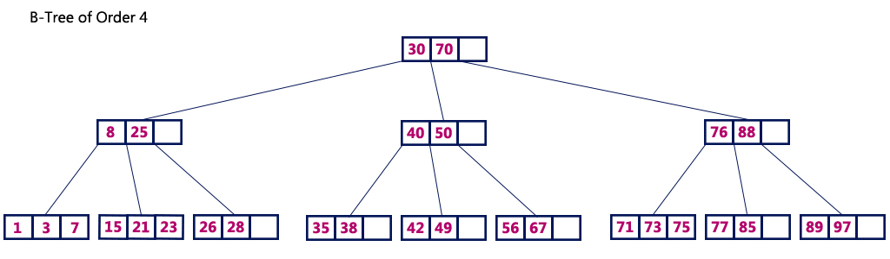

# 인덱스, B-Tree, B+Tree, Join

## Index

### Index란 무엇인가?

추가적인 쓰기와 저장 공간을 사용하여 데이터베이스의 검색 속도 향상을 위한 자료구조이다. 우리가 책의 색인 페이지를 보고 원하는 내용을 빠르게 찾을 수 있듯이 데이터베이스도 인덱스를 통해 검색 속도를 높일 수 있다.

이러한 인덱스가 존재하지 않는다면 데이터베이스를 항상 Full Scan해야 하기 때문에 대용량 데이터엔 비효율적이다.

### Index의 단점

인덱스는 항상 정렬된 상태를 유지하기 때문에 원하는 값을 탐색할 때는 빠르지만 값을 추가(INSERT), 삭제(DELETE), 수정(UPDATE)하는 경우에는 불리하다. 추가, 삭제, 수정을 너무 빈번하게 하는 경우에는 큰 성능 저하가 올 수 있다.

또한 인덱스를 관리하기 위해 DB의 약 10% 정도의 추가적인 저장 공간을 필요로 한다.

결론적으로 DBMS에서 인덱스는 저장 공간과 쓰기 성능을 희생하여 읽기 성능을 높이는 기능이다.

### Index 컬럼 선정 기준

그렇다면 어떤 컬럼을 Index로 걸러야 좋을까?

**Cardinality**가 높은 컬럼을 선택하는게 가장 좋다.

Cardinality가 높음 → 중복도가 낮음

Cardinality가 낮음 → 중복도가 높음

예)


| 성별 | 학과   | 이름   | 학번    |
|------|--------|--------|---------|
| 남   | 컴공   | 장동건 | 1301001 |
| 남   | 컴공   | 원빈   | 1301002 |
| 여   | 컴공   | 송혜교 | 1601010 |
| 남   | 산공   | 정우성 | 1402001 |
| 여   | 산공   | 김태희 | 1702023 |
| 여   | 산공   | 전지현 | 1702059 |
| 남   | 기계공 | 강동원 | 1703001 |


위와 같은 테이블이 있으면 cardinality가 가장 높은(중복도가 가장 낮은) 학번 컬럼을 인덱스 컬럼으로 선정하는게 가장 좋다.

### Clustered Index vs. Non-clustered Index

#### Clustered Index

- 물리적으로 정렬된 상태로 데이터를 보관
- clustered index는 테이블마다 오직 하나만 존재
- 레코드에 데이터를 삽입하거나 수정할 때 시간이 걸림(순서를 지켜야 하기 때문)
- leaf node가 실제 데이터를 갖고 있음

#### Non-clustered Index

- 물리적으로 정렬하지 않고 데이터를 가르키는 포인터를 보관
- 인덱스 구조는 테이블 행으로부터 독립적. 따라서 한 테이블에 여러 개의 인덱스 생성 가능
- 순서를 지킬 필요가 없으니 데이터를 삽입하거나 수정할 때 더 빠름. 그러나 검색 속도는 더 느림
- leaf node가 포인터를 갖고 있음



## B-Tree, B+Tree

### B-Tree



- 이진 트리를 확장시켜 2개 이상의 자식을 가질 수 있게 일반화한 자료구조
- 균형을 맞추어 O(log n)의 검색 시간을 갖도록 만듬
- 모든 leaf node는 같은 레벨에 위치

### B+Tree


- B-Tree의 단점인 보완한 자료구조
- leaf node를 제외한 노드는 데이터의 빠른 접근을 위한 인덱스 역할
- 데이터는 leaf node에만 저장
- leaf node는 연결 리스트 형태로 서로 연결(순차 접근 가능)

시뮬레이션: https://www.cs.usfca.edu/~galles/visualization/BPlusTree.html

### Hash Table

- 해시값을 기반으로 인덱스 구현
- O(1)로 매우 빠름
- 부등호 연산 사용 불가. 따라서 실제로는 사용하지 않음

## Join문

관계형 데이터베이스에서 두 개 이상의 테이블을 연결하여 데이터를 검색하는 방법. 여러 개의 테이블을 하나인 것처럼 활용한다. 적어도 하나의 컬럼을 공유하고 있어야 한다.

예제 테이블:

player Table(축구 국가대표 선수 테이블)

| id | name   | team                |
|----|--------|------------------------|
| 1  | 손흥민 | 토트넘 홋스퍼 FC       |
| 2  | 이강인 | 발렌시아 CF            |
| 3  | 황희찬 | RB 라이프치히          |
| 4  | 박지성 | 맨체스터 유나이티드 FC |
| 5  | 정우영 | SC 프라이부르크        |
| 6  | 황의조 | 보르도                 |
| 7  | 기성용 | FC 서울                |

team Table(해외 축구 팀 테이블)

| id | name                   | nation   |
|----|------------------------|----------|
| 1  | 토트넘 홋스퍼 FC       | 잉글랜드 |
| 2  | 발렌시아 CF            | 스페인   |
| 3  | 보르도                 | 프랑스   |
| 4  | RB 라이프치히          | 독일     |
| 5  | 맨체스터 유나이티드 FC | 잉글랜드 |
| 6  | SC 프라이부르크        | 독일     |
| 7  | 리버풀 FC              | 잉글랜드 |

### Inner Join


교집합과 같다. 기준 테이블과 조인 테이블의 중복된 값을 보여준다.

만약 해외 리그에서 뛰는 한국인 선수와 그 선수의 소속팀을 찾고 싶다면...

```sql
SELECT p.name, t.name
FROM player as p
JOIN team as t
ON p.team = t.name
```

| name   | team                |
|--------|------------------------|
| 손흥민 | 토트넘 홋스퍼 FC       |
| 이강인 | 발렌시아 CF            |
| 황희찬 | RB 라이프치히          |
| 박지성 | 맨체스터 유나이티드 FC |
| 정우영 | SC 프라이부르크        |
| 황의조 | 보르도                 |

### Left Outer Join


기준 테이블과 두 테이블의 중복된 값을 합쳐서 보여준다.

A테이블의 모든 데이터와 A테이블과 B테이블의 중복되는 값이 검색된다.

```sql
SELECT p.name, t.name
FROM player as p
LEFT JOIN team as t
ON p.team = t.name
```

| name   | team                |
|--------|------------------------|
| 손흥민 | 토트넘 홋스퍼 FC       |
| 이강인 | 발렌시아 CF            |
| 황희찬 | RB 라이프치히          |
| 박지성 | 맨체스터 유나이티드 FC |
| 정우영 | SC 프라이부르크        |
| 황의조 | 보르도                 |
| 기성용 | NULL                  |

### Right Outer Join


Left Outer Join의 반대

B테이블을 기준으로 둔다.

```sql
SELECT p.name, t.name
FROM player as p
RIGHT JOIN team as t
ON p.team = t.name
```

| name   | team                |
|--------|------------------------|
| 손흥민 | 토트넘 홋스퍼 FC       |
| 이강인 | 발렌시아 CF            |
| 황희찬 | RB 라이프치히          |
| 박지성 | 맨체스터 유나이티드 FC |
| 정우영 | SC 프라이부르크        |
| 황의조 | 보르도                 |
| NULL   | 리버풀                |

### Cross Join


모든 경우의 수를 표시해준다.

결과 값의 개수는 A테이블의 데이터 X B테이블의 데이터가 된다.

### Self Join


자기 자신과 조인한다.

> Reference
> - https://github.com/JaeYeopHan/Interview_Question_for_Beginner/tree/master/Database#index
> - https://github.com/yoonje/developer-interview-questions-and-answers/blob/master/Database/README.md#index를-사용하는-이유와-장점-및-단점
> - https://mangkyu.tistory.com/96
> - https://www.youtube.com/watch?v=9ZXIoh9PtwY&ab_channel=우아한Tech
> - https://velog.io/@gillog/SQL-Clustered-Index-Non-Clustered-Index
> - https://zorba91.tistory.com/293
> - https://futurists.tistory.com/17#recentComments
> - https://coding-factory.tistory.com/87