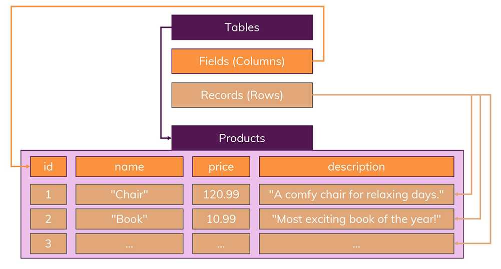
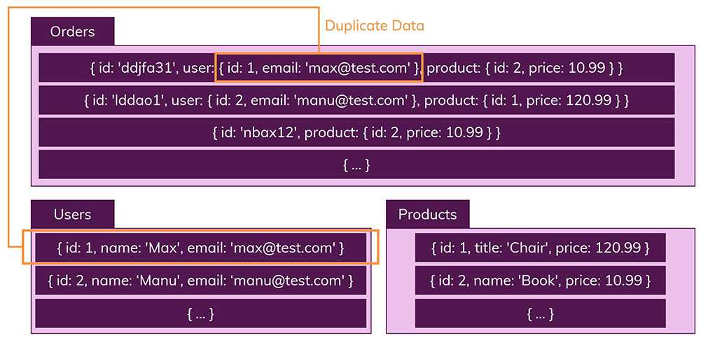
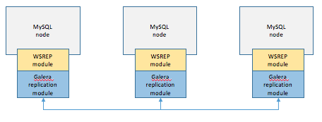
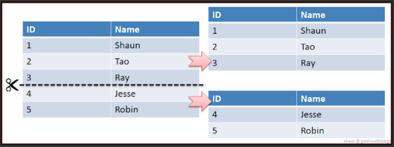
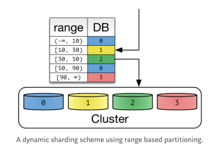
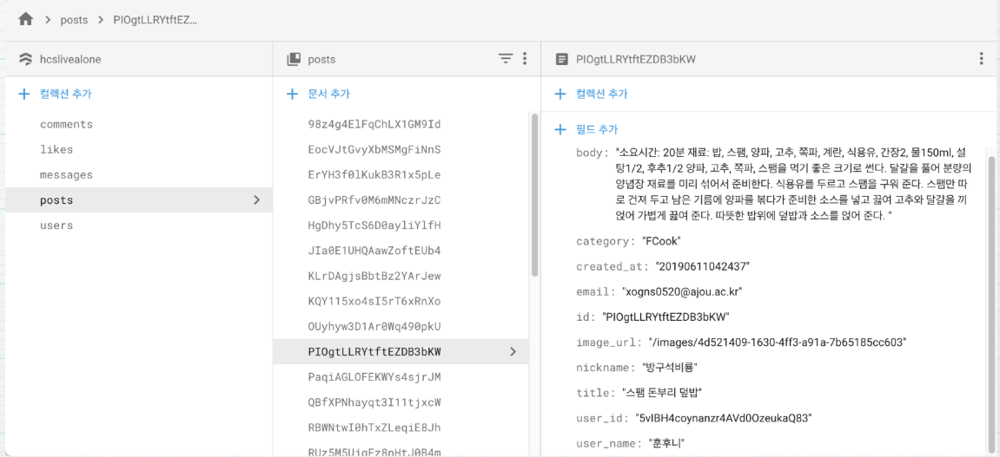

# NoSql, 클러스터링vs 리플리케이션, DB샤딩

3주차  cs스터디

## NoSQL

> RDB 보다 덜 제한적인 "일관성 모델"을 이용하는 데이터 저장 및 검색 매커니즘
>
> = Not Only SQL

- NoSQL은 매우 넓은 범위에서 사용하는 용어로 관계형 테이블의 레거시한 방법을 사용하지 않는 데이터 저장소를 뜻함
- NoSQL 데이터베이스에선 데이터를 행과 열이 아닌 체계적인 방식으로 저장
- NoSQL 데이터베이스의 예시로는 도서카드 목록함에서 MongoDB와 같은 보다 정교한 데이터 저장소에 이르기까지 다양한 개념을 뜻함

#### NoSQL 종류

- Key-Value DB
  - Key와 Value의 쌍으로 데이터가 저장되는 유형으로써 Amazon의 Dynamo Paper에서 유래되었다. Riak, Vodemort, Tokyo 등의 제품이 알려져 있다.
- Wide Columnar DB
  - Big Table DB라고도 하며, Google의 BigTable Paper에서 유래되었다. Column Family 데이터 모델을 사용하고 있고, HBase, Cassandra, Hypertable이 이에 해당된다.
- KDoument DB
  - Lotus Notes에서 유래되었으며, JSON, XML과 같은 Collection 데이터 모델 구조를 채택하고 있다. Mongo DB, Couch DB가 이 종류에 해당된다.
- Graph DB
  - Euler & Graph Theory에서 유래한 DB이며, Nodes, Relationship, Key-Value 데이터 모델을 채용하고 있다. Neo4J 등의 제품이 있다.

## NoSQL vs SQL

### 스키마

- DB의 구조, 제약조건에 관한 명세
  - 개체의 특징을 나타내는 **속성(Attribute)**
  - 속성들의 집합으로 이루어진 **개체(Entity)**
  - 개체 간 존재하는 **관계(RelationShip)**

#### SQL

- Table에 데이터가 저장됨
- Row, Col 구조
- 스키마를 정의 해야 데이터를 저장할 수 있음.

#### NoSQL

- Document에 저장됨
- Key-Value 형태로 데이터 저장
- Document가 모여 Collection
- Collection이 모여 Database
- 스키마를 정의하지 않아도 된다.

### Relation(관계)

#### SQL

- SQL에서 가장 중요
- Table간의 관계(Join)을 통해 데이터를 파악할 수 있음
- 데이터를 중복 없이 저장 가능(정규화 필요)

#### NoSQL

- Join 이란 개념이 없음
- Users 의 데이터가 Orders에 다 담김. -> Join을 통해 확인 X
- 다른 Collection이 필요하다면 기존 Collections의 내용을 일부 복제함
- Collections 별로 중복된 데이터 존재
- 업데이트 할 때 주의 필요

### Scalability(확장)

#### SQL - Vertical

- = scale up

- 성능을 향상시키는 것

#### NoSQL - Horizontal

- = scale out
- 더 많이 서버를 늘리는 것
- 확장을 고려한다면 NoSQL 방식이 맞지만, 구현이 어려움

### Property(특성)

#### SQL - ACID

- ACID는 트랜잭션이 안전하게 수행되도록 보장하는 것
- 트랜잭션은 여러 작업을 하나로 묶은 단위
- 송금 시스템

>- Atomicity(원자성)
>  : 트랜잭션의 작업이 부분적으로 실행되거나 중단되지 않는 것을 보장하는 것이다.
>  (불가능한 최소의 단위인 하나의 원자처럼 동작한다는 의미이다.)
>- Consistency(일관성)
>  : 미리 정의된 규칙에서만 수정이 가능한 특성을 의미한다.
>  (숫자 컬럼에 문자열값이 저장이 안되도록 보장한다.)
>- Isolation(고립성)
>  : 트랜잭션 수행시 다른 트랜잭션의 작업이 끼어들지 못하도록 보장하는 것이다.
>- Durability(영구성)
>  : 성공적으로 수행된 트랜잭션은 영원히 반영이 되는 것을 의미한다.
>  (한번 반영(commit)된 트랜젝션의 내용은 영원히 적용된다.)

#### NoSQL - CAP

- 분산 시스템에서 CAP 세 가지 만족하는 것은 불가능
- 오직 2가지만 만족

>- Consistency (일관성)
>  : 모든 요청은 최신 데이터 또는 에러를 응답받는다.
>  (DB가 3개로 분산되었다고 가정할 때, 하나의 특정 DB의 데이터가 수정되면
>  나머지 2개의 DB에서도 수정된 데이터를 응답받아야 한다.)
>- Availability (가용성)
>  : 모든 요청은 정상 응답을 받는다.
>  (특정 DB가 장애가 나도 서비스가 가능해야 한다.)
>
>- Partitions Tolerance (분리 내구성)
>  : DB간 통신이 실패하는 경우라도 시스템은 정상 동작 한다.

## Replication

> 여러 개의 DB를 권한에 따라 수직 구조로 구축하는 방식. Master Node는 쓰기 작업만, Slave Node는 읽기 작업만. 비동기 방식으로 노드 데이터 동기화

1. Master Node에 쓰기 작업 실행
2. 데이터를 저장하고 트랜잭션 로그를 파일에 기록(BinLog)
3. Slave Node IO Thread는 BinLog를 복사
4. Slave 노드의 SQL Thread는 파일을 읽으며 데이터 저장

#### 장점

- 읽기 작업이 많은 DB 요청에서는 Replication만으로 충분히 성능 높이기 가능
- 비동기 방식이라 지연 시간이 거의 없음

#### 단점

- Master 노드가 다운되면 복구, 대처가 까다로움
- 동기화가 보장되지 않아 일관성 있는 데이터 신뢰 불가

## Clustering

> 여러 개의 DB를 수평 구조로 구축하는 방식. Fail Over 시스템을 구축하기 위해 사용. 동기 방식으로 노드들 간의 데이터 동기화

1. 1개의 노드에 쓰기 트랜잭션 수행
2. 실제 디스크에 내용을 쓰기 전에 다른 노드로 데이터 복제 요청
3. 다른 노드에서 복제 요청 수락 신호를 보내고, 디스크에 쓰기 시작
4. 다른 노드로부터 신호를 받으면 실제 데이터 저장

#### 장점

- 노드들 간의 데이터를 동기화하여 일관성 있는 데이터 신뢰
- 1개의 노드가 죽어도 다른 노드가 살아있어, 시스템을 장애 없이 운영

#### 단점

- Replication에 비해 쓰기 성능이 떨어짐
- 장애가 전파된 경우 처리가 까다로움.

## Sharding

> 같은 테이블 스키마를 가진 데이터를 다수의 데이터베이스에 분산하여 저장하는 방법.
>
> = Horizontal Partitioning

- Shard Key를 어떻게 정의하느냐에 따라 데이터를 효율적으로 분산시키는 것이 결정됨

#### Hash Sharding

- 해싱하여 결정
- Node개수가 늘어나거나 줄면 해쉬 키 또한 변하는데, 분산 Rule이 어긋나게 됨

#### Dynamic Sharding

- 동적 샤딩 키
- 확장에 유연함
- Locator Service를 통해 Shard Key를 얻음
- Locator가 성능을 위해 Cache 하면, 에러 발생

---

