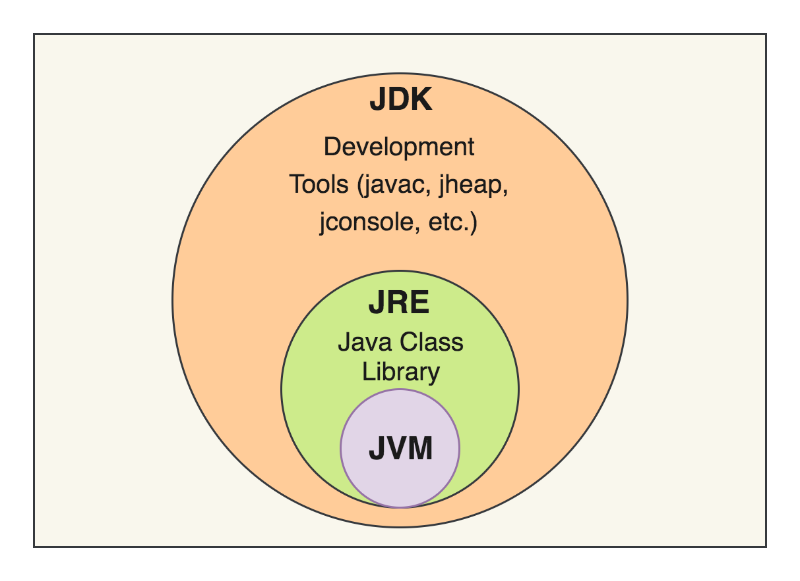
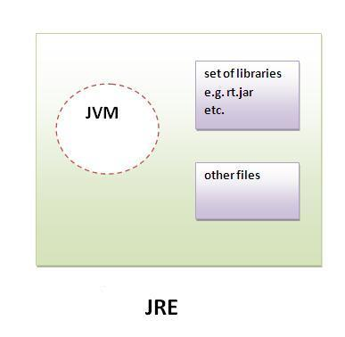
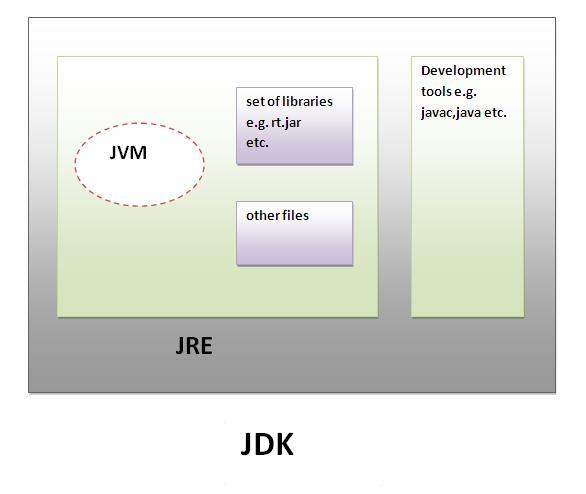
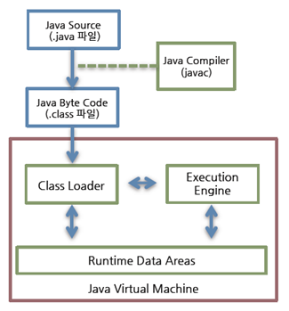

# JVM이란 무엇이며, 자바 코드는 어떻게 실행하는 것인가?

> 먼저 JVM, JRE, JDK를 알아봐야 한다.



### JVM (Java Virtual Machine)

- JAVA 소스코드로 부터 만들어지는 JAVA Binary 파일(*.class)을 실행할 수 있다.
- JVM은 플랫폼에 의존적이다. 즉 리눅스 JVM과 윈도우 JVM은 다르다.
- 하지만 컴파일 된 바이너리 코드는 어떠한 JVM에서도 동작이 가능하다.
- JVM의 역할은
  - 바이너리 코드 읽기
  - 바이너리 코드 검증
  - 바이너리 코드 실행
  - 실행환경 제공

>바이너리 코드
>
>- 0과 1로 구성되어 있는 코드
>- C언어로 작성 된 .c 파일을 컴파일 한 .obj 파일이 바이너리 코드
>- .obj 를 "링커"를 통해 여러 코드와 데이터를 모아서 메모리에서 실행 가능한 파일로 만듬
>
>바이트 코드
>
>- 0과 1로 구성되어 있는 이진 코드이지만, 바이너리 코드와 다르게 가상 머신이 이해 가능
>- 기계어로 만들기 위해서는 인터프리터가 필요

### JRE (Java Runtime Environment)

- JVM이 자바 프로그램을 동작시킬 때 필요한 라이브러리 파일들과 기타 파일들을 가지고 있음

- 자바 실행환경이라는 의미

- JRE는 JVM의 실행환경을 구현했다.

  

### JDK (Java Development Kit)

- JRE + 개발을 위해 필요한 도구를 포함
- 오라클사에서 제공하는 오라클 JDP, 오픈소스 OpenJDK가 있으나, 일반적으로 오라클 JDP 사용



---

## JVM의 특징

> JVM의 역할은 자바 애플리케이션을 클래스 로더(Class Loader)를 통해 읽어 들여서 자바 API와 함께 실행하는 것

#### 1. WORA(Write Once, Run Anyware)

JVM을 통해 자바 파일을 OS나 환경에 따라 다시 작성해줘야되는 문제점 없이 사용할 수 있다. Windows, Linux 용이 아니라 JVM은 운영체제 위에서 작동하며, 자바 프로그램과 운영체제 사이에서 인터페이스 역할을 수행해서 자바 프로그램이 환경에 종속되지 않도록 하였다.

### 2. Garbage Collection

자바 이전 C언어나 다른 모든 프로그램의 메모리는 프로그래머가 직접 관리해줘야 했다. 하지만 자바 프로그램에서 메모리 관리는 JVM이 해준다. Garbage Collection 에서 특정 알고리즘으로 노는 메모리를 Free 시켜준다.

### 3. 스택 기반의 가상머신

인텔 아키텍처나, ARM 아키텍처와 같은 하드웨어가 레지스터 기반이라면, JVM은 스택 기반으로 동작한다.

### 4. 기본 자료형

C/C++등의 전통적 언어는 플랫폼에 따라 int형의 크기가 2 Byte / 4 Byte 등으로 변한다. 하지만 JVM은 기본 자료형을 명확하게 정의하여 호환성을 유지하고 플랫폼 독립성을 보장한다.

---

## JVM 구성요소



### Class Loader

자바는 컴파일 타임이 아니라, 런타임에 클래스를 처음 참조할 때 해당 클래스를 로드하고 링크하는 특성이 있다. Bootstrap class Loader는 주로 $JAVA_HOME/jre/lib 에 있는 JDK 내부 클래스, rt.jar 및 기타 핵심 라이브러리를 로드하는 역할

- 계층 구조 : 클래스 로더끼리 부모 - 자식 관계를 이루어 계층 구조로 생성
- 위임 모델 : 계층 구조를 바탕으로 클래스 로더끼리 로드를 위임하는 구조로 동작
- 가시성 제한 : 하위 클래스 로더는 상위 클래스 로더의 클래스를 찾을 수 있지만, 상위 클래스 로더는 하위 클래스를 찾을 수 없다.
- 언로드 불가 : 클래스 로더는 클래스를 로드할 수 있지만 언로드 할 수는 없다.

### Memory

- field, method, type, constant pool, static, final 등이 관리된다.

- Heap은 모든 객체가 저장된다. 인스턴스 변수나 배열같은 정보들도 저장된다. Method에 올라간 Class만 생성 가능하고, 사용되지 않는 값이 제거되는 영역이라고도 한다.
- JVM Language Stack은 지역 변수를 저장한다. 

### Execution Engine

- 로드된 바이트코드를 실행하는 파트
- JIT
- GC


---

## JAVA 코드가 실행되는 과정

1. 프로그래머가 *.java를 확장자로 하는 텍스트 파일로 작성

   ```java
   // Hello.java
   class Hello{
     public static void main(String[] args){
       System.out.println("Hello World");
     }
   }
   ```

2. 위 코드들을 **javac** 컴파일러에 의해 ***.class** 파일로 컴파일 된다.

   ```shell
   $ javac Hello.java
   ```

3. ***.class** 파일에 쓰여진 기계어들은 프로세서의 명령어가 아니라, jvm의 기계어인 바이트 코드이다.

   ```shell
   $ ls
   2021-07-24 				413 				Hello.class
   2021-07-24 				100 				Hello.java
   ```

4. 위 바이트 코드를 JVM이 해석해서 프로그램이 실행된다.

   ```shell
   $ java Hello
   Hello World
   ```


---

## 참고

#### JIT 컴파일러

- 프로그램을 실제 실행하는 시점에 기계어로 번역하는 컴파일 기법
- JVM에서 프로그램 실행 시점에 바이트코드를 한 줄씩 실행하는 과정에서 실행한 코드들을 캐싱하여 중복되는 코드들을 중복 생성하는 것을 방지한다.


---

## Reference

- https://d2.naver.com/helloworld/1230
- https://coding-nyan.tistory.com/87
- https://velog.io/@jaden_94/1%EC%A3%BC%EC%B0%A8-%ED%95%AD%ED%95%B4%EC%9D%BC%EC%A7%80
- https://ko.wikipedia.org/wiki/%EC%9E%90%EB%B0%94_%EA%B0%80%EC%83%81_%EB%A8%B8%EC%8B%A0

