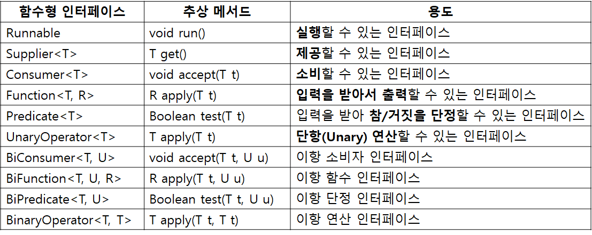

# 람다

### 람다란 무엇인가?

람다란 한 마디로 코드 블록이다.

기존의 코드 블록은 반드시 메서드 내에 존재해야 했다. 그래서 코드 블록만 갖고 싶어도 메서드를, 다시 메서드를 사용하기 위해서 익명 객체를 만들어야 했다.

자바 8부터는 코드 블록을 만들기 위해서 위의 것들을 할 필요가 없다. 람다를 메서드의 인자나 반환값으로 사용할 수 있다. (코드 블록을 변수처럼 사용 가능) </br></br>

**기존 방식의 코드 블록 사용 - 별도의 클래스와 객체, 메서드를 생성해야 한다.**

```java
public class B1 {
		public static void main(String[] args) {
				MyTest mt = new MyTest();

				Runnable r = mt;

				r.run();
		}
}

class MyTest implements Runnable {
		public void run() {
				System.out.println("Hello Lambda!");
		}
}
```

기존 방식으로 Runnable 인터페이스 구현체를 사용하는 코드이다. </br></br>

**기존 방식의 코드 블록 사용 - 익명 객체 생성**

```java
public class B2 {
		public static void main(String[] args) {
				Runnable r = new Runnable() {
						public void run() {
								System.out.println("Hello Lambda2!");
						}
				};

				r.run();
		}
}
```

별도의 클래스 정의 없이 코드 블록인 메서드를 사용하고자 할 때 많이 사용되던 익명 객체를 사용하는 방법이다. </br></br>

**새로운 방식의 코드 블록 사용 - 람다**

```java
public class B3 {
		public static void main(String[] args) {
				Runnable r = () -> {
						System.out.println("Hello Lambda3!");
				};

				r.run();
		}
}
```

익명 객체조차 없이 바로 코드 블록만 사용할 수 있다.

Runnable 타입으로 참조 변수 r을 만들고 있으므로 new Runnable()은 컴파일러가 알아낼 수 있다.
(따라서 생략 가능)

public void run() 메서드는 Runnable 인터페이스가 가진 추상 메서드가 run() 메서드 하나이기 때문에 ()로 변경될 수 있다.

람다의 구조는 (인자 목록) → { 로직 } 이다. </br></br>

**코드 블록이 한 줄인 경우 블록 기호 생략 가능**

```java
public class B4 {
		public static void main(String[] args) {
				Runnable r = () -> System.out.println("Hello Lambda4!");

				r.run();
		}
}
```

람다에서는 로직이 단 한 줄로 표기되는 경우 블록 기호({ }) 마저 생략할 수 있다. </br></br>

### 함수형 인터페이스

Runnable 인터페이스는 run()이라는 추상 메서드 하나만을 가진다.

이처럼 추상 메서드를 하나만 갖는 인터페이스를 자바 8부터 함수형 인터페이스라고 한다.

이런 함수형 인터페이스만을 람다식으로 변경할 수 있다. </br></br>

**사용자 정의 함수형 인터페이스**

```java
public class B5 {
		public static void main(String[] args) {
				MyFunctionalInterface mfi = (int a) -> { return a * a; };

				int b = mfi.runSomething(5);

				System.out.println(b);
		}
}

@FunctionalInterface
interface MyFunctionalInterface {
		int runSomething(int count);
}
```

함수형 인터페이스를 선언할 때 @FunctionalInterface 어노테이션을 붙이는 것은 옵션이지만 붙이는것이 베스트 프랙티스이다.

해당 어노테이션을 붙이면 컴파일러가 함수형 인터페이스의 제약을 지켰는지 확인해준다. </br></br>

**사용자 정의 함수형 인터페이스의 최적화된 람다식**

```java
public class B6 {
		public static void main(String[] args) {
				MyFunctionalInterface mfi = a -> a * a;

				int b = mfi.runSomething(5);

				System.out.println(b);
		}
}

@FunctionalInterface
interface MyFunctionalInterface {
		int runSomething(int count);
}
```

예제 B5에서 람다식의 인자로 사용하고 있는 int a는 a가 int일 수 밖에 없음을 runSomething() 메서드 정의에서 알 수 있다. 따라서 int를 생략할 수 있는데, 이를 타입 추적 기능이라고 한다.

(int a) → { return a _ a; }; ⇒ (a) → { return a _ a; };

또한, 인자가 하나이고 자료형을 표기하지 않는 경우 소괄호를 생략할 수 있다.

(a) → { return a _ a; } ⇒ a → { return a _ a; };

그리고 코드가 단 한 줄인 경우 중괄호({ })도 생략할 수 있다. 다만 이때 return 구문도 생략해야 한다. 역시 runSomething() 메서드 정의를 통해 int를 반환한다는 사실을 알 수 있기 때문이다. 추가로 연산식 뒤에 세미클론도 생략한다.

a → { return a _ a; }; ⇒ a → a _ a; </br></br>

### 메서드 호출 인자로 람다 사용

```java
public class B8 {
		public static void main(String[] args) {
				MyFunctionalInterface mfi = a -> a * a;

				doIt(mfi);
		}
}

public static void doIt(MyFunctionalInterface mfi) {
		int b = mfi.runSomething(5);

		System.out.println(b);
}

@FunctionalInterface
interface MyFunctionalInterface {
		int runSomething(int count);
}
```

람다식을 변수에 저장할 수 있으므로 당연히 메서드의 인자로도 사용할 수 있다.

```java
public class B8 {
		public static void main(String[] args) {
				doIt(a -> a * a);
		}
}

public static void doIt(MyFunctionalInterface mfi) {
		int b = mfi.runSomething(5);

		System.out.println(b);
}

@FunctionalInterface
interface MyFunctionalInterface {
		int runSomething(int count);
}
```

람다식을 단 한 번만 사용한다면 굳이 변수에 할당할 필요도 없다.

람다식을 이용하는 코드에서 가장 많이 등장하는 형식이니 익숙해지면 좋다. </br></br>

### 메서드 반환값으로 람다 사용

```java
public class B9 {
		public static void main(String[] args) {
				MyFunctionalInterface mfi = toDo();

				int result = mfi.runSomething(3);

				System.out.println(result);
		}
}

public static MyFunctionalInterface toDo() {
		return num -> num * num;
}

@FunctionalInterface
interface MyFunctionalInterface {
		int runSomething(int count);
}
```

람다식을 메서드의 반환값으로도 사용할 수 있다. </br></br>

### 자바 8 API에서 제공하는 함수형 인터페이스

개발자들이 많이 쓸 것이라고 예상되는 함수형 인터페이스를 java.util.function 패키지와 여러 패키지에서 제공한다.

총 43개의 함수형 인터페이스를 제공하며, 만약 이 중에 필요한 함수형 인터페이스가 없다면 사용자 정의 함수형 인터페이스를 정의해서 사용한다.

```java
public class B10 {
    public static void main(String[] args) {
        Runnable run = () -> System.out.println("hello");
        Supplier<Integer> sup = () -> 3 * 3;
        Consumer<Integer> con = num -> System.out.println(num);
        Function<Integer, String> fun = num -> "input: " + num;
        Predicate<Integer> pre = num -> num > 10;
        UnaryOperator<Integer> uOp = num -> num * num;

        BiConsumer<String, Integer> bCon = (str, num) -> System.out.println(str + num);
        BiFunction<Integer, Integer, String> bFun = (num1, num2) -> "add result: " + (num1 + num2);
        BiPredicate<Integer, Integer> bPre = (num1, num2) -> num1 > num2;
        BinaryOperator<Integer> bOp = (num1, num2) -> num1 - num2;

        run.run();
        System.out.println(sup.get());
        con.accept(3);
        System.out.println(fun.apply(3));
        System.out.println(pre.test(3));
        System.out.println(uOp.apply(3));

        System.out.println();

        bCon.accept("user", 3);
        System.out.println(bFun.apply(3, 5));
        System.out.println(bPre.test(5, 3));
        System.out.println(bOp.apply(5, 3));
    }
}
```

 </br></br>

### 컬렉션 스트림에서 람다 사용

람다는 주로 컬렉션 스트림을 위한 기능에 크게 초점이 맞춰져 있다.

```java
public class B11 {
    public static void main(String[] args) {
        Integer[] ages = {20, 25, 18, 27, 30, 21, 17, 19, 34, 28};

				// 단순 반복문
        for (int i = 0; i < ages.length; i++) {
            if (ages[i] < 20) {
                System.out.format("Age %d!!! Can't enter\n", ages[i]);
            }
        }

        System.out.println();

				// for each 구문 사용
        for (Integer age : ages) {
            if (age < 20) {
                System.out.format("Age %d!!! Can't enter\n", age);
            }
        }

        System.out.println();

				// 컬렉션 스트림 사용
        Arrays.stream(ages)
                .filter(age -> age < 20)
                .forEach(age -> System.out.format("Age %d!!! Can't enter\n", age));
    }
}
```

기존 배열을 이용해 스트림을 얻기 위해서 Arrays 클래스의 stream() 정적 메서드를 사용했다.

filter() 메서드는 SQL 구문에서 where 절과 같은 역할을 수행한다. 따라서 true/false를 반환하는 조건이 필요하다. (Predicate 함수형 인터페이스를 filter 메서드의 인자로 제공하면 된다.)

스트림 내부 반복을 실행하는 forEach() 메서드를 사용했다. (전달된 인자를 소비하는 함수형 인터페이스 Consumer를 요구한다.)

스트림을 이용하면서 함수형 프로그래밍의 장점인 선언적 프로그래밍을 할 수 있다.

이는 How가 아닌 What을 지정하는 것이다. 예를들어,

- filter(age → age < 20) : 20세 미만인 경우를 선발(filter)해주세요.
- forEach(age -> System.out.format("....")); : 선별된 각 요소에 대해 입장이 불가하다고 해주세요.

즉, 의사소통 내용 자체가 그대로 코드로 구현될 수 있다. </br></br>

### 메서드 레퍼런스

메서드 레퍼런스에는 다음과 같이 세 가지 유형이 있다.

- 인스턴스::인스턴스 메서드
- 클래스::정적 메서드
- 클래스::인스턴스메서드

```java
public class B12 {
    public static void main(String[] args) {
        Double[] nums = {1.0, 4.0, 9.0, 16.0, 25.0};

        System.out.println("=== Lambda ===");
        Arrays.stream(nums)
                .map(num -> Math.sqrt(num))
                .forEach(sqrtNum -> System.out.println(sqrtNum));

        System.out.println();

        System.out.println("=== Method Reference ===");
        Arrays.stream(nums)
                .map(Math::sqrt) // 클래스::정적 메서드
                .forEach(System.out::println); // 인스턴스::인스턴스 메서드

        System.out.println();

        BiFunction<Integer, Integer, Integer> bif_lambda = (a, b) -> a.compareTo(b);
				// 클래스::인스턴스 메서드
        BiFunction<Integer, Integer, Integer> bif_method_reference = Integer::compareTo;

        System.out.println(bif_lambda.apply(10, 12));
        System.out.println(bif_lambda.apply(10, 10));
        System.out.println(bif_lambda.apply(10, 2));

        System.out.println();

        System.out.println(bif_method_reference.apply(10, 12));
        System.out.println(bif_method_reference.apply(10, 10));
        System.out.println(bif_method_reference.apply(10, 2));
    }
}
```

람다식은 메서드 레퍼런스로 바뀔 수 있다.

역으로, 메서드 레퍼런스는 람다식으로 변형되고 최종적으로 함수형 인터페이스가 된다. </br></br>

### 생성자 레퍼런스

```java
public class B13 {
    public static void main(String[] args) {
        B14 b13_1 = new B13();

        // error : B13 is not functional interface
        // B13 b13_2 = B13::new;

        Supplier<B13> factory = B13::new;
				// Supplier<B13> facotry = () -> new B13();

        B14 b13_3 = factory.get();
        B14 b13_4 = factory.get();

        System.out.println(b13_1);
        System.out.println(b13_3);
        System.out.println(b13_4);
    }
}
```

생성자 레퍼런스를 이용해 생성한 B13 객체를 B13 타입의 참조 변수에 할당하면 에러가 발생한다. 생성자 레퍼런스로 생성한 것은 B13 클래스의 객체가 아니라 함수형 인터페이스 구현 객체이기 때문이다.

B13의 생성자는 기본 생성자이기에 이를 만족하는 Supplier 함수형 인터페이스를 사용해 생성자 자체에 대한 참조가 만들어진다.

만약 기본 생성자 외에 다른 생성자가 있는 경우라면 그에 맞는 함수형 인터페이스 참조 변수를 사용해야 한다.
