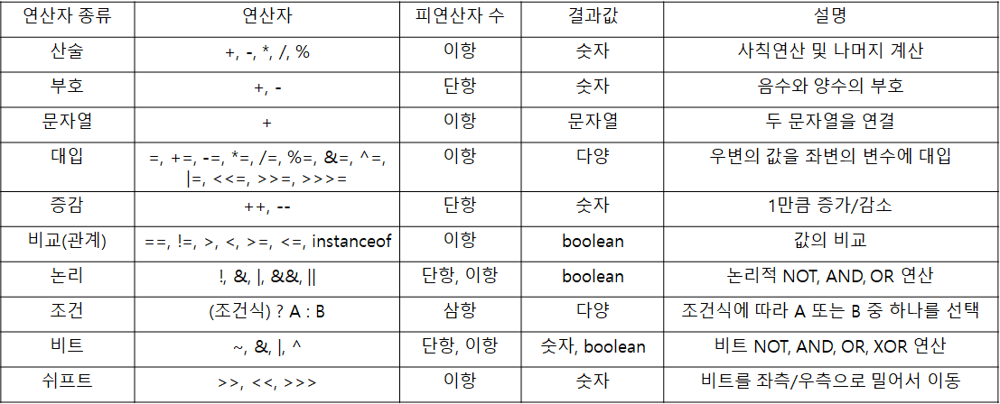
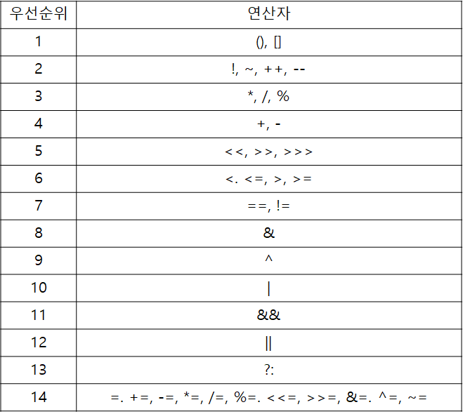

# 연산자

## ※ 용어 정의

- 연산(operations) : 프로그램에서 데이터를 처리하여 결과를 산출하는 것
- 연산자(operator) : 연산에 사용되는 표시나 기호
- 피연산자(operand) : 연산의 대상이 되는 데이터
- 연산식(expressions) : 연산자와 피연산자로 연산의 과정을 기술한 것



## 산술 연산자

자바에서의 산술 연산은 덧셈, 뺄셈, 곱셈, 나눗셈, 나머지 연산 5개를 의미

타입 변환(타입 캐스팅, 타입 프로모션)이 산술 연산에서 빈번하게 발생할 수 있음

```java
int n1 = 10;
int n2 = 3;

System.out.println("n1 + n2 = " + (n1 + n2));
System.out.println("n1 - n2 = " + (n1 - n2));
System.out.println("n1 * n2 = " + (n1 * n2));
System.out.println("n1 / n2 = " + (n1 / n2));
System.out.println("n1 % n2 = " + (n1 % n2));

// n1 + n2 = 13
// n1 - n2 = 7
// n1 * n2 = 30
// n1 / n2 = 3 // 타입 캐스팅
// n1 % n2 = 1 // 타입 캐스팅
```

나눗셈 연산과 나머지 연산에서 정수형 자료를 사용했기 때문에, 표현 범위 내에서 실수를 표현할 수 없으므로 다음과 같이 타입 캐스팅이 발생

```java
double n1 = 10;
double n2 = 3;

System.out.println("n1 + n2 = " + (n1 + n2));
System.out.println("n1 - n2 = " + (n1 - n2));
System.out.println("n1 * n2 = " + (n1 * n2));
System.out.println("n1 / n2 = " + (n1 / n2));
System.out.println("n1 % n2 = " + (n1 % n2));

// n1 + n2 = 13.0
// n1 - n2 = 7.0
// n1 * n2 = 30.0
// n1 / n2 = 3.3333333333333335
// n1 % n2 = 1.0
```

반면에 실수 자료형을 산술 연산 했을 때는 나눗셈 연산과 나머지 연산을 했을 때 결과를 실수로 표현

## 비트 연산자

비트 연산은 1과 0으로 이루어짐

일반적으로 0은 false, 1은 true를 의미, 그 외의 모든 값은 true

다음은 비트 연산의 종류를 알아보자

- ~ : 단항 연산을 하고, 부정을 의미 예를들어 0은 1로, 1은 0으로 변환 (NOT)
- & : 양쪽 항의 값이 모두 1(true)인 경우 1(true)를 반환하는 연산자 (AND)
- | : 양쪽 항의 값 중 하나라도 1(true)이면 1(true)를 반환하는 연산자 (OR)
- ^ : 양쪽 항의 값이 서로 다를 때 1(true)를 반환하는 연산자 (XOR)

```java
// 정수형 자료형 int는 4바이트, 즉 32비트로 표현된다.
int n1 = 10; // 00000000 00000000 00000000 00001010
int n2 = 15; // 00000000 00000000 00000000 00001111

// ~ 연산을 하면 모든 비트를 반전한다.
//  11111111 11111111 11111111 11110101
// MSB가 1이므로 음수를 뜻한다.
// 2의 보수를 취한 값에 -를 붙인 값을 반환한다.
// 00000000 00000000 00000000 00001010 -> 모든 비트 반전
// 00000000 00000000 00000000 00001011 -> 1을 더함
// 1011은 10진수로 11이므로, -11을 출력
System.out.println("~n1 = " + ~n1);

// 00000000 00000000 00000000 00001010
// 00000000 00000000 00000000 00001111
// 양쪽 모두 1일 때, 1을 반환
// 00000000 00000000 00000000 00001010
// 1010은 10진수로 10이므로, 10을 출력
System.out.println("n1 & n2 = " + (n1 & n2));

// 00000000 00000000 00000000 00001010
// 00000000 00000000 00000000 00001111
// 한쪽이라도 1일 때, 1을 반환
// 00000000 00000000 00000000 00001111
// 11은 10진수로 15이므로, 15를 출력
System.out.println("n1 | n2 = " + (n1 | n2));

// 00000000 00000000 00000000 00001010
// 00000000 00000000 00000000 00001111
// 양쪽 모두 다를 때, 1을 반환
// 00000000 00000000 00000000 00000101
// 101은 10진수로 5이므로, 5를 출력
System.out.println("n1 ^ n2 = " + (n1 ^ n2));

// ~n1 = -11
// n1 & n2 = 10
// n1 | n2 = 15
// n1 ^ n2 = 5
```

## 관계 연산자

관계 연산자를 중심으로 양쪽의 값이 어떠한 관계를 가지는지 확인할 때 사용


```java
// == 연산자
System.out.println("(10 == 10) = " + (10 == 10)); // true
System.out.println("(10 == 20) = " + (10 == 20)); // false

// != 연산자
System.out.println("(10 != 10) = " + (10 != 10)); // false
System.out.println("(10 != 20) = " + (10 != 20)); // true

// > 연산자
System.out.println("(10 > 20) = " + (10 > 20)); // false
System.out.println("(20 > 10) = " + (20 > 10)); // true

// >= 연산자
System.out.println("(10 >= 10) = " + (10 >= 20)); // false
System.out.println("(20 >= 10) = " + (20 >= 10)); // true

// < 연산자
System.out.println("(10 < 20) = " + (10 < 20)); // true
System.out.println("(20 < 10) = " + (20 < 10)); // false

// <= 연산자
System.out.println("(10 <= 10) = " + (10 < 20)); // true
System.out.println("(20 <= 10) = " + (20 < 10)); // false
```

## 논리 연산자

비트 연산과 비슷하지만 피연산자가 boolean 타입의 논리 값이라는 점이 다름

!는 논리적인 부정을 뜻하며, true를 false로, false를 true로 바꿔줌

&&는 양쪽 피연산자가 모두 true일 때, true를 반환하고 그 외의 경우에는 false를 반환

||는 양쪽 피연산자 중 하나라도 true이면 true를 반환하고 그 외의 경우에는 false를 반환

```java
boolean flag1 = true;
boolean flag2 = false;

if(flag1 & flag2) {
	System.out.println("if test1 >> flag1과 flag2 는 모두 true 입니다.");
}
if(flag1 | flag2) {
	System.out.println("if test2 >> flag1과 flag2 둘 중 하나는 true 입니다.");
}
if(flag1 && flag2) {
	System.out.println("if test3 >> flag1과 flag2 는 모두 true 입니다.");
}
if(flag1 || flag2) {
	System.out.println("if test4 >> flag1과 flag2 둘 중 하나는 true 입니다.");
}

// if test2 >> flag1과 flag2 둘 중 하나는 true 입니다.
// if test4 >> flag1과 flag2 둘 중 하나는 true 입니다.
```

**※ &와 &&, |과 ||의 차이**

&&는 첫번째 조건이 참이면, 두번째 조건은 확인 X, 그러나 &는 첫번째 조건이 참이 아니어도 두번째 조건을 확인

마찬가지로 ||는 첫번째 조건이 참이면 두번째 조건은 확인 X, 그러나 |는 첫번째 조건이 참이 아니어도 두번째 조건을 확인

## instanceof

레퍼런스 타입 변수가 레퍼런스 타입의 데이터 타입인지 확인할 때 사용하는 연산

```java
public class OperatorClass {

    public static void main(String[] args) {

        CustomClass1 class1 = new CustomClass1();
        CustomClass2 class2 = new CustomClass2();
        CustomClass3 class3 = new CustomClass3();

        System.out.println("class1 instanceof CustomInterface = " + (class1 instanceof CustomInterface)); // false
        System.out.println("class2 instanceof CustomInterface = " + (class2 instanceof CustomInterface)); // true
        System.out.println("class3 instanceof CustomInterface = " + (class3 instanceof CustomInterface)); // true
        System.out.println("class2 instanceof CustomClass3 = " + (class2 instanceof CustomClass3)); // true
    }
}

class CustomClass1 {}
class CustomClass2 extends CustomClass3 {}
class CustomClass3 implements CustomInterface {}
interface CustomInterface {}
```

## assignment(=) operator

대입 또는 할당 연산자라고 부르며, 오른쪽의 피연산자를 왼쪽의 피연산자의 값으로 할당

그렇기 때문에 왼쪽에는 변수가, 오른쪽에는 리터럴 또는 리터럴이 담긴 변수가 옴 (값을 초기화 한다고 표현)

```java
int n = 30;

System.out.println("n1 += 20 = " + (n += 20)); // 50
System.out.println("n1 -= 10 = " + (n -= 10)); // 40
System.out.println("n1 *= 10 = " + (n *= 10)); // 400
System.out.println("n1 /= 50 = " + (n /= 50)); // 8
System.out.println("n1 %= 5 = " + (n %= 5)); // 3
```

```java
int n1, n2;

System.out.println("===== << 연산 =====");
n1 = 17; // 00000000 00000000 00000000 00010000
n2 = n1 << 3; // 00000000 00000000 00000000 10001000 왼쪽으로 비트를 3칸 이동
System.out.println("n2 = " + n2); // 128 + 8 = 136
System.out.println();

System.out.println("===== 양수 >> 연산 =====");
n1 = 17; // 00000000 00000000 00000000 00010001
n2 = n1 >> 3; // 00000000 00000000 00000000 00000010 오른쪽으로 비트를 3칸 이동
System.out.println("n2 = " + n2); // 2
System.out.println();

System.out.println("===== 음수 >> 연산 =====");
n1 = -17; // 11111111 11111111 11111111 11101111 // 2의 보수 되돌리기(?)
n2 = n1 >> 3; // 11111111 11111111 11111111 11111101 // 오른쪽으로 비트를 3칸 이동
System.out.println("n2 = " + n2); // -3
System.out.println();

System.out.println("===== 양수 >>> 연산 =====");
n1 = 17; // 00000000 00000000 00000000 00010001
n2 = n1 >>> 3; // 00000000 00000000 00000000 00000010 오른쪽으로 비트를 3칸 이동
System.out.println("n2 = " + n2); // 2
System.out.println();

System.out.println("===== 음수 >>> 연산 =====");
n1 = -17; // 11111111 11111111 11111111 11101111 // 2의 보수 되돌리기(?)
n2 = n1 >>> 3; // 00011111 11111111 11111111 11111101 // 오른쪽으로 비트를 3칸 이동
System.out.println("n2 = " + n2); // 00100000 00000000 00000000 00000000 -> 536870912 - 1
                                  // 00011111 11111111 11111111 11111111 -> 536890911 - 2
                                  // 00011111 11111111 11111111 11111101 -> 536890909
System.out.println();
```

'>>' 연산과 '>>>' 연산의 차이는 오른쪽으로 비트를 이동할 때, MSB값으로 채우느냐 무조건 0으로 채우느냐의 차이

'>>' 연산의 경우 비트를 이동하면서 부족한 비트를 MSB값으로 채우고, '>>>' 연산의 경우 MSB 상관없이 무조건 0으로 채움

모든 비트 연산을 할 때, 밀려나는 비트는 전부 버려짐

## 화살표(->) 연산자

Java8에서 람다 표현식이 도입되면서 등장한 연산자

람다 표현식(Lambda expression), 줄여서 람다식은 간단히 말해 메서드를 하나의 식으로 표현한 것

```java
// 메서드
int max(int x, int y) {
	return x > y ? x : y;
}

// 람다식
(x, y) -> x > y ? x : y;
```

위의 예제처럼 메서드를 람다식으로 표현하면, 클래스를 작성하고 객체를 생성하지 않아도 메서드를 사용할 수 있음

그런데 자바에서는 클래스의 선언과 동시에 객체를 생성하므로, 단 하나의 객체만을 생성할 수 있는 클래스를 `익명 클래스` 라고 함

따라서 자바에서 람다식은 익명 클래스와 같은 의미입니다.

```java
// 람다식
(x, y) -> x > y ? x : y;

// 익명 클래스
new Object() {
	int max(int x, int y) {
		return x > y ? x : y;
	}
}
```

이러한 람다식은 메서드의 매개변수로 전달될 수도 있으며, 메서드의 결과값으로 반환될 수도 있음

따라서 람다식을 사용하면 기존의 불필요한 코드를 줄이고, ~~작성된 코드의 가독성을 높여줌~~

## 삼항 연산자

`(조건) ? (조건이 참일 때 실행) ? (조건이 거짓일 때 실행)`

```java
int n1 = 10;

System.out.println(n1 > 10 ? (n1 *= 10) : (n1 -= 5)); // 5
```

삼항 연산자를 사용할 경우 if-else문 보다 빠르다는 장점을 갖지만, 코드의 가독성이 좋지 않음

## 연산자 우선 순위



## Java 13. switch 연산자

```java
public static void main (String[] args) {
	// 가장 기본적인 형태의 switch문
	System.out.println(switchBasic("a")); // 1
	System.out.println(switchBasic("e")); // 3

	// Java12 부터 쉼표(, 콤마)를 사용하여 여러 case를 한 줄에 나열
	System.out.println(switchWithMulticase("d")); // 3
	System.out.println(switchWithMulticase("f")); // 3

	// Java12 부터 화살표 연산자(->)를 사용하여 결과 반환
	// 더 이상 break 키워드를 사용하지 않아도 원하는 결과를 받을 수 있음
	// 실행 결과를 바로 변수에 할당
	System.out.println(switchWithArrow("c")); // 2
	System.out.println(switchWithArrow("e")); // 3

	// Java13 부터 yield 키워드를 사용하여 switch 결과 반환
	System.out.println(switchWithJava13Yield("a")); // 1
	System.out.println(switchWithJava13Yield("e")); // 3

}

private static int switchBasic(String str) {
	int result;

	switch(str) {
		case "a":
		case "b":
			result = 1;
			break;
		case "c":
			result = 2;
			break;
		case "d":
		case "e":
		case "f":
			result = 3;
			break;
		default:
			result = -1;
	};

	return result;
}

private static int switchWithMultiCase(String str) {
	int result;

	switch(str) {
		case "a", "b":
			result = 1;
			break;
		case "c":
			result = 2;
			break;
		case "d", "e", "f":
			result = 3;
			break;
		default:
			result = -1;
	};

	return result;
}

private static int switchWithArrow(String str) {
	int result = switch(str) {
		case "a", "b" -> 1;
		case "c" -> 2;
		case "d", "e", "f" -> 3;
		default -> -1;
	};

	return result;
}

private static int switchWithJava13Yield(String str) {
	int result = switch(str) {
		case "a", "b":
			yield 1;
		case "c":
			yield 2;
		case "d", "e", "f":
			yield 3;
		default:
			yield -1;
	};

	return result;
}
```
