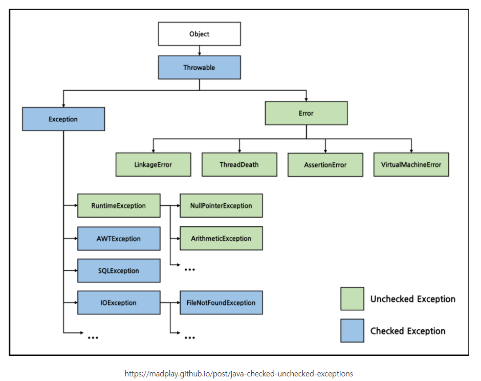
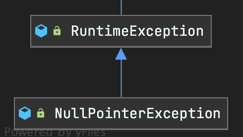

# 예외 처리

### JAVA 예외 계층 구조



자바의 모든 클래스의 조상은 **Object** 클래스이다.

**Throwable** 클래스도 Object 클래스를 상속받고 있다.

## Error(오류)

하드웨어의 오동작, 고장으로 인해 응용 프로그램 실행 오류가 발생하는 것. JVM 실행에 문제가 생겼다는 것이다. 메모리부족(OutOfMemoryError), 스택오버플로우(StackOVerFlowErro) 등이 있다. 개발자는 이런 에러에 대처할 방법이 없다.


## Exception(예외)

사용자의 잘못된 조작, 개발자의 잘못된 코딩으로 인해 발생할 수 있는 프로그램 오류. Exception은 Exception Handling을 통해 프로그램을 종료하지 않고 정상 실행 상태가 되도록 함.

#### Checked Exception vs Unchecked Exception

| Checked Exception                                            | Unchecked Exception                                          |
| ------------------------------------------------------------ | ------------------------------------------------------------ |
| 반드시 예외를 처리해야 함.                                   | 명시적인 처리를 강제하지 않음                                |
| 컴파일                                                       | 실행                                                         |
| Exception을 상속하는 하위 클래스 중 Runtime Exception을 제외한 모든 예외 | Exception을 상속한 하위 클래스 중 Runtime Exception 하위 예외 |
| IOException, SQLException                                    | NullPointerException, IndexOutOfBoundException               |

1. 예외가 발생하면 다른 작업 흐름으로 유도하는 **예외 복구**
2. 처리하지 않고 호출한 쪽으로 던져버리는 **예외처리 회피**
3. 호출한 쪽으로 던질 때 명확한 의미를 전달하기 위해 다른 예외로 전환하여 던지는 **예외 전환**

#### Compile Error

```java
public class Main{
    public static void main(String[] args){
        System.out.println("Hello World!")
        int a = "WW";
    }
}
```

#### Runtime Error

- NullPointerException

  ```java
  String nullptr = null;
  System.out.println(nullptr); // NullPointerException
  ```

- ArithmeticException

  ```java
  int a = 5/0; // ArithmeticException
  ```

  

## 예외 처리(Exception Handling)

> 일반적인 실행의 흐름을 바꾸는 몇가지 조건을 처리하도록 설계한 프로그래밍 언어의 개념이나 컴퓨터 하드웨어 구조.

#### C#에서의 예외처리

```C#
try {
  line = console.readLine();

  if (line.length() == 0) {
    throw new EmptyLineException("콘솔에서 읽어들인 줄이 비어 있습니다!");
  }

  console.printLine("안녕하세요, %s님!" % line);
  console.printLine("프로그램이 성공적으로 실행되었습니다");
}
catch (EmptyLineException e) {
  console.printLine("안녕하세요!");
}
catch (Exception e) {
  console.printLine("오류: " + e.message());
}
finally {
  console.printLine("프로그램이 지금 종료되었습니다");
}
```


## JAVA

### try

- 예외를 처리할 대상이 되는 코드를 입력하기 위해 사용
- 특별한 역할을 하지 않지만, catch, finally 블럭 필수로 필요

```java
private void process(String str) {
    try {
        System.out.println("str의 길이 : " + str.length());
    }// 컴파일 에러
} 
```

### catch

- try 블럭에서 발생한 예외 처리
- Throwable의 서브클래스 처리 가능
- try 블럭에서 throw 되면, 던져진 예외와 동일한 타입 혹은 예외의 슈퍼클래스가 파라미터로 있는 catch절로 들어감

```java
private void process(String str) {
    try {
        System.out.println("str의 길이 : " + str.length());
    } catch (NullPointerException e) {
        System.out.println("NullPointerException");
    }
}
```



NullPointerException은 RuntimeException의 자식 클래스


- 여러개를 추가하려면 catch 블럭을 여러개 쓰면 된다.

```java
 try {
        System.out.println("str의 길이 : " + str.length());
        System.out.println("list.get(1) : " + list.get(1)); // 요소가 없는 인덱스 접근
    } catch (NullPointerException e) {
        System.out.println("NullPointerException");
    } catch (IndexOutOfBoundsException e) {
        System.out.println("IndexOutOfBoundsException");
 }
```


### finally

- try 블럭의 코드를 정리하는데 사용
- finally는 무조건 실행됨. (중간에 catch로 빠지더라도)

```java
private void process(String str) {
    try {
        System.out.println("str의 길이 : " + str.length());
    } catch (NullPointerException e) {
        System.out.println("NullPointerException");
    } finally{
         System.out.println("finally");
    }
}
```


### throw

- 특정 시점에 예외를 던져서 호출한 곳에 예외를 알리는 것
- Exception을 포함한 하위 타입을 throw 가능
- getMessage() 메서드

```java
private void go(int a){
    if (a < 5){
        throw new IllegalArgumentException("a는 5 이상");
    }
    ...
}

try{
    go(4);
}catch (IllegalArgumentException e){
    System.out.println(e.getMessage());
}
```


### throws

- 메서드 시그니쳐에 사용 가능함.
- 해당 메서드를 호출하는 클라이언트에게 예외를 던진다.
- CheckException도 전달 가능. 
- 메서드 뒤에 예외 클래스 형태로 정의된다
- 여러 Exception을 던질 수 있다.

```java
void f1() throws SQLException { 
    // Do Someting..
} 

void f2() throws IOException, FileNotFoundException{ 
    // Do Someting.. 
}
```


### try-with-resources

- Exception시 리소스를 자동으로 close
- AutoCloseable 인터페이스를 구현한 객체여야 함
- java 7 부터

```java
try(FileOutputSTream out = new FileOutpuStream("file.txt")){
	// do something
}catch(IOException e){
	e.printStackTrace()l;
}
```


### 커스텀 예외 만들기

- Check Exception을 구현할 때는 Exception 확장

- Unchecked Exception을 구현할 때는 RuntimeException을 확장

  

추가적으로 4가지 Best Practices를 따르는 것이 좋다.

1. Java 표준 예외를 사용하는 것 보다 작성한 Custom 예외를 사용하는게 더 많은 이익을 얻는다고 생각할 경우에만 Custom Exception을 구현하자.
2. 작성한 Custom Exception 클래스의 이름의 끝은 "Exception"으로 끝나도록 하자.
3. API 메소드가 어떤 하나의 예외를 기술하고 있다면, 그 예외는 API의 한 부분이 되는 것이며 그 예외를 문서화 해야 한다.
4. 예외의 Cause 를 설정할 수 있는 생성자를 제공해야 한다.

```java
// Custom Runtime Exception 
public class NoSuchPostException extends Exception { 
    // Do SomeThing.. 
    public NoSuchPostException(String errorMessage) { 
        super(errorMessage); 
    } 
}
```


### 자바가 제공하는 기본 예외

##### Arithmetic Exception

산술연산에서 예외 조건이 발생했을 때 발생 ,  divide by zero

##### ArrayIndexOutOfBounds Exception

잘못된 인덱스로 Array에 엑세스 했을 경우 발생.

인덱스가 음수이거나 배열 크기보다 크거나 같을 때 발생

##### ClassNotFoundException

정의한 클래스를 찾을 수 없을 때 발생하는 예외

##### FileNotFoundException

파일에 엑세수 할 수 없거나 열리지 않을 경우 발생

##### IOException

입출력 작업이 실패하거나 중단될 때 발생

##### InterruptedException

Thread가 waiting, sleeping 또는 어던 처리를 하고 있을 떄 interrupt가 되면 발생하는 예외

##### NoSuchMethodException

찾을 수 없는 메서드에 엑세스 할 때 이 예외가 발생

##### NullPointerException

null 객체의 멤버를 참조할 때 발생

##### NumberFormatException

메서드가 문자열을 숫자 형식으로 변환할 수 없는 경우 발생

##### StringIndexOutOfBoundsException

문자열에 엑세스 하는 인덱스가 문자열보다 큰 경우거나 음수일 때 발생


## 참조

- https://ko.wikipedia.org/wiki/%EC%98%88%EC%99%B8_%EC%B2%98%EB%A6%AC
- https://www.notion.so/3565a9689f714638af34125cbb8abbe8
- https://github.com/highright96/java-livestudy/blob/main/live-study/week9/week9.md