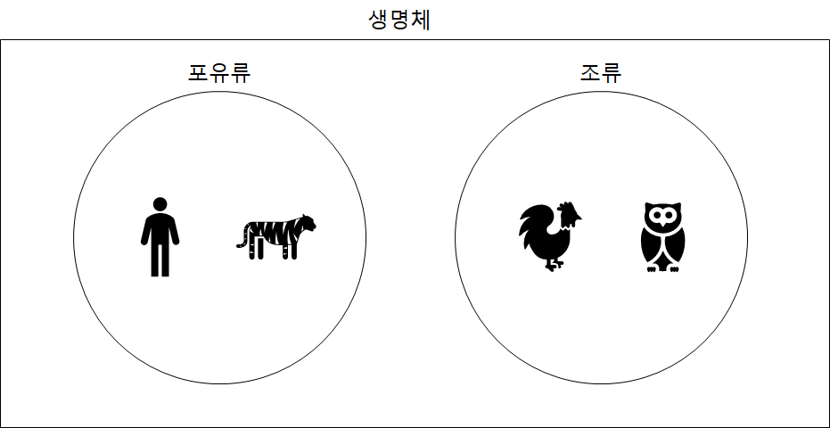
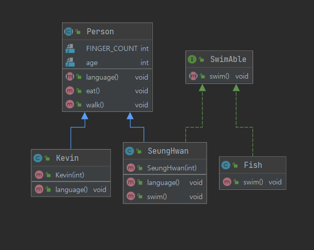

# 인터페이스

## 인터페이스를 정의/구현하는 방법

### 인터페이스란?

인터페이스는 일종의 추상 클래스

추상 클래스처럼 추상 메서드를 가지지만, 추상 클래스보다 추상화 정도가 높아서 **일반 메서드 또는 멤버 변수를 구성원으로 가질 수 없음** 

오직 **추상 메서드와 상수만을 멤버로 가질 수 있으며**, 그외의 어떤 다른 요소도 허용하지 않음 

※ 그러나 자바 8 부터는 default 키워드를 통해 일반 메서드가 구현 가능

### 인터페이스를 사용하는 이유

 먼저 추상 클래스와 인터페이스의 공통점과 차이점을 알아보자

> 추상(abstract)은 사물이 지니고 있는 여러가지 측면 가운데서, 특정한 측면만을 가려내어 포착하는 것이다. (위키백과)

실 세상에 존재하는 모든 객체를 구체적이고 상세하게 파악하는 것은 불가능, 따라서 우리는 **객체들에 대해서 공통점을 찾고, 그러한 공통점을 가지는 객체를 묶는 행위**를 **추상화**(일반화)라고 함



인간이라는 객체와 호랑이라는 객체가 있다고 가정 

이 둘은 다르지만, 공통점을 찾아서 그룹화하면 포유류라는 그룹에 속하는 것을 확인할 수 있음

마찬가지로 닭과 부엉이도 공통점을 찾아 조류로 그룹화할 수 있음

이렇게 객체의 개념을 이용하여 여러 그룹으로 분류할 수 있고, 다음과 같은 장점을 가짐

1. 객체 간의 차이점은 무시하고 객체들 간의 공통점을 파악하기 쉬움
2. 객체의 불필요한 세부사항을 제거함으로써 중요한 부분을 강조할 수 있음
3. 즉, 복잡한 프로그래밍을 단순화하고 분류화함으로써 유연한 관계를 만들어낼 수 있음

### 인터페이스 정의

인터페이스를 정의하는 것은 클래스를 작성하는 것과 같음, 다만 키워드를 class 대신 `interface` 키워드를 사용

```java
interface 인터페이스명 {
		public static final 타입 상수이름 = 값;
		public abstract 메서드이름(매개변수);
}
```

- 인터페이스는 static final 필드만 가질 수 있음 (필드를 선언할 때 public static final이 생략 되어있음)
- 인터페이스에 적는 모든 메서드들은 추상 메서드로 간주됨
- 인터페이스 내에 존재하는 메서드는 무조건 `public abstract`로 선언되며, 생략 가능
- 인터페이스 내에 존재하는 변수는 무조건 `public static final`로 선언되며, 생략 가능

### 인터페이스 구현

인터페이스는 구현한다는 의미의 키워드 `implements`를 사용

```java
public interface Animal {
    void sound(); // public abstract
}

public class Dog implements Animal{

    @Override
    public void sound() {
        System.out.println("멍멍");
    }
}

public class Lion implements Animal {

    @Override
    public void sound() {
        System.out.println("어흥");
    }
}
```

Animal 인터페이스에 정의된 sound() 메서드를 Dog와 Lion 클래스에서 구현할 때 접근 제어자가 public이라는 것이 중요!

 오버라이딩 할 때는 부모의 메서드보다 같거나 넓은 범위의 접근 제어자를 지정

### 추상 클래스 vs 인터페이스

**공통점**

- 자기 자신을 객체화할 수 없으며(인스턴스를 생성할 수 없으며) 다른 객체가 상속(extends), 구현(implements)을 하여 객체를 생성할 수 있음
- 상속, 구현을 한 하위 클래스에서는 상위에서 정의한 추상 메서드를 반드시 구현해야함

```java
/* 추상 클래스 */
public abstract class Person {

    public final int FINGER_COUNT = 10; // 상수를 가질 수 있음
    public int age; // 변수를 가질 수 있음

    public abstract void language(); // 추상 메서드

    // 일반 메서드 구현 가능
    public void eat() {
        System.out.println("나는 음식을 입으로 먹는다.");
    }

    public void walk() {
        System.out.println("나는 두 다리로 걷는다.");
    }
}

/* 인터페이스 */
public interface SwimAble {
    void swim(); // public abstract
}
```

**차이점**

추상 클래스

- 다중 상속 불가능
- 상수, 변수 필드 포함가능
- 일반 메서드 포함가능

인터페이스

- 다중 상속 가능
- 상수 필드만 포함 가능
- 모든 메서드는 추상메서드                                                          (자바 8 이후부터는 default, static 메서드 추가 가능)

**추상 클래스는 IS - A( ~는 ~이다.)** 의 개념

→ SeungHwan(승환)은 사람이다.

**인터페이스는 HAS - A(~는 ~를 할 수 있다.)** 의 개념

→ SeungHwan(승환)은 수영을 할 수 있다.

## 인터페이스 레퍼런스를 통해 구현체를 사용하는 방법

다형성을 공부하면 자식 클래스의 인스턴스를 부모 타입의 참조 변수로 참조하는 것이 가능하다는 것을 알 수 있다.

인터페이스도 이를 구현한 클래스의 부모이므로 해당 인터페이스 타입의 참조 변수로 클래스의 인스턴스를 참조할 수 있고, 인터페이스 타입으로 형변환도 가능

```java
// 위의 '인터페이스 구현' 코드와 이어진다.
public class Dog implements Animal{

    @Override
    public void sound() {
        System.out.println("멍멍");
    }

		public void sleep() {
        System.out.println("새근새근 잡니다.");
    }
}

public class Lion implements Animal {

    @Override
    public void sound() {
        System.out.println("어흥");
    }

		public void hunting() {
        System.out.println("사냥을 합니다.");
    }
}
```

```java
public static void main(String[] args) {
        Animal dog = new Dog();
        Animal lion = new Lion();

        dog.sound();
        lion.sound();

//        부모 클래스(Animal 인터페이스)를 바라보고 있으므로, 
//        각각의 구현 클래스에서 생성 구현된 메서드를 사용할 수 없음
//        dog.sleep();
//        lion.hunting();

        // 아래와 같이 다운캐스팅 해줘야함
        ((Dog)dog).sleep();
        ((Lion)lion).hunting();
    }
```

또한, 객체의 상세정보를 제외하고 분류를 통해 정의에 중요한 부분을 강조할 수 있음

```java
// '추상 클래스 vs 인터페이스' 코드와 이어집니다.
public class Kevin extends Person {

    public Kevin(int age) {
        this.age = age;
    }
    
    @Override
    public void language() {
        System.out.println("I speak English");
    }
}

public class Fish implements SwimAble {

    @Override
    public void swim() {
        System.out.println("나는 헤엄을 엄청 잘한다.");
    }
}

public class SeungHwan extends Person implements SwimAble {

    public SeungHwan(int age) {
        this.age = age;
    }

    @Override
    public void language() {
        System.out.println("I speak Korean");
    }

    @Override
    public void swim() {
        System.out.println("나는 자유형을 잘한다.");
    }
}
```

객체들의 다이어그램은 다음과 같다.



SeungHwan이라는 객체는 다이어그램을 보면 Person 그룹에도 속할 수 있고 SwimAble 그룹에도 속할 수 있다. 

따라서 다음과 같은 코드를 작성할 수 있음

```java
public static void main(String[] args) {
        SeungHwan seungHwan = new SeungHwan(27);
        Kevin kevin = new Kevin(25);
        Fish fish = new Fish();

        // Person 그룹
        List<Person> people = new ArrayList<>();
        people.add(seungHwan);
        people.add(kevin);
        for (Person person : people) {
            person.language();
            person.walk();
            person.eat();
        }

        // SwimAble 그룹
        List<SwimAble> swimAbles = new ArrayList<>();
        swimAbles.add(seungHwan);
        swimAbles.add(fish);

        for (SwimAble swimAble : swimAbles) {
            swimAble.swim();
        }
    }
```

## 인터페이스 상속

다중 상속이 불가능한 자바에서 인터페이스는 예외로 다중 상속이 가능

즉, 여러 개의 인터페이스로부터 상속받는 것이 가능하다. (인터페이스는 인터페이스로부터만 상속받을 수 있음)

```java
// 기존 코드에서 추가
public interface Freestyle {
    void freestyle(); // public abstract
}

public interface ButterflyStroke extends SwimAble, Freestyle { // 다중 상속
    void butterflyStroke(); // public abstract
}

// 수정
public class SeungHwan extends Person implements ButterflyStroke { 

    public SeungHwan(int age) {
        this.age = age;
    }

    @Override
    public void language() {
        System.out.println("저는 한국어를 사용합니다.");
    }

    @Override
    public void swim() {
        System.out.println("수영을 합니다.");
    }

    @Override
    public void butterflyStroke() {
        System.out.println("접영을 합니다.");
    }

    @Override
    public void freestyle() {
        System.out.println("자유형을 합니다.");
    }
}
```

또한, 인터페이스는 다중 구현이 가능한데 다음 코드를 살펴보자

```java
// 기존 코드에서 추가
public interface Programming {
    void programming(); // public abstract
}

// 수정 -> 승환이는 사람이면서 수영과 프로그래밍이 가능하다.
public class SeungHwan extends Person implements ButterflyStroke, Programming {

    public SeungHwan(int age) {
        this.age = age;
    }

    @Override
    public void language() {
        System.out.println("저는 한국어를 사용합니다.");
    }

    @Override
    public void swim() {
        System.out.println("수영을 합니다.");
    }

    @Override
    public void butterflyStroke() {
        System.out.println("접영을 합니다.");
    }

    @Override
    public void freestyle() {
        System.out.println("자유형을 합니다.");
    }

    @Override
    public void programming() {
        System.out.println("코딩을 합니다.");
    }
}
```

## 인터페이스의 기본 메서드 (Default Method), 자바 8

인터페이스는 기능에 대한 선언만 가능하기 때문에 실제 코드를 구현한 로직은 포함할 수 없었다. 

그러나 자바 8에서 이러한 룰을 깨트리는 default method 탄생

 메서드 선언시 default를 명시하게 되면, 인터페이스 내부에서도 코드가 포함된 메서드를 선언할 수 있다.

접근제어자에서 사용하는 default와 같은 키워드이지만, **접근 제어자는 아무것도 명시하지 않은 제어자를 default**라 하고, **인터페이스의 default method는 `default` 라는 키워드를 명시**

```java
interface MyInterface {
		// 인터페이스 내부에 코드를 구현할 수 있다.
		default void printHello() {
				System.out.println("Hello World!");
		}
}
```

인터페이스는 기능에 대한 구현보다 기능에 대한 선언에 초점을 맞추어서 사용하는데, 왜 default 메서드가 탄생하게 되었을까?

> ...(중략)... 바로 "하위 호환성"때문이다. 예를 들어 설명하자면, 여러분들이 만약 오픈 소스코드를 만들었다고 가정하자. 그 오픈소스가 엄청 유명해져서 전 세계 사람들이 다 사용하고 있는데, 인터페이스에 새로운 메소드를 만들어야 하는 상황이 발생했다. 자칫 잘못하면 내가 만든 오픈소스를 사용한 사람들은 전부 오류가 발생하고 수정을 해야 하는 일이 발생할 수도 있다. 이럴 때 사용하는 것이 바로 default 메소드다. (자바의 신 2권)

기존에 존재하던 인터페이스를 이용하여 구현된 클래스를 만들고 있는데, 인터페이스를 보완하는 과정에서 추가적으로 구현해야 할 혹은 필수적으로 존재해야 할 메서드가 있다면, 이미 인터페이스를 구현한 클래스와의 호환성이 떨어지게 된다. 이러한 경우 default 메서드를 추가하게 된다면 하위 호환성은 유지되고 인터페이스의 보완을 진행할 수 있다.

- 인터페이스에서도 메서드 구현이 가능
- 참조 변수로 함수를 호출할 수 있음
- implements한 클래스에서 오버라이딩 가능

## 인터페이스의 static 메서드, 자바 8

인스턴스 생성과 상관없이 인터페이스 타입으로 호출하는 메서드

static 키워드를 사용하고, 접근 제어자는 항상 public이며 생략 가능

body가 있어야 하며 implements한 곳에서 오버라이딩 할 수 없음

```java
public interface Programming {
    void programming(); // public abstract

    default void application() {
        System.out.println("애플리케이션을 만듭니다.");
    }

    static void study() {
        System.out.println("프로그래밍을 공부합니다.");
    }
}

```

static 메서드를 사용할 때 주의점은 `인터페이스명.메서드`로 호출해야 함

## 인터페이스의 private 메서드, 자바 9

자바 9에서는 private 메서드와 private static 메서드가 추가

자바 8의 새로운 기능인 default method와 static 메서드는 단지 특정 기능을 처리하는 내부 메서드인데, 외부에 공개되는 public 메서드로 만들어야 하는 점이 단점

 즉, 인터페이스를 구현하는 다른 인터페이스 혹은 클래스가 해당 메서드에 액세스 하거나 상속할 수 있는 것을 원하지 않아도 그렇게 될 수 있음

위와 같은 문제점을 해결하기 위해서 다음과 같은 기능이 추가되었고, 이를 통해 코드의 중복을 피하고 인터페이스에 대한 캡슐화를 유지할 수 있게 되었음

```java
public interface Programming {
    void programming(); // public abstract

    default void application() {
        System.out.println("애플리케이션을 만듭니다.");
    }

    static void study() {
        System.out.println("프로그래밍을 공부합니다.");
    }

		private void debug() {
				System.out.println("디버깅을 합니다.");
		}		
}
```
