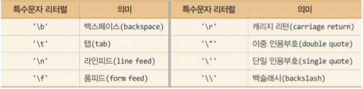

# 프리미티브 타입 종류와 값의 범위 그리고 기본 값

|        | 타입    | 메모리 크기 | 기본값   | 데이터의 표현 범위                                     |
| ------ | ------- | ----------- | -------- | ------------------------------------------------------ |
| 논리형 | boolean | 1 byte      | false    | true, false                                            |
| 정수형 | byte    | 1 byte      | 0        | -128 ~ 127                                             |
|        | short   | 2 bytes     | 0        | -32,768 ~ 32,767                                       |
|        | int     | 4 bytes     | 0        | -2,147,483,648 ~ 2,147,483,647                         |
|        | long    | 8 bytes     | 0L       | -9,223,372,036,854,775,808 ~ 9,223,372,036,854,775,807 |
| 실수형 | float   | 4 bytes     | 0.0F     | (3.4 X 10-38) ~ (3.4 X 1038) 의 근사값                 |
|        | double  | 8 bytes     | 0.0      | (1.7 X 10-308) ~ (1.7 X 10308) 의 근사값               |
| 문자형 | char    | 2 bytes     | '\u0000' | 0 ~ 65,535                                             |

# 프리미티브 타입과 레퍼런스 타입

- Primitive type(기본형 타입)
  - 8가지 기본형 타입을 미리 정의하여 제공
  - object가 아님(Null 제공X)
  - 스택 메모리에 저장
- Reference type(참조형 타입)
  - class, interface, enum, array, String 등
  - 값이 저장되어 있는 곳의 주소 값을 저장
    - 주소 값은 **스택 공간**, 실제 객체는 **힙 공간**에 저장
  - 빈 값을 의미하는 Null 존재

# 리터럴

리터럴은 변수나 상수에 저장되는 값 그 자체를 의미

### 정수 리터럴

```JAVA
 int decimal = 26;	   // 일반적인 형태 10진법
int ocatal = 032;        // 제일 앞에 0 이 붙으면 8진법
int heaxaDecimal = 0x1a; // 0x가 붙으면 16진법
int binary = 0b11010;    // 0b가 붙으면 2진법
```

long 타입을 표현할 때는 마지막에 l이나 L을 붙임

### 실수 리터럴

```JAVA
double a = 0.1;				// 0.1
double b = 1E-1;			// 0.1
float c = 0.1f;				// 0.1
```

### 문자 리터럴

문자열은 작은따옴표(`)안에 표현

```JAVA
char a = 'a';
```

또한 특수문자 리터럴도 존재



### 문자열 리터럴

문자열은 큰따옴표(")안에 표현

```JAVA
String a = "abc";
```

문자열은 프리미티브 타입이 아닌, **레퍼런스 타입**이며 String에 값을 주면 Heap 영역에 String constant pool 이라는 특수한 영역에 값이 저장된다.
그리고 동일한 값을 쓰는 경우에 String constant pool 에 존재하는 값을 참조한다.

### boolean 리터럴

```JAVA
boolean a = true;
boolean b = false;
```

# 변수 선언 및 초기화 방법

```JAVA
int a; // 선언
a = 10 // 초기화
int b = 10; 선언과 초기화
```

# 변수의 스코프와 라이프 타임

### 스코프

**변수에 접근하거나 접근할 수 있는 유효 범위/영역**
일반적으로 변수가 선언된 블록내에서만 접근 가능

### 라이프 타임

변수가 메모리에 살아있는 시간

### Instance Variables

스코프: static method를 제외한 클래스 전체

라이프 타임: 객체가 메모리에 있는 동안

### Class Variables

변수에 static을 붙여 사용

스코프: 클래스 전체

라이프 타임: 프로그램 종료시까지

### Local Variables

스코프: 선언된 블록

라이프 타임: 블록에서 벗어날 때 까지

# 타입 변환, 캐스팅 그리고 타입 프로모션

### 타입 캐스팅

크기가 더 큰 자료형을 크기가 작은 자료형에 대입하는 것을 의미  
변환 과정에서 데이터 손실이 올 수 있음

### 타입 프로모션

크기가 더 작은 자료형을 크기가 더 큰 자료형에 대입하는 것을 의미
변환 과정에서 데이터 손실이 오지 않음

### ※ 레퍼런스 타입간에 변환은 데이터 손실이 오지 않음

# 1차 및 2차 배열 선언하기

```JAVA
// 1차원 배열 선언 방법
int[] arr = new int[3]
int[] arr = new int[]{1, 2, 3}
int[] arr = {1, 2, 3}

// 2차원 배열 선언 방법
int[][] arr = new int[2][3];
int[][] arr = new int[][]{ {1, 2, 3}, {4, 5, 6} };
int[][] arr = { {1, 2, 3}, {4, 5, 6} };
```

# 타입 추론, var

타입 추론은 변수의 타입을 명시하지 않고 컴파일러가 타입을 추측함  
지역 변수에서만 사용이 가능

```JAVA
var a = "hello";
var b = 10;
```
