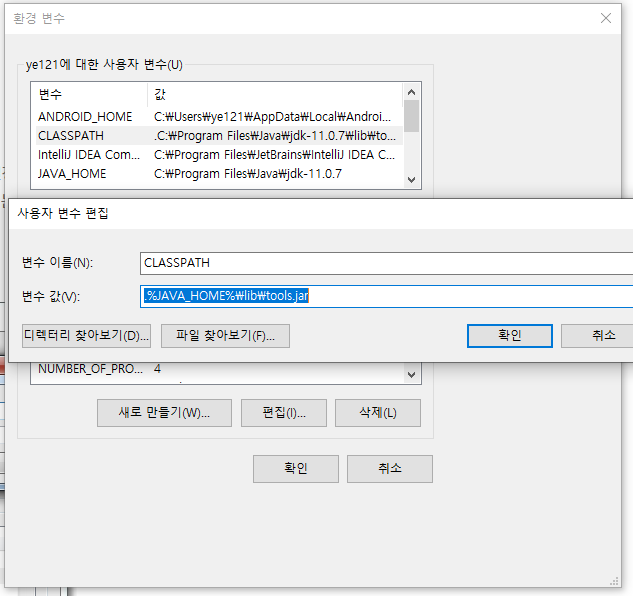
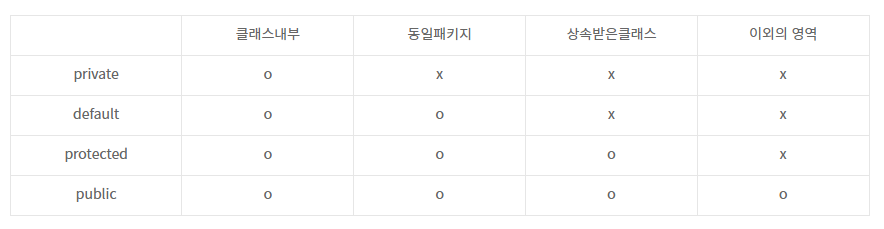

# 패키지

## package 키워드

자바의 패키지는 클래스의 묶음으로서 하나의 디렉토리(폴더)이다.  
보통 기능이나 특징이 비슷한 클래스를 모아 하나의 패키지 안에 넣는다.  
또한 패키지 안에 하위 패키지를 포함하는 중첩된 구조도 가능하다.

```java
package animal; // 코드 맨 위에 package 선언

// 동물 패키지 안 고양이 클래스
public class Cat {
    private String name;
    private int weight;
    private String gender;
    private String color;

    public Cat(String name, int weight, String gender, String color) {
        this.name = name;
        this.weight = weight;
        this.gender = gender;
        this.color = color;
    }

    public String getName() {
        return this.name;
    }

    public int getWeight() {
        return this.weight;
    }

    public String getGender() {
        return this.gender;
    }

    public String getColor() {
        return this.color;
    }

    public void cry() {
        System.out.println("야옹~");
    }
}
```

### Built-in 패키지

사용자 정의 패키지 이름은 java로 선언할 수 없다. 왜냐하면 java라는 기본 빌트인 패키지가 존재하기 때문

- **java.lang:** language support 클래스를 포함하는 패키지
  - java.lang.String
    - String s = new String();
  - java.lang.System
    - System.out.println()
- **java.io:** 입출력 기능을 지원하는 클래스를 포함하는 패키지
- **java.util:** 자료구조 구현을 위한 유틸리티 클래스를 포함하는 패키지
  - Linked List, Dictionary...
  - Date, Time

java 패키지는 import 없이 사용할 수 있다. 그말은 즉슨 사용자 정의 패키지를 사용하려면 import 키워드를 사용해야 한다는 말.

## import 키워드

만들어진 패키지에 클래스를 다른 코드에서 사용하고 싶을 때 사용한다.  
_import packageName.className_ 과 같은 형식으로 패키지를 불러온다.

```java
import animal.Cat; // animal 패키지에 Cat 클래스 불러오기

public class Test {
    public static void main(String[] args) {
        Cat myCat = new Cat("야옹이", 15, "수컷", "빨강");
        System.out.println(myCat.getName()); // 야옹이
        myCat.cry(); // 야옹
    }
}
```

만약 패키지 안 모든 클래스를 불러오고 싶다면?  
_import packageName.\*_

## 클래스패스

**클래스를 찾기위한 경로**  
JVM에서 프로그램을 실행할 때, 클래스 파일을 찾는데 기준이 되는 파일 경로를 말한다.

1. 소스 코드(.java)를 컴파일하면 바이트 코드 생성(.class)
2. java runtime으로 이 바이트 코드를 실행하려면 이 파일을 찾아야 함
3. 이 때 classpath에 지정된 경로에서 파일을 찾게됨

### 클래스패스를 지정할 수 있는 방법 두가지

- 환경 변수 CLASSPATH를 사용하는 방법
- java runtime에 -classpath 플래그를 사용하는 방법

## CLASSPATH 환경변수



※ 리눅스에선 export 명령어 사용

## -classpath 옵션

클래스패스를 임의로 지정하는 방법  
만약 Test.java 파일이 C:\Java 디렉터리에 존재하고,  
필요한 클래스 파일들이 C:\Java\classes에 위치한다면,  
_javac -classpath C:\Java\classes C:\Java\Test.java_ 로 해주면 된다.

## 접근지시자

클래스, 메소드, 인스턴스 및 클래스 변수를 선언할 때 사용한다.

- **public:** 누구나 접근 가능
- **protected:** 같은 패키지에 있거나, 상속 받는 경우에만 사용 가능
- **package-private:** 같은 패키지 내에서만 접근 가능
- **private:** 해당 클래스 내에서만 접근 가능



만약 private 변수를 외부에서 접근하려고 하면?

```java
import animal.Cat; // animal 패키지에 Cat 클래스 불러오기

public class Test {
    public static void main(String[] args) {
        Cat myCat = new Cat("야옹이", 15, "수컷", "빨강");
        System.out.println(myCat.getName()); // 야옹이
        myCat.cry(); // 야옹

        System.out.println(myCat.name); // java: name is not public in animal.Cat; cannot be accessed from outside package
    }
}
```

> reference
>
> - https://kils-log-of-develop.tistory.com/430
> - https://jjunbbang.tistory.com/8
> - https://gyucheolk.tistory.com/12
