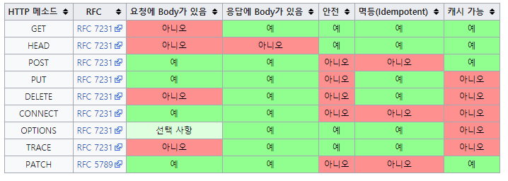
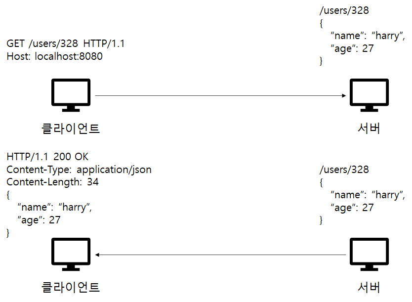
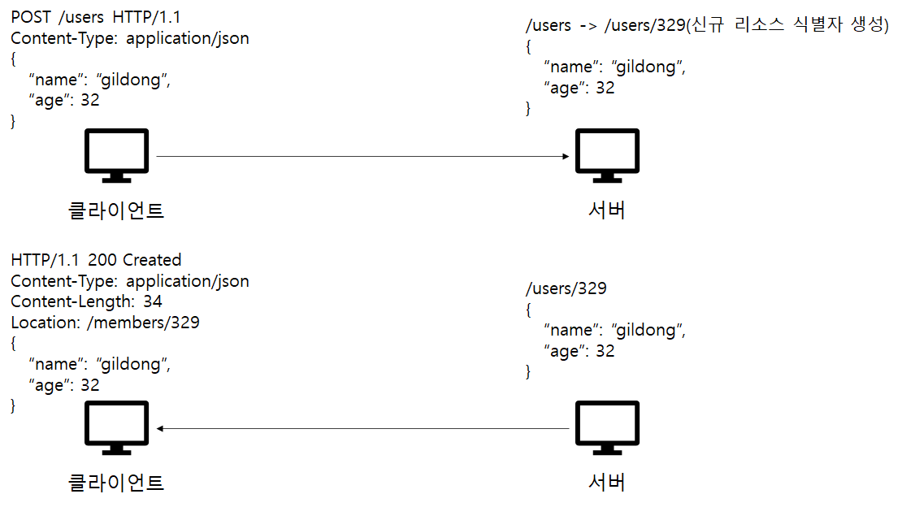
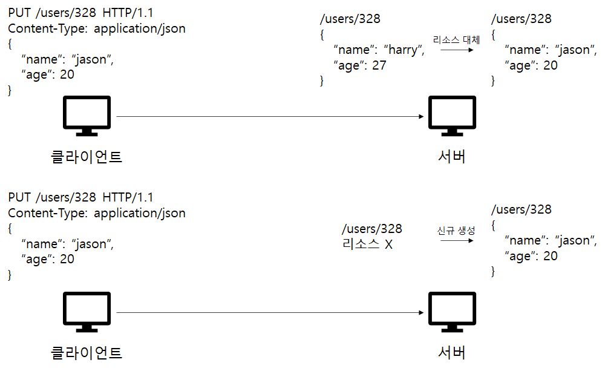
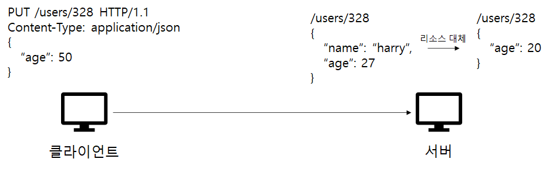
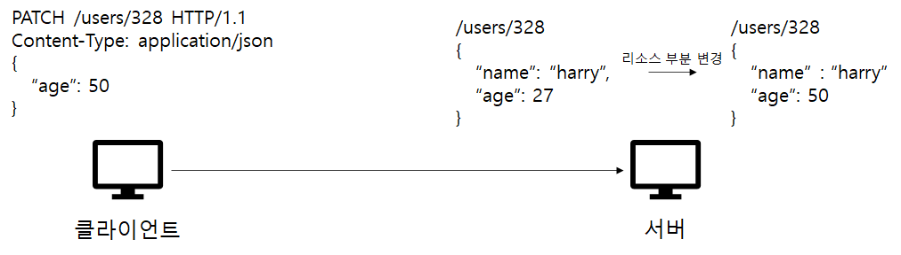
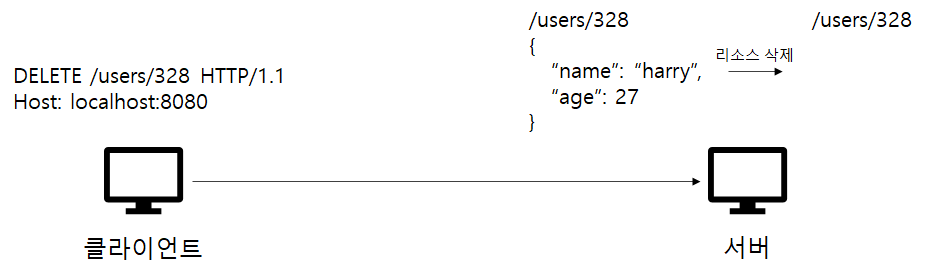

# GET vs POST

## REST API(REpresentational State Transfer)

HTTP 통신에서 어떤 자원에 대한 CRUD 요청을 Resource와 Method로 표현하여 특정한 형태로 전달하는 방식으로, REST API는 아래와 같은 것들로 구성입니다.

- 자원(Resource)
- **메서드(Method)**
- 표현(Representation of Resource)

이 중에서 HTTP 메서드에는 여러가지 종류가 존재하는데, GET과 POST 방식이 무엇인지, 이 둘의 차이점이 무엇인지 중점적으로 알아보고, PUT, PATCH. DELETE 등 다른 메서드들에 대해서도 알아보는 시간을 가져보려고 합니다.   

## HTTP 메서드의 속성

- 안전(Safe) : 호출해도 리소스를 변경하지 않음
- 멱등(Idempotent) : 여러번 호출해도 같은 결과를 가져옴
- 캐시가능(Cacheable) : 응답 결과를 캐시해서 사용할 수 있음

GET, HEAD 등과 같은 읽기 작업에 사용되는 메서드들은 호출해도 리소스를 변경하지 않으므로 안전합니다. 그러나 POST, PUT, DELETE 등과 같은 메서드들은 리소스를 수정하거나 삭제하므로 안전하지 않습니다.

마찬가지로 GET, HEAD 등과 같은 메서드들은 읽기 작업에 사용되므로 여러번 호출해도 같은 결과를 가져오므로 멱등합니다. 또한 PUT, DELETE 등과 같은 메서드들도 리소스를 덮어 쓰거나 삭제한 후 같은 결과를 반환하므로 멱등합니다. 그러나 POST 같은 경우, 호출할 때마다 새로운 리소스를 생성하므로 다른 결과를 반환합니다. 따라서 멱등하지 않습니다.   

※ PATCH 같은 경우 멱등하지 않다고 표에 나와있는데, 이는 해당 [링크](https://kscodebase.tistory.com/332)를 참조하면 도움이 될 것 같습니다.

※ 멱등은 외부 요인으로 중간에 리소스가 변경되는 것 까지 고려하지 않음   

## GET

- 리소스를 읽거나 검색할 때 사용하는 메서드
- 서버에 전달하고 싶은 데이터는 쿼리(쿼리 파라미터, 쿼리 스트링)를 통해서 전달
- 메세지 바디를 사용해서 전달할 수 있으나, 지원하지 않는 곳이 많아서 권장하지 않음
- GET같은 경우 읽기 작업에만 사용되기 때문에, 호출해도 리소스 결과를 변경하지 않음 → 안전
- 또한 같은 요청을 여러번 하더라도 변함없이 항상 같은 응답을 받을 수 있음 → 멱등
- 위의 안전한 특성 덕분에 캐싱이 가능함

328번 회원의 정보를 조회한다고 가정할 때, GET을 사용합니다. 328번이라는 리소스를 서버에 전달하기 위해서 url에 담고 요청을 보내면, 서버에서 요청을 받아 적절한 데이터를 찾아냅니다. 그리고 클라이언트로 응답을 보내는데, 이때 반환하는 데이터의 타입이 무엇인지, 길이가 얼마나 되는지 등의 정보와 함께 요청한 데이터를 사용자에게 반환하게 됩니다.   

## POST

- 주로 새로운 리소스를 생성하거나, 프로세스를 처리할 때 사용하는 메서드
- 메세지 바디를 통해 서버로 요청 리소스를 전달(메세지 바디를 통해 들어온 데이터를 처리하는 모든 기능을 수행)
- 다른 메서드로 처리하기 애매한 경우, 애매하면 POST
- POST같은 경우 새로운 리소스를 생성하므로 리소스가 매번 변경됨 → 안전 X
- 또한 같은 요청을 여러번 했을 때 다른 결과물이 나올 수 있음 → 멱등 X
- 멱등하지 않기 때문에 캐싱이 어려움

이름이 gildong이고 나이가 34인 신규 회원을 등록한다고 할 때, POST를 사용합니다 HTTP 메세지 바디에 리소스들을 담아서 서버로 요청을 보내면, 데이터베이스에 신규 회원 등록을 하고 신규 리소스 식별자를 생성합니다. 그리고 클라이언트로 응답을 보내는데, 이 때 Location을 통해 해당 자원이 생성된 경로를 보내주고 등록된 데이터도 함께 보내줍니다.   

## PUT

- 기존 리소스가 존재하면 대체하고, 없다면 새로 생성할 때 사용하는 메서드
- 클라이언트가 리소스 위치를 알고 URI를 지정한다는 점에서 POST와 차이 존재(POST에서는 URI의 결정권이 서버에 있음)

기존의 328번 회원이 존재한다고 가정하고, 이 회원의 이름과 나이를 변경할 때 PUT을 사용합니다. 리소스가 존재하므로 새로운 이름인 jason과 나이 20이 새롭게 대체됩니다. 만약 328번 회원이 존재하지 않는다면, POST처럼 신규 회원을 생성하게 됩니다.

그러나 PUT 메서드를 사용할 때는 위와 같은 경우를 주의해야합니다. 만약 name 필드 없이 age 필드의 값만 변경하면, 리소스가 대체 될 때 name 필드가 아예 삭제될 수 있습니다. 따라서 부분적인 변경이 필요할 때는 PATCH 메서드를 사용하는 것을 권장합니다.   

## PATCH

- 기존에 존재하는 리소스를 부분적으로 변경할 때 사용하는 메서드

   

## DELETE

- 리소스를 삭제할 때 사용하는 메서드

   

## ETC

- HEAD : GET과 동일하지만 메세지 부분을 제외하고, 상태 줄과 헤더만을 반환
- OPTIONS : 대상 리소스에 대한 통신 가능 옵션(메서드)을 설명(주로 CORS에서 사용)
- CONNECT : 대상 자원으로 식별되는 서버에 대한 터널을 설정
- TRACE : 대상 리소스에 대한 경로를 따라 메세지 루프백 테스트를 수행     

> Reference

[[HTTP] HTTP Method 정리 / GET vs POST 차이점](https://im-developer.tistory.com/166)

[REST API 제대로 알고 사용하기 : NHN Cloud Meetup](https://meetup.toast.com/posts/92)

[HTTP Methods](https://restfulapi.net/http-methods/)

[What is Idempotency? - API Blog: Everything You Need to Know](https://blog.dreamfactory.com/what-is-idempotency/)

[Difference between idempotent and safe HTTP methods in REST APIs](https://stackoverflow.com/questions/56729786/difference-between-idempotent-and-safe-http-methods-in-rest-apis)
