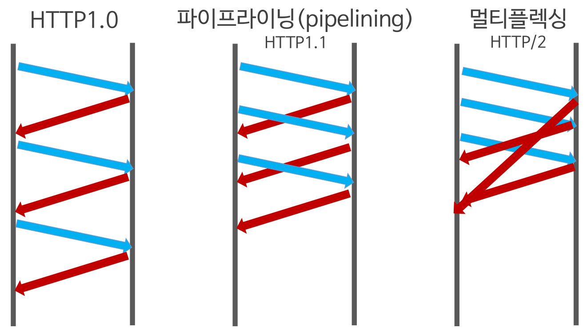
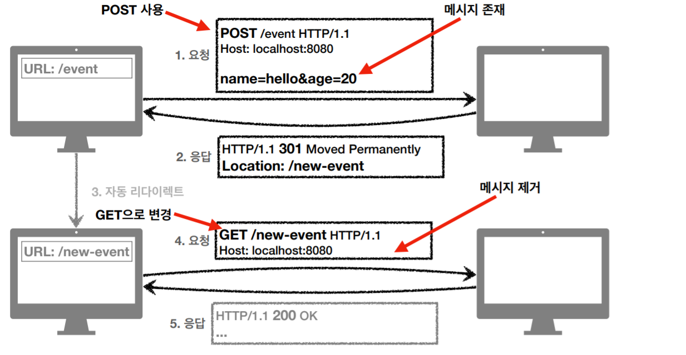
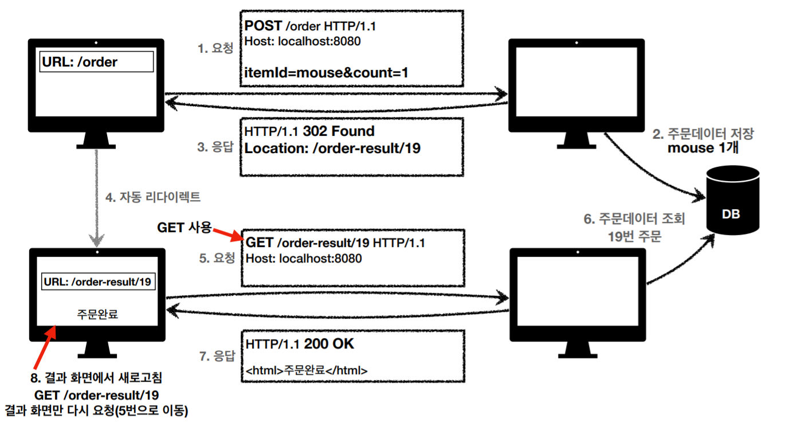

# HTTP

> HyperText Transfer Protocol

## HTTP 동작

- Request : Client -> Server

  - **GET** : 자료를 **요청**할 때 사용
  - **POST** : 자료의 **생성**을 요청할 때 사용
  - **PUT** : 자료의 **수정**을 요청할 때 사용
  - **DELETE** : 자료의 **삭제**를 요청할 때 사용

  ```text
  GET https://www.naver.com HTTP/1.1								// 시작줄
  User-Agent: Chrome/5.0 (Windows NT 10.0; Win64; x64) ...			  // 헤더 
  ```

- Response : Server -> Client

  ```text
  HTTP/1.1 200 OK														// 시작줄
  Connection: keep-alive												 // 헤더			 
  Content-Length: 21211
  Content-Type: text/html;
  
  <!DOCTYPE html><html><head><title...
  ```

  

HTML 뿐만 아니라, JSON, XML 같은 형태의 정보도 주고받을 수 있음.


## HTTP 특징

- 클라이언트 - 서버 구조
  - 비즈니스 로직, 데이터는 **서버**
  - UI는 **클라이언트** 에 집중시킬 수 있음
- TCP / IP를 이용하는 Application Layer Protocol
- Connectionless Protocol
  - 장점
    - 수많은 요청 처리 가능
  - 단점
    - 매번 연결을 새로 맺기 때문에 3 way handshake 시간 추가
    - html, js, css 수많은 자원이 함께 다운로드 됨
  - http 2.0, 3.0에서 최적화
- Stateless
  - 서버가 클라이언트의 상태를 저장하지 않음
  - scale out에 유리
  - 클라이언트가 추가 데이터를 전송해야함.


## HTTP 버전

### HTTP / 0.9 - 원 라인 프로토콜

- 초기 버전

- GET이 유일

- 요청

  ```
  GET /mypage.html
  ```

- 응답

  ```
  <HTML>
  A very simple HTML page
  </HTML>
  ```

  

### HTTP / 1.0 - 확장성 [RFC 1945](https://tools.ietf.org/html/rfc1945)

- 1996년 11월

- 버전 정보도 함께 전송

- HTML 파일 외 다른 문서 전송

- 요청

  ```
  GET /mypage.html HTTP/1.0
  User-Agent: NCSA_Mosaic/2.0 (Windows 3.1)
  ```

  - 헤더 개념 도입 -> 메타데이터 전송, 확장성

- 응답

  ```
  200 OK
  Date: Tue, 15 Nov 1994 08:12:31 GMT
  Server: CERN/3.0 libwww/2.17
  Content-Type: text/html
  <HTML>
  A page with an image
    
  </HTML>
  ```

  - 성공과 실패 여부를 알수 있게 됨
  - Content-Type

### HTTP / 1.1 - 표준 프로토콜 [RFC 2068](https://tools.ietf.org/html/rfc2068)

- 1.0이 나온지 몇달 후 공개(1997년 초)

- 커넥션이 재사용될 수 있게 함 -> 사용된 커넥션을 다시 열어 시간 절약

- 파이프라이닝 추가 -> 첫번째 요청에 대한 응답이 전송되기 전에 두번째 요청 전송 가능

- 캐시 제어

- Host 헤더

- 요청

  ```
  GET /en-US/docs/Glossary/Simple_header HTTP/1.1
  Host: developer.mozilla.org
  User-Agent: Mozilla/5.0 (Macintosh; Intel Mac OS X 10.9; rv:50.0) Gecko/20100101 Firefox/50.0
  Accept: text/html,application/xhtml+xml,application/xml;q=0.9,*/*;q=0.8
  Accept-Language: en-US,en;q=0.5
  Accept-Encoding: gzip, deflate, br
  Referer: https://developer.mozilla.org/en-US/docs/Glossary/Simple_header
  ```

- 응답

  ```
  200 OK
  Connection: Keep-Alive
  Content-Encoding: gzip
  Content-Type: text/html; charset=utf-8
  Date: Wed, 20 Jul 2016 10:55:30 GMT
  Etag: "547fa7e369ef56031dd3bff2ace9fc0832eb251a"
  Keep-Alive: timeout=5, max=1000
  Last-Modified: Tue, 19 Jul 2016 00:59:33 GMT
  Server: Apache
  Transfer-Encoding: chunked
  Vary: Cookie, Accept-Encoding
  ```

- 보안 전송 SSL-> TLS로 진화
- https://luavis.me/server/tls-1.3

##### CORS : 시스템 수준에서 타 도메인 간 자원 호출을 승인하거나 차단하는 것을 결정하는 것

##### CSP :  XSS나 데이터 주입과 같은 특정 웹사이트 관련 공격을 탐지 하거나 완화 하기 위해 사용

### HTTP / 2.0 - 성능 개선

- 2010년 초 SPDY

- 병렬 요청이 동일한 커넥션 상에서 다루어질 수 있는 다중화 프로토콜

- 코스요리 vs 한번에 다나오는요리

- HTTP/1.1 제약사항 개선(HOL 블로킹 문제)

  > HOL(Head-of-Line) Blocking: 컴퓨터 네트워킹에서 패킷 대기열이 존재 할 때, 앞선(Head) 패킷이 지연될 때 발생하는 성능 저하 현상

-  Multiplexed Streams

  - 한 Connection으로 동시에 여러 개 메시지를 주고 받을 수 있으며, Response는 순서에 상관없이 stream으로 주고받는다.

   Stream Prioritization

  - 리소스간 우선순위를 설정해 클라이언트가 먼저 필요한 리소스부터 보내준다.

 - Server Push

     - 서버는 클라이언트의 요청에 대해 요청하지 않은 리소스를 마음대로 보내줄 수 있다.

  - 즉, 클라이언트가 요청하기 전에 필요하다고 예상되는 리소스를 Server에서 먼저 요청한다. 예) http만 요청했는데 http와 css, js, image를 함께 전송해주는 등

 - Header Compression

     - Header table과 Huffman Encoding 기법(HPAC 압축방식)을 이용해 압축했다.
     - 이전 Header의 내용과 중복되는 필드를 재전송하지 않아 데이터를 절약했다.




## HTTP 상태코드

#### 1xx (Informational) - 요청이 수신되어 처리중

- 거의 사용 x

#### 2xx(Successful) - 클라이언트의 요청을 성공적으로 처리

- 200 OK : 요청 성공
- 201 Created : 요청 성공해서 새로운 리소스 생성
- 202 Accepted : 요청 접수, 처리 미완료
- 204 No content : 요청 성공, 응답 페이로드 본문에 보낼 데이터가 없음
  - 웹문서 편집기 save 버튼

#### 3xx(Redirection) - 요청을 완료하기 위해 추가 조치 필요

- 300 Multiple Choices
- 301 Moved Permanently 
- 302 Found 
- 303 See Other 
- 304 Not Modified 
- 307 Temporary Redirect 
- 308 Permanent Redirect




##### PRG - Post Redirect Get(Post로 주문 후에 웹 브라우저 새로고침?)



#### 4xx(Client Error) - 클라이언트 오류

- 400 Bad Request
- 401 Unauthorized
- 403 Forbidden
- 404 Not Found

#### 5xx(Server Error) - 서버 오류

- 500 Internal Server Error
- 503 Service Unavailable