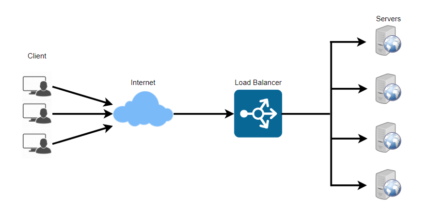
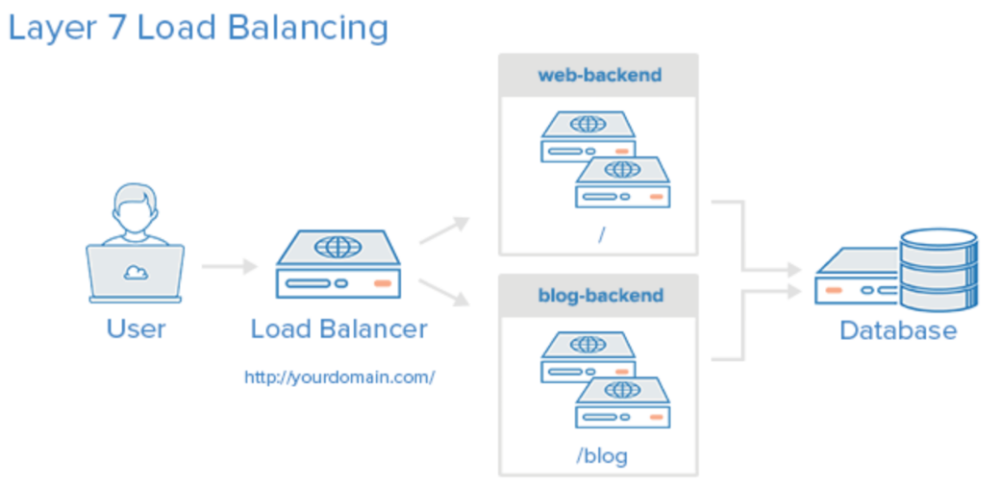
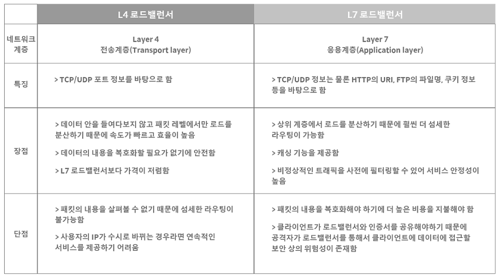

# Load Balancing

## 트래픽 대처 방법

- **Scale-up(스케일 업)**
  - 서버가 더 빠르게 동작하기 위해 자체의 성능을 확장하는 것을 의미
  - ex) CPU i3 → i7 으로 업그레이드
- **Scale-out(스케일 아웃)**
  - 기존 서버와 동일하거나 낮은 성능의 서버를 두 대 이상 증설하여 운영하는 것
  - ex) CPU i3 컴퓨터를 여러 대 추가 구입
  - 하드웨어 성능 향상 비용보다는 저렴한 편
  - 여러 대의 서버 덕분에 무중단 서비스를 제공할 수 있음

Scale-out 방식으로 서버를 증설하여 트래픽을 대처하기로 결정했다면, 여러 대의 서버로 트래픽을 균등하게 분산해주기 위해서 로드 밸런싱이 필요합니다.   

## 로드 밸런서(Load Balancer)란?

로드밸런서는 서버에 가해지는 부하(로드)를 분산(밸런싱) 해주는 장치 또는 기술을 통칭

클라이언트와 서버 풀 사이에 위치, 한 대의 서버로 부하가 집중되지 않도록 트래픽을 관리

즉 여러 대의 서버를 두고 서비스를 제공하는 분산 처리 시스템에서 필요한 기술   

## 로드 밸런싱의 주요 기능

### NAT(Network Address Translation)

- 사설 IP 주소를 공인 IP 주소로 바꾸는 데 사용하는 통신망의 주소 변조기
- IPv4에서 IP 주소가 부족하고 보안상에 몇가지 문제가 있어 인터넷에서 사용할 수 없는 사설 IP 증가
- 이때 인터넷 망에서 사설 망의 호스트에 접근하기 위해 네트워크 주소 변환 기능이 필요

### DSR(Dynamic Source Routing Protocol)

- 서버에서 클라이언트로 되돌아가는 경우 목적지 주소를 스위치의 IP 주소가 아닌 클라이언트의 IP 주소로 전달
- 네트워크 스위치를 거치지 않고 클라이언트를 바로 찾아가는 개념

### Tunneling

- 인터넷 상에서 눈에 보이지 않는 통로를 만들어 통신할 수 있게 하는 개념
- 데이터를 캡슐화해서 연결된 상호 간에만 캡슐화된 패킷을 구별해 캡슐화를 해제할 수 있음   

## 로드밸런싱의 종류

### L2 Load Balancing

MAC 주소를 바탕으로 로드 밸런싱

L4, L7 로드 밸런서 대비 로드 밸런싱 전략이 제한적   

### L3 Load Balancing

IP 주소를 바탕으로 로드 밸런싱

L2에 라우팅 기능이 추가   

### L4 Load Balancing

보통 부하 분산에는 L4 이상의 로드밸런서가 가장 많이 활용

네트워크 계층(IP, IPX)이나 트랜스포트 계층(TCP, UDP)의 정보를 바탕으로 로드를 분산

IP주소나 포트번호, MAC주소, 전송 프로토콜을 바탕으로 로드 밸런싱   

### L7 Load Balancing

애플리케이션 계층(HTTP, FTP, SMTP)에서 로드를 분산

HTTP 헤더, 쿠키, URL 등 사용자의 요청을 바탕으로 로드 밸런싱

패킷의 내용을 확인하고 그 내용에 따라 로드를 특정 서버에 분배하는 것이 가능

클라이언트의 요청을 보다 세분화하여 서버에 전달할 수 있음

특정한 패턴을 지닌 바이러스를 감지해 네트워크를 보호할 수 있으며, DoS/DDoS와 같은 비정상적인 트래픽을 필터링할 수 있어 네트워크 보안 분야에서도 활용   

## L4 vs L7 정리

   

## 로드 밸런싱 알고리즘

### 라운드 로빈 방식(Round Robin Method)

서버에 들어온 요청을 순서대로 돌아가면서 배정하는 방식

클라이언트의 요청을 순서대로 배분하기 때문에 여러 대의 서버가 동일한 스펙을 갖고 있는 경우, 서버와의 연결(세션)이 오래 지속되지 않는 경우 활용하기 적합

### 가중 라운드 로빈 방식(Weighted Round Robin Method)

각각의 서버마다 가중치를 매기고 가중치가 높은 서버에 클라이언트의 요청을 우선적으로 배분

주로 서버의 트래픽 처리 능력이 상이한 경우 사용되는 부하 분산 방식

ex) A서버의 가중치가 5, B서버의 가중치가 2라면, 로드밸런서는 라운드 로빈 방식으로 A 서버에 5개, B서버에 2개의 요청을 전달

### IP 해시 방식(IP Hash Method)

클라이언트의 IP 주소를 특정 서버로 매핑하여 요청을 처리하는 방식

사용자의 IP를 해싱해 로드를 분배하므로 사용자가 항상 동일한 서버로 연결되는 것을 보장

### 최소 연결 방식(Least Connection Method)

요청이 들어온 시점에 가장 적은 연결 상태를 보이는 서버에 우선적으로 트래픽을 배분

자주 세션이 길어지거나, 서버에 분배된 트래픽들이 일정하지 않은 경우 적합한 방식

### 최소 응답 시간 방식(Least Response Time Method)

서버의 현재 연결 상태와 응답 시간을 모두 고려하여 트래픽을 배분

가장 적은 연결 상태와 가장 짧은 응답 시간을 보이는 서버에 우선적으로 로드를 배분하는 방식   

## 로드 밸런서 장애 대비(Fail Over)

로드밸런서 서버의 이중화를 기본으로 구성

이중화된 로드 밸런서들은 서로 Health Check

Master 서버와 Standby 서버를 구성하고, Master 서버에 장애가 발생하면 Standby 서버가 자동으로 Master 서버의 역할을 하게됨

Standby 서버는 평상시에 대기 상태로 있다가 Master 서버가 장애가 발생할 때만 작동   

## 로드 밸런싱 단점

세션 데이터를 관리하는데 어려움이 있음

클라이언트의 연결 정보를 저장하는 세션이 로드 밸런싱을 통해 하나의 서버에 저장이 되는 경우, 나중에 다른 서버로 접속했을 때, 해당 클라이언트의 세션이 유지되지 않을 수 있음

서버에 액세스할 때마다 다른 세션을 사용하면 특정 사용자의 정보를 일관성있게 유지할 수 없음

이러한 문제를 해결하기 위해 세션 고정(Session Sticky) 기술을 사용 → 특정 사용자의 요청이 전달된 노드를 고정할 수 있음

그러나 고정된 세션의 노드에 장애가 발생한다면? → 장애가 발생하여 비활성화된 노드에 대한 고려가 필요   

## 클러스터링(Clustering)

여러 대의 컴퓨터를 가상의 하나의 컴퓨터처럼 사용하게 해주는 것

클러스터링 환경에서는 특정 장비에 문제가 생기거나 애플리케이션에 문제가 생겨도 전체적인 서비스에 영향을 주지 않음

클러스터링은 가상 IP 기반으로 구현, 서비스를 제공하는 실제 장비는 물리 IP를 가짐, 데이터의 처리는 가상 IP를 통해 처리 → 추상화

클러스터링은 한 서비스를 제공하는 여러 개의 서버를 하나로 묶어 성능을 높여 많은 양의 패킷을 처리하는 것이고,로드밸런싱은 여러 대의 서버에 분산을 시켜주는 것이다.   

> Reference
>
> - [https://goodgid.github.io/Load-Balancing-And-Clustering/](https://goodgid.github.io/Load-Balancing-And-Clustering/)
> - [https://post.naver.com/viewer/postView.nhn?volumeNo=27046347&memberNo=2521903](https://post.naver.com/viewer/postView.nhn?volumeNo=27046347&memberNo=2521903)
> - [http://wiki.hash.kr/index.php/로드밸런싱](http://wiki.hash.kr/index.php/%EB%A1%9C%EB%93%9C%EB%B0%B8%EB%9F%B0%EC%8B%B1)
> - [https://aws.amazon.com/ko/elasticloadbalancing/?nc=sn&loc=0&whats-new-cards-elb.sort-by=item.additionalFields.postDateTime&whats-new-cards-elb.sort-order=desc](https://aws.amazon.com/ko/elasticloadbalancing/?nc=sn&loc=0&whats-new-cards-elb.sort-by=item.additionalFields.postDateTime&whats-new-cards-elb.sort-order=desc)
