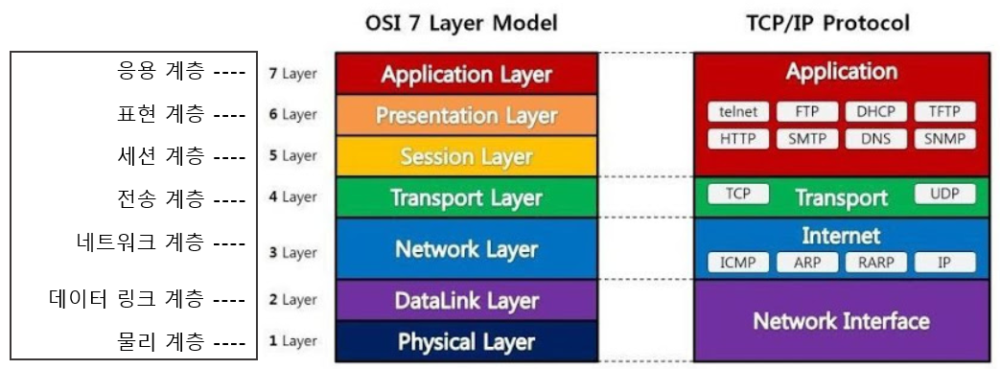

# OSI 7계층

## 네트워크에서 7계층이란?

---

쉽게 말하면 네트워크 통신 과정을 7단계로 나눈 것이다.

복잡한 데이터 전송 과정을 7단계로 나누어 보면 이해하기 쉽다. 또한 계층별로 프로토콜을 개발해 구성 요소들이 모듈화 돼있다.

7계층은 다시 두 가지 계층으로 나눌 수 있다.

- 1~4계층: 데이터 플로 계층 / 하위 계층
- 5~7계층: 애플리케이션 계층 / 상위 계층

인캡슐레이션: 상위 계층에서 하위 계층으로 데이터를 보내는 과정(헤더를 붙이면서 보냄)

디캡슐레이션: 하위 계층에서 상위 계층으로 데이터를 보내는 과정(헤더를 쪼개면서 보냄)

## 1계층(피지컬 계층)

- 물리적 연결과 관련된 정보를 정의
- 들어온 전기 신호를 그대로 잘 전달하는 것이 목적

### ※ 주요 장비

케이블, 허브

## 2계층(데이터 링크 계층)

- 전기 신호를 모아 데이터 형태로 처리
- 네트워크 인터페이스 카드(랜 카드)의 MAC 주소(물리 주소)를 통해 통신

### MAC 주소란?

- 네트워크 인터페이스 카드의 고유 주소

### 네트워크 인터페이스 카드 동작 방식

1. 전기 신호를 데이터 형태로 만든다.
2. 목적지 MAC 주소와 출발지 MAC 주소를 확인한다.
3. 네트워크 인터페이스 카드의 MAC 주소를 확인한다.
4. 목적지 MAC 주소과 네트워크 인터페이스 카드가 갖고 있는 MAC 주소가 맞으면 데이터를 처리하고 다르면 데이터를 폐기한다.

### ※ 주요 장비

스위치, 브릿지, 네트워크 카드

### ※ 주요 프로토콜

IEEE 802.2, FDDI

## 3계층(네트워크 계층)

- 2계층의 물리 주소와 달리 논리 주소(IP 주소)가 정의
- 라우터가 IP 주소를 사용해 최적의 경로를 찾아주고 해당 경로로 패킷을 전송한다.

### ※ 주요 장비

라우터, L3 스위치

### ※ 주요 프로토콜

IPv4, IPv6, NAT, ARP

## 4계층(트랜스포트 계층)

- 패킷이 유실되거나 순서가 바뀌었을 때 바로잡아 주는 역할
- 헤더 부분에 패킷 순서를 명시(ACK 번호, 시퀸스 번호)
- 로드 밸런서와 방화벽과 같은 장비 동작

### ※ 주요 장비

로드 밸런서, 방화벽

### ※ 주요 프로토콜

TCP, UDP, SCTP, DCCP, AH, AEP

## 5계층(세션 계층)

- 양 끝단의 응용 프로세스의 연결을 도와주고 안정적으로 유지되도록 관리
- TCP/IP 세션을 만들고 없애는데 책임을 짐

### ※ 주요 프로토콜

SSH, L2TP, PPTP, NFS, RPC, RTCP, SIP

## 6계층(프레젠테이션 계층)

- 표현 방식이 다른 애플리케이션이나 시스템 간의 통신을 돕기 위해 하나의 통일된 구문 형식으로 변환시키는 기능 수행
- 데이터의 형식상 차이를 다루는 부담을 줄여줌
- MIME인코딩, 암호화, 압축, 코드 변환과 같은 동작

### ※ 주요 프로토콜

SSH, TLS, AFP

## 7계층(애플리케이션 계층)

- 최상위 계층으로 애플리케이션 프로세스를 정의하고 서비스를 수행
- 소프트웨어의 UI 부분이나 사용자 입출력 부분을 정의함

### ※ 주요 장비

ADC, NGFW, WAF

### ※ 주요 프로토콜

HTTP, SMP, SMTP, STUN, TFTP, TELNET