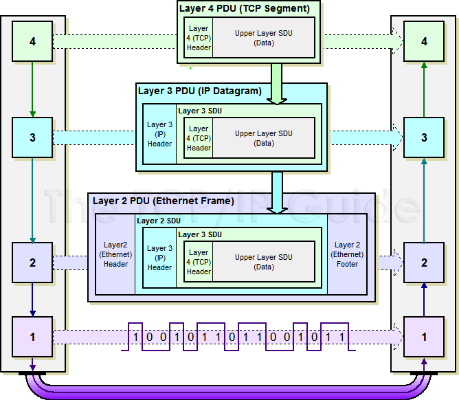
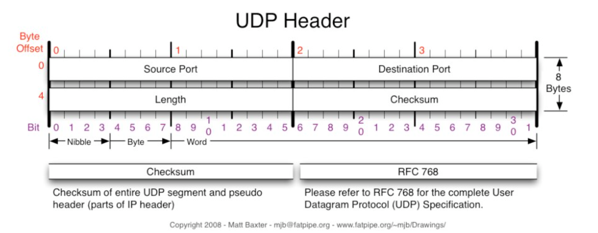
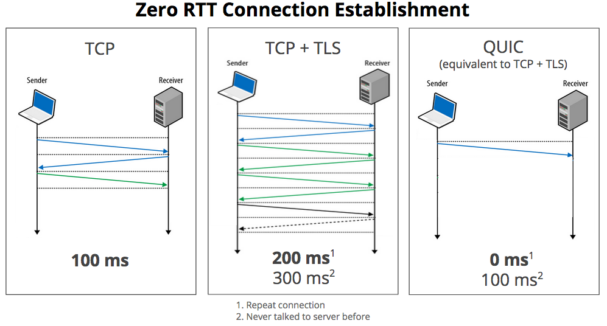

# TCP vs UDP


## 0.  Internet Protocol Suite

- **TCP/IP**

| 5    | **응용** **계층**                    | DNS, TFTP, TLS/SSL, FTP, HTTP, IMAP, IRC, NNTP, POP3, SIP, SMTP, SNMP, SSH, 텔넷, ECHO, 비트토렌트, RTP, PNRP, rlogin, ENRP, … |
| ---- | ------------------------------------ | ------------------------------------------------------------ |
| 4    | **전송** **계층**                    | TCP, UDP, DCCP, SCTP, IL, RUDP, …                            |
| 3    | **인터넷** **계층**                  | IP (IPv4, IPv6)                                              |
| 2.5  | **ARP**                              | ARP, RARP  (주소 결정 프로토콜)                              |
| 1,2  | **네트워크** **인터페이스** **계층** | 이더넷, Wi-Fi, 토큰링, PPP, SLIP, FDDI, ATM, 프레임 릴레이, SMDS, … |

- **OSI 7 계층**

| 7    | **응용** **계층**            | HTTP, SMTP, SNMP, FTP, 텔넷, SSH & Scp, NFS, RTSP            |
| ---- | ---------------------------- | ------------------------------------------------------------ |
| 6    | **표현** **계층**            | XDR, ASN.1, SMB, AFP                                         |
| 5    | **세션** **계층**            | TLS, SSL, ISO 8327 / CCITT X.225, RPC, 넷바이오스, 애플토크  |
| 4    | **전송** **계층**            | TCP, UDP, RTP, SCTP, SPX, 애플토크                           |
| 3    | **네트워크** **계층**        | IP, ICMP, IGMP, X.25, CLNP, ARP, RARP, BGP, OSPF, RIP, IPX, DDP |
| 2    | **데이터** **링크** **계층** | 이더넷, 토큰링, PPP, HDLC, 프레임 릴레이, ISDN, ATM, 무선랜, FDDI |
| 1    | **물리** **계층**            | 전선, 전파, 광섬유, 동축케이블, 도파관, PSTN, 리피터, DSU, CSU, 모뎀 |

 

## 1. Transportation Layer

- 4계층(OSI 7 계층)
- 다른 호스트들이 계속 네트워크에 머물도록 응용 프로세스 간의 논리적 통신을 제공한다.
- 송신자와 수신자를 연결하는 통신 서비스 제공
  - 송신 호스트 : 데이터 메시지를 세그먼트로 분해하여 네트워크 계층(3계층)으로 전송한다.
  - 수신 호스트 : 세그먼트들을 데이터 메시지로 재조립하여 응용 계층으로 전송한다.
- vs **Network Layer**
  - Network Layer(네트워크 계층, 3계층) : 호스트들 간의 논리적 통신을 돕는다.
  - Transport Layer(전송 계층, 4계층) : 응용 프로세스 간의 논리적 통신을 돕는다.

## 2. TCP

- 연결지향적 프로토콜
  - 클라이언트와 서버가 연결된 상태에서 데이터를 주고 받음
  - 3way handshaking
  - 4-way handshaking 을 통해 연결을 해제.
- SYN - ACK 순차전달
  - 전송 순서를 보장.
  - 각 바이트마다 번호를 부여
- 신뢰성 있는 데이터 전달
- Flow Control
  - 데이터 처리 속도를 조절하여 수신자의 버퍼 오버플로우를 방지
    - 송신하는 곳에서 감당이 안되게 많은 데이터를 빠르게 보내 수신하는 곳에서 문제가 일어나는 것을 막는다.
    - 수신자가 `윈도우크기(Window Size)` 값을 통해 수신량을 정할 수 있다.
- Congestion Control
  - 네트워크 내의 패킷 수가 넘치게 증가하지 않도록 방지
- UDP 보다 느림


#### TCP 프로토콜의 작동

```
연결 생성 (Connection establishment)
자료 전송 (Data transfer)
연결 종료 (Connection termination)
```


#### TCP Header


## Flow Control - 신뢰성 보장, 흐름 제어

- 송신측과 수신측의 데이터 처리 속도차이를 해결하기 위한 기법
- 수신측 처리속도 > 송신측 처리속도 (문제 X)
- Stop And wait
  - 매번 전송한 패킷에 대해 확인 응답
- 슬라이딩 윈도우
  - 수신 측에서 설정한 윈도우 크기만큼 송신 측에서 세그먼트 전송
  - 데이터 흐름 동적으로 조절

## Congestion Control - 혼잡 제어

- 송신측의 데이터 전달과 네트워크 처리 속도 차이를 해결하기 위한 기법
- TCP Taho, TCP Reno, TCP Vegas - [혼잡 방지 알고리즘](https://ko.wikipedia.org/wiki/TCP_%ED%98%BC%EC%9E%A1_%EB%B0%A9%EC%A7%80_%EC%95%8C%EA%B3%A0%EB%A6%AC%EC%A6%98)
- 라우터는 매우 복잡하기 때문
- Slow Start
  - 윈도우 크기를 2배씩 증가 -> 혼잡발생 -> 1로 감소 ->Threshold 까지 2배 -> 1씩 증가
- Fast Recovery
  - 혼잡상태 발생시 반으로 감소 -> 선형 증가


## 3. UDP

- 데이터의 신뢰성이 없다.
- 의미있는 서버를 구축하기위해서는 일일이 패킷을 관리해주어야 한다.
- 세그먼트가 손실될 수 있고, 순서가 뒤바뀔 수 있다.
- Handshaking이 없음
- 실시간이 중요한 스트리밍 멀티미디어와 같은 응용프로그램, 도메인 네임 서버(DNS) 및 SNMP에 이용되어진다
- DNS, IPTV, VoIP, TFTP, IP터널, 온라인게임 등


#### UDP Header



## 4. TCP vs UDP


#### 공통점

- 포트 번호 이용하여 주소 지정
- Checksum 이용하여 데이터 오류 검사

|                  | TCP       | UDP               |
| ---------------- | --------- | ----------------- |
| 연결 방식        | 연결      | 비연결            |
| 패킷 교환 방식   | 가상 회선 | 데이터그램        |
| 전송 순서        | 보장      | 바뀔 수 있음      |
| 수신 여부        | 확인      | 비확인            |
| 통신 방식        | 1:1       | 1:1 or 1:N or N:N |
| 신뢰성           | 높음      | 낮음              |
| 속도             | 느림      | 빠름              |
| 혼잡제어         | O         | X                 |
| 흐름제어         | O         | X                 |
| Streaming 서비스 | 불리      | 유리              |


# 5. QUIC

- 현재 구글 서비스의 약 절반 정도
- Zero RTT
- UDP 사용
- HOL 블로킹 문제 해결
  - HoL (Head-Of-Line) 블로킹 : 네트워크에서 같은 큐에 있는 패킷이 첫번째 패킷에 의해 지연될 때 발생하는 성능 저하 현상
- 구글 검색에서 3%로딩 시간 개선, 유튜브 30% 버퍼링 감소



---

> ref
>
> - https://coding-factory.tistory.com/614
> - https://velog.io/@hidaehyunlee/TCP-%EC%99%80-UDP-%EC%9D%98-%EC%B0%A8%EC%9D%B4
> - https://ko.wikipedia.org/wiki/%EC%A0%84%EC%86%A1_%EC%A0%9C%EC%96%B4_%ED%94%84%EB%A1%9C%ED%86%A0%EC%BD%9C
> - https://jsonsang2.tistory.com/17
> - https://judo0179.tistory.com/41

