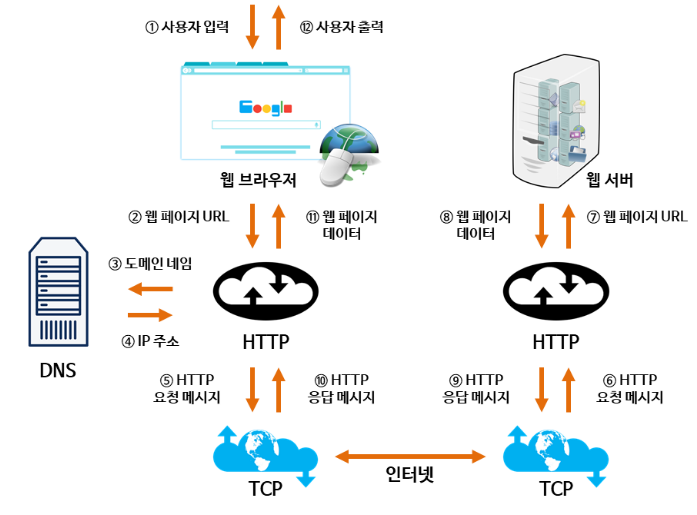
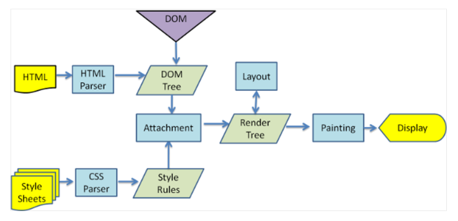

# URL 입력, 렌더링 과정, 기타 네트워크 프토콜과 주소, URI vs URL vs URN, 웹 캐시

## 기타 네트워크 프로토콜과 기본 네트워크 주소들

- DHCP : 호스트의 IP 주소 및 TCP/IP 설정을 클라이언트에 자동으로 제공하는 프로토콜
- DNS : IP 주소와 도메인의 매핑 정보를 관리하는 프로토콜(도메인 명을 IP 주소로 변환)
- ARP : IP 주소를 물리적 네트워크 주소로 대응시키기 위해 사용되는 프로토콜
- IP 주소 : 컴퓨터 마다 부여된 고유의 주소
- MAC 주소: NIC 카드 마다 부여된 네트워크 장비 고유의 주소   

## URI vs URL vs URN

### URI

Uniform : 리소스를 식별하는 통일된 방식

Resource : 자원, URI로 식별할 수 있는 모든 것(제한없음)

Identifier : 다른 항목과 구분하는데 필요한 정보

자원을 고유하게 식별하고 위치를 지정하는 통합 자원 식별자

### URL

Locator : 리소스가 있는 위치를 지정

특정 서버의 한 리소스에 대한 구체적인 위치

URI나 URL이나 거의 같다고 봐도 무방

### URN

Name : 리소스에 이름을 부여

이름만으로 실제 리소스를 찾을 수 있는 방법이 보편화 X

### URL 포맷

1. 스키마
   - http, https와 같은 스키마를 사용하여 리소스를 얻기 위해 사용하는 프로토콜 지시
   - 대소문자 무시, 콜론(:)이 하나 붙음
   - data:와 javascript: 같이 데이터와 프로그램을 지정할 수 도 있음
2. 자격정보(크레덴셜)
   - 서버로부터 리소스를 취득할 때 필요
   - 유저명과 패스워드를 지정할 수 있으나 옵션
3. 서버 주소
   - DNS명이나 IP주소를 지정
4. 서버 포트
   - 서버의 접속 대상이 되는 네트워크 포트 번호 지정
   - 옵션이고 생략하면 디폴트 포트가 사용
5. 계층적 파일 패스
   - 특정 리소스를 식별하기 위해서 서버 상의 파일 패스를 지정
6. 쿼리 문자열
   - 파일 패스로 지정된 리소스에 임의의 파라미터를 넘겨주기 위해 사용
   - 옵션이라 생략 가능
7. 프래그먼트 식별자
   - 주로 취득한 리소스에서 서브 리소스(도큐먼트 중간에 위치)를 가리키기 위해 사용
   - 옵션이라 생략 가능   

## 웹 브라우저에 URL을 입력했을 때의 수행 과정

1. 사용자가 브라우저에 URL을 입력
2. 브라우저는 DNS를 통해 서버의 진짜 주소(IP 주소)를 찾음
3. HTTP 프로토콜을 사용하여 HTTP 요청 메세지를 생성함
4. SOCKET 라이브러리를 통해 TCP/IP로 3way handshake를 실행해 서버와 연결
5. TCP/IP 연결을 통해 HTTP 요청이 서버로 전송
6. 서버는 HTTP 프로토콜을 활용해 HTTP 응답 메세지를 생성함
7. TCP/IP 연결을 통해 요청한 클라이언트에게 전송
8. 도착한 HTTP 응답 메세지는 웹 브라우저에 의해 렌더링되어 사용자에게 화면으로 출력   

## HTTP 응답의 랜더링 과정

웹 브라우저는 WWW(World Wide Web)에서 정보를 검색, 표현하고 탐색하기 위한 소프트웨어

**데이터를 해석해주는 Parser**와 **데이터를 화면에 표현해주는 Rendering Engine**을 포함

HTML을 해석해서 DOM Tree를 만들고, CSS를 해석해서 역시 CSS Tree(CSS Object Model)을 만듦

이 과정에서 Parsing 과정이 필요하며 토큰 단위로 해석되는 방식은 일반적인 소스코드의 컴파일 과정

DOM Tree와 CSS Tree, 이 두 개는 연관되어 있으므로 Render Tree로 다시 조합

이렇게 조합된 결과는 화면에 어떻게 배치할지 크기와 위치 정보를 담고 있음

이후에 이렇게 구성된 Render Tree정보를 통해서 화면에 어떤 부분에 어떻게 색칠을 할지 Painting 과정을 거침

참고로 Javascript 코드는 body 태그 닫히기 전에 위치하는 것이 렌더링을 방해하지 않아도 좋고, CSS코드는 head 안에 위치해서 렌더링 처리 시에 브라우저가 더 빨리 참고할 수 있게 하는 것이 좋음   

## 웹 캐시

https://www.notion.so/HTTP-Header-0a285f87134a453291d585ff9d21fb04

  

> Reference
>
> - https://junshock5.tistory.com/143
> - https://github.com/yoonje/developer-interview-questions-and-answers/blob/master/Network/README.md
> - https://d2.naver.com/helloworld/59361
