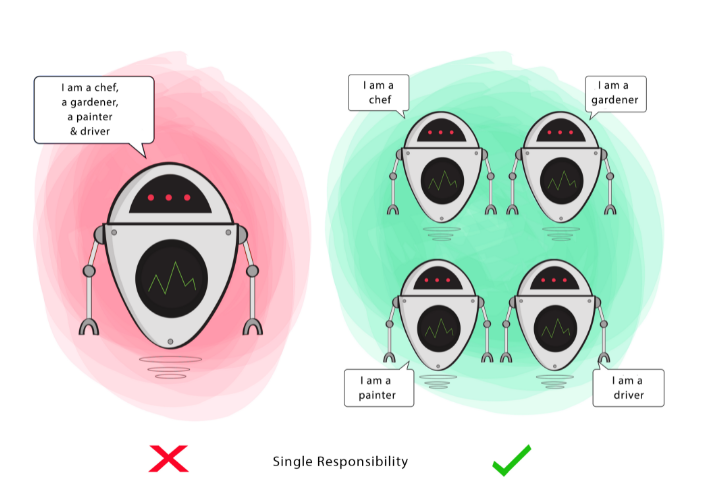
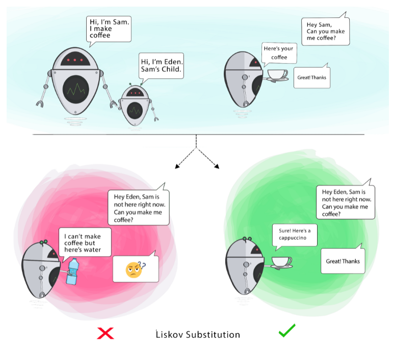
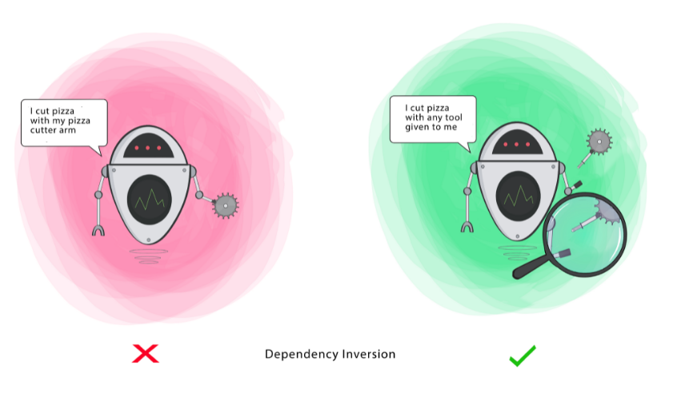
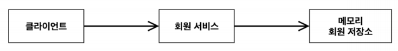
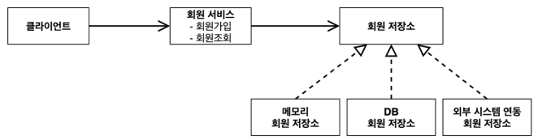
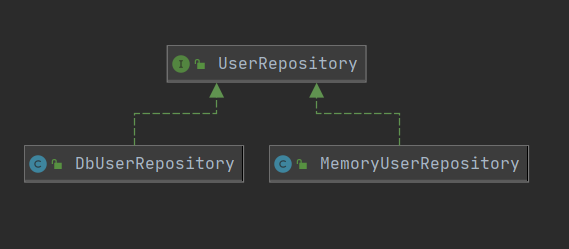

# SOLID 원칙

## SOLID 원칙이란?

SOLID란 클린코드로 유명한 로버트 마틴이 좋은 객체 지향 설계의 5가지 원칙을 정리한 것 </br></br>

## 객체 지향이란?

객체지향의 다양한 특성 `추상화, 캡슐화, 상속,**다형성** ...`

> 객체 지향 프로그래밍은 컴퓨터 프로그램을 명령어의 목록으로 보는 시각에서 벗어나 여러 개의 독립된 단위, 즉 "**객체**"들의 **모임**으로 파악하고자 하는 것이다. 각각의 **객체**는 **메세지**를 주고 받고, 데이터를 처리할 수 있다. (**협력**)

> 객체 지향 프로그래밍은 프로그램은 **유연**하고 **변경**이 **용이**하게 만들기 때문에 대규모 소프트웨어 개발에 많이 사용된다.
> </br>

### 유연하고 변경이 용이?

- 레고 블럭 조립하듯이,
- 키보드, 마우스 갈아 끼우듯이,
- 컴퓨터 부품 갈아 끼우듯이,
- **컴포넌트를 쉽고 유연하게 변경하면서 개발할 수 있는 방법** </br></br>

## SRP(Single responsibility Principle) - 단일 책임 원칙



메서드나 클래스는 단 하나의 책임(기능)을 가져야 한다는 원칙

책임이 많아지면 결합도가 높아짐 → 유지보수의 비용 증가

MSA(Micro Service Architecture)에서는 한층 더 나아가 서비스에 하나의 책임을 가진다고 함

```java
// BAD
public class UserService {

    public void save(User user) {
				// DB에 유저 정보 저장
				// 로그 기록
		}
}

// GOOD
public class UserService {

		public void save(User user) {
				// DB에 유저 정보 저장
		}

		public void writeLog() {
				// 로그 기록
		}
}
```

</br></br>

## OCP(Open Closed Principle) - 개방 폐쇄 원칙


소프트웨어 요소는 확장에는 열려 있으나, 변경에는 닫혀 있어야 한다는 원칙

HOW? 확장을 하려면 기존 코드를 변경해야.... → 다형성을 활용

인터페이스를 구현한 새로운 클래스를 하나 만들어서 새로운 기능을 구현 </br></br>

**요구사항**

- 영수증을 모아 총 비용을 계산하는 로직 개발
- 현재는 현금 계산만 지원하지만, 나중에 카드 계산이 추가되어야 함
- 결제 방법은 열려있어야 함

```java
// Origin
void checkOut(Receipt receipt) {
  // 영수증의 금액 취합
  Money total = Money.zero;
  for (item : items) {
    total += item.getPrice();
    receipt.addItem(item);
  }
  // 현금으로 계산
  Payment p = acceptCash(total);
  receipt.addPayment(p);
}
```

```java
// BAD
void checkOut(Receipt receipt, boolean isCash) {
  // 영수증의 금액 취합
  Money total = Money.zero;
  for (item : items) {
    total += item.getPrice();
    receipt.addItem(item);
  }

  Payment p = null;
  if(isCach) p = acceptCash(total);   // 현금으로 계산
  else p = acceptCreditCard(total);   // 신용카드로 계산

  receipt.addPayment(p);
}
```

```java
public interface PaymentMethod {
    Payment acceptPayment(Money total);
}

-----------------------------------------------------------

public class PaymentCash implements PaymentMethod {
    public Payment acceptPayment(Money total){
        // 현금 계산 구현
    }
}

pulbic class PaymentCreditCard implements PaymentMethod {
    public Payment acceptPayment(Money total){
        // 신용카드 계산 구현
    }
}

-----------------------------------------------------------

void checkOut(Receipt receipt, PaymentMethod method) {
  // 영수증의 금액 취합
  Money total = Money.zero;
  for (item : items) {
    total += item.getPrice();
    receipt.addItem(item);
  }

  // function을 호출할 때 함께 들어오는 PaymentMethod Type으로 어떻게 계산할지가 정해진다.
  Payment p = method.acceptPayment(total);
  receipt.addPayment(p);
}
```

</br></br>

## LSP(Liskov Substitution Principle) - 리스코프 치환 원칙



자식 클래스는 부모 클래스에서 가능한 행위를 수행할 수 있어야 한다는 원칙

(자식 클래스가 부모 클래스로 대체 가능해야함)

상속 관계에서 일반화 관계(IS-A)가 성립해야함 → 일관성이 있는지를 의미

```java
public class Rectangle {

    public int width;
    public int height;

    public void setHeight(int height) {
        this.height = height;
    }

    public int getHeight() {
        return this.height;
    }

    public void setWidth(int width) {
        this.width = width;
    }

    public int getWidth() {
        return this.width;
    }

    public int area() {
        return this.width * this.height;
    }
}

-----------------------------------------------------

public class Square extends Rectangle {

    @Override
    public void setHeight(int value) {
        this.width = value;
        this.height = value;
    }

    @Override
    public void setWidth(int value) {
        this.width = value;
        this.height = value;
    }
}
```

`정사각형(자식 클래스)은 사각형(부모 클래스)의 행위를 수행할 수 있다` 라는 조건이 성립할까? 🤔

```java
@DisplayName("정사각형은 사각형의 행위를 수행할 수 있다.")
@Test
public void Square_IS_A_Rectangle() throws Exception {
    // given
    Rectangle square = new Square();
    square.setWidth(4);
    square.setHeight(5);

    // when
    int area = square.area();
    System.out.println("area = " + area);

    // then
    Assertions.assertThat(area).isEqualTo(20);
}
```

</br></br>

## ISP(Interface Segregation Principle) - 인터페이스 분리 원칙


특정 클라이언트를 위한 인터페이스 여러 개가 범용 인터페이스 하나보다 낫다는 원칙

클라이언트는 사용하지 않는 메서드에 대해 의존적이지 않아야 함

```java
public interface AllInOne {

    void copy();
    void fax();
    void print();
}
```

만약 복합기를 구현해 복사기를 생성한다면?

아래와 같이 복사기에는 필요없는 기능인 fax와 print 기능에 의존적

```java
// BAD
public class Copier implements AllInOne {

    @Override
    public void copy() {
        System.out.println("복사합니다.");
    }

    @Override
    public void fax() {

    }

    @Override
    public void print() {

    }
}
```

fax() 메서드가 다음과 같이 수정된다면?

복사기는 fax 기능을 사용하지 않는데 해당 코드를 수정해야함 → OCP 원칙 위배

```java
// BAD
public interface AllInOne {

    void copy();
    void fax(Address from, Address to);
    void print();
}

public class Copier implements AllInOne {

    @Override
    public void copy() {
        System.out.println("복사합니다.");
    }

    @Override
    public void fax(Address from, Address to) {

    }

    @Override
    public void print() {

    }
}
```

따라서 AllInOne 이라는 범용 인터페이스를 Copy, Print, Fax 로 세분화하여 분리

필요한 기능을 골라서 구현할 수 있음

```java
public interface Copy {

    void copy();
}

public interface Print {

    void print();
}

public interface Fax {

    void fax();
}
```

</br></br>

## DIP(Dependency Inversion Principle) - 의존관계 역전 원칙



추상화에 의존해야지, 구체화에 의존하면 안된다는 원칙

즉 구현 클래스에서 의존하지말고, 인터페이스에 의존하라는 의미

</br></br>

**현재 회원 도메인**



**요구사항**

- 회원 가입을 하고 조회할 수 있음
- 회원 데이터는 메모리, DB 혹은 외부 시스템과 연동될 수 있음



위의 그림과 같이 회원 서비스가 메모리 회원 저장소라는 구현체에 의존하는 것이 아닌, 회원 저장소라는 추상화 된 인터페이스를 의존하도록 설계!



</br></br>

> Reference
>
> - https://sabarada.tistory.com/36
> - https://cheese10yun.github.io/spring-solid-srp/
> - https://victorydntmd.tistory.com/291
> - https://blog.siner.io/2020/06/18/solid-principles/
