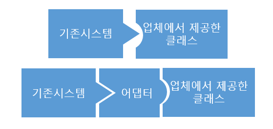
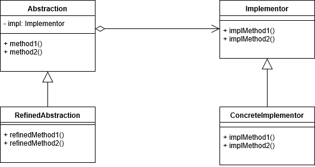
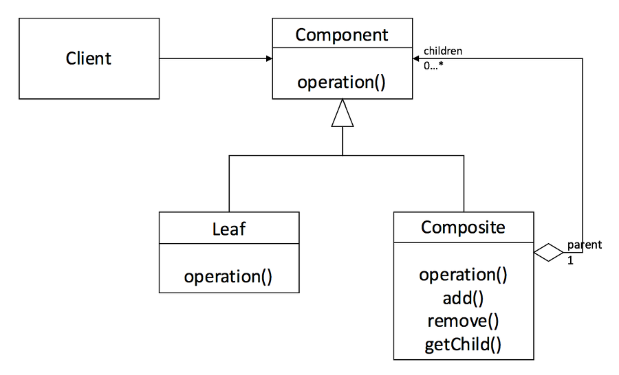
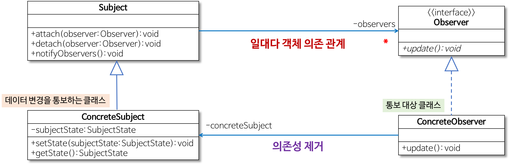
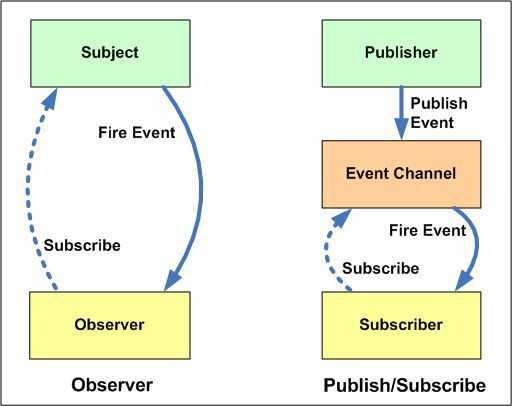

# 디자인 패턴 

> It suggests that design patterns aren’t things we invent. They’re things we discover.

- 객체지향 소프트웨어를 설계할 때 고질적인 문제가 발생하면, 재사용할 수 있는 해결책
- 이미 잘 만들어 사용되는 것을 다시 처음부터 만들 필요가 없다는 것
- 협업해서 개발할 때 다른 사람이 작성한 코드나, 기존에 존재하는 코드를 이해하는 것은 어렵다. 
- 팀원 사이의 의사 소통을 원활하게 해주는 중요한 역할


## 객체지향 3대 요소

### 캡슐화(Encapsulation)

- 변수와 함수를 하나의 단위로 묶는 것(Data Bundling)
- 클래스를 통해 구현
- 클래스는 클래스 안에 포함된 멤버 변수로 구분, 접근
- 정보 은닉
  - 접근 제한자(public, protected, private)
  - 캡슐화 != 정보은닉
    - 파이썬은 정보은닉을 지원하지는 않지만, 클래스를 통한 캡슐화를 지원하기 때문에 객체지향 언어로 분류

### 상속(Inheritance)

- 자식 클래스가 부모 클래스의 특성과 기능을 그대로 물려받는 것
- 기능의 일부분을 변경해야 할 경우, 자식 클래스에서 상속받은 기능만을 수정해서 다시 정의(Overriding)
- 상속은 캡슐화를 유지하면서, 클래스의 재사용이 용이하도록 함

### 다형성(Polymorphism)

- 하나의 변수, 또는 함수가 상황에 따라 다른 의미로 해석될 수 있는 것
- Subtype Polymorphism
  - 일반적으로 생각하는 것
  - 상위 클래스를 상속받는 하위 클래스가 상위 클래스의 객체를 참조하는 것.
  - 오버라이딩
- Parametric Polymorphism
  - Template
    - C++에서 사용하는 개념. 
    - 타입 매개변수를 입력한 타입으로 치환한 코드 생성
  - Generic
    - JAVA, C#에서 사용하는 개념
    - 지정한 타입 매개변수에 해당하는 타입만을 사용하겠다고 약속
- Ad hoc Polymorphism
  - 함수 오버로딩
  - 연산자 오버로딩
    - C++, C#은 가능 JAVA 불가능
- Coercion Polymorphism
  - 묵시적 형 변환(Implicit type coercion)
    - dobule a = 30;
      - int 형 값 30은 double로 묵시적 형 변환이 일어남.
      - type promotion
      - explicit 키워드를 추가하면 묵시적 형 변환 막음
  - 명시적 형 변환(Explicit type coercion)
    - double a = (double)30;
      - 위와 동일한 결과이지만, 명시적으로 표현함


## 디자인 패턴의 종류


## 생성 패턴

> 추상 객체 인스턴스화


### 1. 추상 팩토리

- 많은 수의 연관된 서브클래스를 한번에 교체할 수 있음
- 구체적인 클래스에 의존하지 않고 서로 연관되거나 의존적인 객체들의 조합을 만드는 인터페이스를 제공하는 패턴으로 이 패턴을 통해 생성된 클래스에서는 사용자에게 인터페이스(API)를 제공하고, 구체적인 구현은 Con-crete Product 클래스에서 이루어지는 특징을 갖는 디자인 패턴

### 2. 팩토리 메소드

- 객체를 만들어 반환하는 함수를 제공하여 초기화 과정을 외부에서 보지 못하게 숨기고 반환 타입 제어
- 상위 클래스에서 객체를 생성하는 인터페이스를 정의하고, 하위 클래스에서 인스턴스를 생성하도록 하는 방식으로, 상위 클래스에서 인스턴스를 만드는 방법만 결정하고, 하위 클래스에서 그 데이터의 생성을 책임지고 조작하는 함수들을 오버로딩하여 인터페이스와 실제 객체를 생성하는 클래스를 분리할 수 있는 특성을 갖는 디자인 패턴
- 생성할 객체의 클래스를 국한하지 않고 객체를 생성
- 방법 1 : 객체를 직접 만들어 넘겨주는 객체를 생성
- 방법 2: 팩토리 기능을 하는 함수가 자기 자신에 포함되어있고, 생성자 대신 사용

```java
abstract class Product {
    public abstract void use();
}

class IDCard extends Product {
    private String owner;

    public IDCard(String owner) {
        System.out.println(owner + "의 카드를 만듭니다.");
        this.owner = owner;
    }

    @Override
    public void use() {
        System.out.println(owner + "의 카드를 사용합니다.");
    }

    public String getOwner() {
        return owner;
    }
}

abstract class Factory {
    public final Product create(String owner) {
        Product p = createProduct(owner);
        registerProduct(p);
        return p;
    }
    protected abstract Product createProduct(String owner);
    protected abstract void registerProduct(Product p);
}

class IDCardFactory extends Factory {
    private List<String> owners = new ArrayList<>();

    @Override
    protected Product createProduct(String owner) {
        return new IDCard(owner);
    }

    @Override
    protected void registerProduct(Product p) {
        owners.add(((IDCard) p).getOwner());
    }

    public List<String> getOwners() {
        return owners;
    }
}

Factory factory = new IDCardFactory();
Product card1 = factory.create("홍길동");
Product card2 = factory.create("이순신");
Product card3 = factory.create("강감찬");
card1.use();
card2.use();
card3.use();
```


C++에서는 'std::chrono::..._clock::now()' class static 함수


### 3. Builder 

- 복잡한 인스턴스를 조립하여 만드는 구조로, 복합 객체를 생성할 때 객체를 생성하는 방법(과정)과 객체를 구현(표현)하는 방법을 분리함으로써 동일한 생성 절차에서 서로 다른 표현 결과를 만들 수 있는 디자인 패턴
- 생성과 표기를 분리해서 복잡한 객체를 생성

```java
class Something {

    private Something(int number, String name, double size) {
    }

    public static class Builder {
        int number=0;
        String name=null;
        double size=0d;

        public Builder() {
        }

        public Builder setNumber(int number) {
            this.number = number;
            return this;
        }

        public Builder setName(String name) {
            this.name = name;
            return this;
        }

        public Builder setSize(double size) {
            this.size = size;
            return this;
        }

        public Something build() {
            return new Something(number, name, size);
        }
    }
}

public void createSomething() {
    Something something = new Something.Builder().setNumber(number).setName(name).setSize(size).build();
}
```


- 인스턴스를 생성자를 통해 생성하지 않고, 빌더라는 내부 클래스를 통해 간접적으로 생성
- 사용 목적
  - 클래스와 사용 대상의 결합도를 낮추기 위해
  - 생성자에 전달하는 인수에 의미를 부여하기 위해


### 4. 싱글턴

- 전역 변수를 사용하지 않고 객체를 하나만 생성하도록 하며, 생성된 객체를 어디에서든지 참조할 수 있도록 하는 디자인 패턴
- 한 클래스에 한 객체만 존재하도록 제한
- 하나의 인스턴스만을 생성하는 책임이 있으며, getInstance 메서드를 통해 모든 클라이언트에게 동일한 인스턴스를 반환하는 작업을 수행

```java
public class Singleton{

    public void run(int i){
        Printer printer = Printer.getPrinter();
        printer.print("["+i+" 번째 객체] using "+printer.toString());
    }

    public static void main(String [] args){
        Singleton [] singletons = new Singleton [5];

        for(int i=0;i<singletons.length;i++){
            singletons[i] = new Singleton();
            singletons[i].run(i+1);
        }
    }
}

class Printer{

    private static Printer printer = null;
    private Printer() {}

    public static Printer getPrinter(){
        if(printer == null){
            printer = new Printer();
        }
        return printer;
    }

    public void print(String str){
        System.out.println(str);
    }
}
```


- 문제점
  - 의존 관계상 클라이언트가 구체 클래스에 의존
  - private 생성자 때문에 테스트가 어려움
  - 객체 인스턴스를 하나만 생성해서 공유하는 방식 때문에 싱글톤 객체를 stateful하게 설계 했을 경우 큰 장애 발생요인이 된다
- 싱글톤의 단점을 해결하기 위해 무상태(stateless)로 설계해야 함.
  - 특정 클라이언트에 의존적인 필드가 있으면 안됨
  - 특정 클라이언트가 값을 변경할 수 있는 필드가 있으면 안됨
  - 가급적 읽기 전용으로 만들고, 필드 대신에 자바에서 공유되지 않는 지역변수, 파라미터, ThreadLocal 등을 사용

참고 : [싱글턴 패턴 설계 최적화](https://velog.io/@think2wice/Java-%EC%8B%B1%EA%B8%80%ED%84%B4-%ED%8C%A8%ED%84%B4%EC%97%90-%EB%8C%80%ED%95%B4-%EC%95%8C%EC%95%84%EB%B4%85%EC%8B%9C%EB%8B%A4)


## 구조 패턴

> 객체 결합

### 1. 어답터

- 한 클래스의 인터페이스를 클라이언트에서 사용하고자 하는 다른 인터페이스로 변환

- 인터페이스 호환성 문제 때문에 같이 쓸 수 없는 클래스를 연결해서 사용 가능

- Adaptee 를 감싸고, Target Interface 만을 클라이언트에게 드러낸다.

- Target Interface 를 구현하여 클라이언트가 예상하는 인터페이스가 되도록 Adaptee 의 인터페이스를 간접적으로 변경한다.

- Adaptee 가 기대하는 방식으로 클라이언트의 요청을 간접적으로 변경한다.

- 호환되지 않는 우리의 인터페이스와 Adaptee 를 함께 사용할 수 있다.

  - 전기 콘센트

    


* 예제

  > 오리와 칠면조 인터페이스 생성
  >
  > 만약 오리 객체가 부족해서 칠면조 객체를 대신 사용해야 한다면?
  >
  > 두 객체는 인터페이스가 다르므로, 바로 칠면조 객체를 사용하는 것은 불가능함
  >
  > 따라서 칠면조 어댑터를 생성해서 활용해야 한다

  ```java
  package AdapterPattern;
  
  public interface Duck {
  	public void quack();
  	public void fly();
  }
  public interface Turkey {
  	public void gobble();
  	public void fly();
  }
  
  public class WildTurkey implements Turkey {
  
  	@Override
  	public void gobble() {
  		System.out.println("Gobble gobble");
  	}
  
  	@Override
  	public void fly() {
  		System.out.println("I'm flying a short distance");
  	}
  }
  
  public class TurkeyAdapter implements Duck {
  
  	Turkey turkey;
  
  	public TurkeyAdapter(Turkey turkey) {
  		this.turkey = turkey;
  	}
  
  	@Override
  	public void quack() {
  		turkey.gobble();
  	}
  
  	@Override
  	public void fly() {
  		turkey.fly();
  	}
  
  }
  
  public class DuckTest {
  
  	public static void main(String[] args) {
  
  		MallardDuck duck = new MallardDuck();
  		WildTurkey turkey = new WildTurkey();
  		Duck turkeyAdapter = new TurkeyAdapter(turkey);
  
  		System.out.println("The turkey says...");
  		turkey.gobble();
  		turkey.fly();
  
  		System.out.println("The Duck says...");
  		testDuck(duck);
  
  		System.out.println("The TurkeyAdapter says...");
  		testDuck(turkeyAdapter);
  
  	}
  
  	public static void testDuck(Duck duck) {
  
  		duck.quack();
  		duck.fly();
  
  	}
  }
  ```

  => Target은 오리, Adapter는 칠면조

#### 두 개의 인터페이스가 달라서 호환이 안된다면, 하나를 바꿔서 되게 하던지, 둘 다 바꾸면 되지않나?

- 서드파티 라이브러리인 경우 직접접근이 불가능. 직접접근이 가능하더라도, Adaptee 쪽에서 변경했을 경우 전체 시스템이 깨질 수도 있음.

#### 우리 쪽 인터페이스를 수정하면?

- 가능할 수도 있음.
- 하지만 인터페이스를 다른곳에서 사용하면 그 부분도 모두 바꿔줘야 함. 
- 예기치 못한 오류가 발생할 가능성이 매우 큼


### 2. 브릿지

#### 어댑터 패턴과의 차이

- 두 패턴 모두 interface의 디테일을 감추자 하여, 구조적인 차이가 없음
- 사용하는 목적의 차이가 다름
  - 어댑터 : 어떤 클래스의 인터페이스가 다른 코드에서 기대하는 것과 다를 때, 어댑터를 중간에 두어 맞춰주는 것
  - 브릿지 : 추상과 구현을 분리하는 것.(추상 클래스와 구현의 변경이 서로 영향을 주지 않도록)



**Abstraction** 

\- 기능 계층의 최상위 클래스이며 추상 인터페이스를 정의한다. Implementor에 대한 레퍼런스를 유지한다.
\- 구현 부분에 해당하는 클래스를 인스턴스를 가지고 해당 인스턴스를 통해 구현부분의 메서드를 호출한다.


**RefinedAbstraction**

\- Abstraction에 의해 정의된 인터페이스를 확장한다.(extends)
\- 기능 계층에서 새로운 부분을 확장한 클래스이다.


**Implementor** 

\- 구현 클래스를 위한 인터페이스를 정의한다.
\- Abstraction의 기능을 구현하기 위한 인터페이스 정의한다.


**ConcreteImplementor** 

\- Implementor 인터페이스를 구현 즉, 실제 기능을 구현한다.

출처: https://www.crocus.co.kr/1537 [Crocus]


### 3. 컴포지트

- Composite : 하나 이상의 유사한 객체를 구성으로 설계된 객체. 객체 그룹을 조작하는 것처럼 단일 객체를 조작할 수 있음
- 복합 객체나 단일 객체를 동일하게 취급하는 것을 목적
- 전체-부분 관계를 트리 구조로 표현하고 싶을 경우(Directory - File)
- 전체-부분 관계를 클라이언트에서 부분, 관계 객체를 균일하게 처리하고 싶을 경우



- 공통 인터페이스 "Component"를 참조함.
- Leaf 클래스는 Component 클래스를 구현함

```java
interface Graphic {
    public void print();
} // Component 에 해당하는 인터페이스
class Ellipse implements Graphic {
    public void print() {
        System.out.println("Ellipse");
    }
} // Leaf 에 해당하는 구체 클래스 중 하나로 표현할 수 있는 타원 클래스
class CompositeGraphic implements Graphic {
    private List<Graphic> childGraphics = new ArrayList<Graphic>();
    public void print() {
        for (Graphic graphic : childGraphics) {
            graphic.print();  //Delegation
        }
    }
    public void add(Graphic graphic) {
        childGraphics.add(graphic);
    }
    public void remove(Graphic graphic) {
        childGraphics.remove(graphic);
    }
} //Composite에 해당하는 클래스.

public class Program {
    public static void main(String[] args) {
        Ellipse ellipse1 = new Ellipse();
        Ellipse ellipse2 = new Ellipse();
        Ellipse ellipse3 = new Ellipse();
        Ellipse ellipse4 = new Ellipse();

        CompositeGraphic graphic = new CompositeGraphic();
        CompositeGraphic graphic1 = new CompositeGraphic();
        CompositeGraphic graphic2 = new CompositeGraphic();

        graphic1.add(ellipse1); // children - leaf
        graphic1.add(ellipse2); // children - leaf
        graphic1.add(ellipse3); // children - leaf

        graphic2.add(ellipse4); // children - leaf

        graphic.add(graphic1); // children - composite
        graphic.add(graphic2); // children - composite

        graphic.print();
    }
}

// 출처 : https://mygumi.tistory.com/343
```

- 클라이언트에서 Composite는 자식을 관리하기 위한 추가 메소드인 add 를 통해 자식으로 여러 개의 Leaf를 가질 수 있음.
- Composite에 해당하는 또 다른 인스턴스를 자식으로 가질 수 있는 모습
- Ellipse 말고 Rectangle 이 추가되었을 경우?


### 4. 데코레이터

- 객체의 결합을 통해 기능을 동적으로 유연하게 확장할 수 있게 해주는 패턴

- 기본 기능에 추가할 수 있는 기능의 종류가 많은 경우, 각 추가 기능을 Decorator 클래스로 정의한 후, 필요한 Decorator 객체를 조합함으로써, 추가 기능의 조합을 설계하는 방식

  

  - 객체의 타입과 호출 가능한 메소드를 그대로 유지하면서, 객체에 새로운 책임을 추가할 때 사용
  - 상속을 통해 서브클래스를 계속 만드는 방법이 비효율적일 때


- 예제

```java
// 음료
abstract class Beverage {
    String description = "제목 없음";

    public String getDescription() { return description; }
    public abstract double cost();

    @Override
    public String toString() {
        return getDescription() + ": $" + cost();
    }
}

// 첨가물
abstract class CondimentDecorator extends Beverage {
    public abstract String getDescription();
}

class Espresso extends Beverage {
    public Espresso() { description = "에스프레소"; }

    @Override
    public double cost() { return 1.99; }
}

class HouseBlend extends Beverage {
    public HouseBlend() { description = "하우스 블렌드 커피"; }

    @Override
    public double cost() { return 0.89; }
}

class Mocha extends CondimentDecorator {
    Beverage beverage;

    public Mocha(Beverage beverage) {
        description = "모카";
        this.beverage = beverage;
    }

    @Override
    public double cost() {
        // 중요한 부분
        return 0.20 + beverage.cost();
    }

    @Override
    public String getDescription() {
        // 중요한 부분
        return beverage.getDescription() + ", " + description;
    }
}


// 
Beverage beverage = new Espresso();
System.out.println(beverage);

beverage = new Mocha(beverage);
System.out.println(beverage);

Beverage beverage2 = new HouseBlend();
System.out.println(beverage2);

beverage2 = new Mocha(beverage2);
System.out.println(beverage2);

// 에스프레소: $1.99
// 에스프레소, 모카: $2.19
// 하우스 블렌드 커피: $0.89
// 하우스 블렌드 커피, 모카: $1.09
```

- 이 모든 경우에 대해 일일이 클래스를 만들지 않아도 된다는 점이 장점.
- 만약 컵 사이즈, 빨대의 종류, 증정품 등의 개념이 추가되어도 상대적으로 추가해야 하는 코드의 양이 많지 않다는 게 장점.


### 5. 파사드

- 호출과정을 대신 처리해주는 Wrapper 객체를 따로 만드는 것.
  - 래퍼(wrapper)가 특정 인터페이스를 준수해야 하며, 폴리모픽 기능을 지원해야 할 경우에는 [어댑터 패턴](https://ko.wikipedia.org/wiki/어댑터_패턴)을 쓴다. 단지, 쉽고 단순한 인터페이스를 이용하고 싶을 경우에는 퍼사드를 쓴다.
- 함수 호출 비용이 조금 들어가나, 훨씬 쉽게 사용할 수 있음
- 시스템의 복잡성을 감추고, 사용자가 시스템에 접근할 수 있는 인터페이스를 사용자에게 제공함. 
- 파사드 패턴은 기존의 시스템에 인터페이스를 추가함으로써, 복잡성을 갑추기 위해 사용 됨

```java
// 1단계 인터페이스 생성
public interface Shape {
   void draw();
}
// 2단계 인터페이스를 구현하기 위한 구체적 클래스 생성
public class Rectangle implements Shape {
   @Override
   public void draw() {
      System.out.println("Rectangle::draw()");
   }
}
public class Square implements Shape {
   @Override
   public void draw() {
      System.out.println("Square::draw()");
   }
}
public class Circle implements Shape {
   @Override
   public void draw() {
      System.out.println("Circle::draw()");
   }
}

//3단계 파사드 클래스 생성
public class ShapeMaker {
   private Shape circle;
   private Shape rectangle;
   private Shape square;

   public ShapeMaker() {
      circle = new Circle();
      rectangle = new Rectangle();
      square = new Square();
   }

   public void drawCircle(){
      circle.draw();
   }
   public void drawRectangle(){
      rectangle.draw();
   }
   public void drawSquare(){
      square.draw();
   }
}

// 4단계 : 다양한 종류의 형태를 만듬
public class FacadePatternDemo {
   public static void main(String[] args) {
      ShapeMaker shapeMaker = new ShapeMaker();

      shapeMaker.drawCircle();
      shapeMaker.drawRectangle();
      shapeMaker.drawSquare();		
   }
}
```


- 위키백과 예제

```java

class CPU {
	public void freeze() { ... }
	public void jump(long position) { ... }
	public void execute() { ... }
}

class Memory {
	public void load(long position, byte[] data) {
		...
	}
}

class HardDrive {
	public byte[] read(long lba, int size) {
		...
	}
}

/* Façade */

class Computer {
	public void startComputer() {
    CPU cpu = new CPU();
    Memory memory = new Memory();
    HardDrive hardDrive = new HardDrive();
		cpu.freeze();
		memory.load(BOOT_ADDRESS, hardDrive.read(BOOT_SECTOR, SECTOR_SIZE));
		cpu.jump(BOOT_ADDRESS);
		cpu.execute();
	}
}

/* Client */

class You {
	public static void main(String[] args) throws ParseException {
		Computer facade = /* grab a facade instance */;
		facade.startComputer();
	}
}
```


### 6. 플라이웨이트

### 7. 프록시


## 행위 패턴

> 객체 간 커뮤니케이션

### 1. 책임 체인

- 정적으로 어떤 기능에 대한 처리의 연결이 하드코딩 되어 있을 때 기능 처리의 연결 변경이 불가능한데, 이를 동적으로 연결되어 있는 경우에 따라 다르게 처리될 수 있도록 연결한 디자인 패턴

- 한 요청을 2개 이상의 객체에서 처리

### 2. 커맨드

### 3. 인터프리터

### 4. 반복자(iterator)

- 객체 지향에서 가장 접하기 쉬운 패턴

- 일반적인 array 같은 자료구조에서 자료 전체를 순회할 때, List같은 구조에서는 아래와 같이 반복

  ``` java
  for(int index=0; index<list.size(); index++) {
    list.get(index).doSomething();
  }
  ```

- 하지만  Tree, Trie, Graph, Map 등 index 접근을 못하는 경우, Iterator를 사용

  ```java
  interface Iterator<E> {
    boolean hasNext();
    E next();
    void remove();
  }
  
  Iterator<Object> iterator = collection.iterator();
  while(iterator.hasNext() == true) {
    Object object = iterator.next();
    object.doSomething();
  }
  ```

- Array든, List든, Tree 든, Iterable 을 정의해놓기만 하면, 자료구조 전체를 순회하여 작업을 할 수 있음.

- C++

  ```C++
  std::list<int>list;
  for(std::list<int>::iterator it = list.begin(); it != list.end(); ++it){
    (*it)=3;
  }
  ```

  

### 5. 중재자(Mediator)

### 6. 메멘토

### 7. 옵저버

- 객체의 상태 변화에 따라 다른 객체의 상태도 연동되도록 1:N 객체 의존 관계를 구성하는 패턴
- 데이터의 변경이 발생했을 경우, 상대 클래스나 객체에 의존하지 않으면서, 데이터의 변경을 통보하고자 할 때
  - 새로운 파일이 추가되거나 기존 파일이 삭제되었을 때, 탐색기는 다른 탐색기에게 즉시 변경을 통보



- Subject와 Observer가 느슨한 결합을 갖는 것이 중요하다.
  - Observer 등록 순서 등에 특정 로직이 의존하지 않도록 한다.

- 대표 사례
  - 외부에서 발생한 이벤트(사용자 입력같은)에 대한 응답.
  - 객체의 속성 값 변화에 따른 응답. 종종 콜백은 속성 값 변화를 처리하기 위해 호출될 뿐 아니라 속성 값 또한 바꾼다. 


```java
public interface Observer {
    public void update(float temp, float humidity, float pressure);
}
public interface Subject {
    public void registerObserver(Observer o);
    public void removeObserver(Observer o);
    public void notifyObservers();
}

public class WeatherData implements Subject {
    private ArrayList<Observer> observers;
    private float temperature;
    private float humidity;
    private float pressure;

    public WeatherData() {
        this.observers = new ArrayList<>();
    }

    @Override
    public void registerObserver(Observer o) {
        observers.add(o);
    }

    @Override
    public void removeObserver(Observer o) {
        int i = observers.indexOf(o);
        if (i >= 0) {
            observers.remove(i);
        }
    }

    @Override
    public void notifyObservers() {
        for (Observer o : observers) {
            o.update(temperature, humidity, pressure);
        }
    }

    public void measurementsChanged() {
        notifyObservers();
    }

    public void setMeasurements(float temperature, float humidity, float pressure) {
        this.temperature = temperature;
        this.humidity = humidity;
        this.pressure = pressure;
        measurementsChanged();  // 변경이 발생할 때, 알림을 돌리는 방법 선택
    }
}

public interface DisplayElement {
    public void display();
}

public class CurrentConditionsDisplay implements Observer, DisplayElement {
    private int id;
    private float temperature;
    private float humidity;
    private Subject weatherData;

    public CurrentConditionsDisplay(Subject weatherData, int id) {
        this.id = id;
        this.weatherData = weatherData;
        weatherData.registerObserver(this);
    }

    @Override
    public void update(float temp, float humidity, float pressure) {
        this.temperature = temp;
        this.humidity = humidity;
        display(); 
    }

    @Override
    public void display() {
        System.out.println("장비 ID: " + id + ", 현재 기온: " + temperature + "도, 습도: " + humidity + "%");
    }
}

public static void main(String[] args) {

    WeatherData weather = new WeatherData();
    CurrentConditionsDisplay current1 = new CurrentConditionsDisplay(weather, 1);
    CurrentConditionsDisplay current2 = new CurrentConditionsDisplay(weather, 2);
    CurrentConditionsDisplay current3 = new CurrentConditionsDisplay(weather, 3);

    weather.setMeasurements(30,65, 30.4f);
    weather.setMeasurements(29,64, 30.5f);
    weather.setMeasurements(30,64, 30.6f);
}
```


##### Observer 패턴과 Pub-sub 패턴



### 8. 상태

### 9. 전략

### 10. 템플릿 메소드

### 11. 방문자

