# 메모리 관리 전략

## 1. 개요

- 메모리란?

>  프로그램을 실행하는 중요한 작업 공간. 다중 프로그래밍 환경에서는 한정된 메모리를 여러 프로세스가 함께 사용하므로, 효율적으로 관리하는 방법이 필요.

#### 메모리 주요 정책

- 적재정책(fetch) : 디스크에서 메모리로 프로세스를 반입할 시기
  - 요구 적재 : 참조 요청에 따라 다음에 실행할 프로세스를 적재
  - 예상적재 : 미리 예측하여 메모리에 적재.
- 배치정책(placement) : 디스크에서 반입한 프로세스를 메모리 어느 위치에 저장할 것인지
  - first fit : 메모리 순차탐색하여 가장 먼저 발견한 곳
  - best fit : 메모리 공간 중에 가장 작은 크기 사용공간
  - worst fit : 가장 큰 사용 가능 공간
- 대치정잭(replacement) : 메모리가 충분하지 않을 때, 현재 메모리에 적재된 프로세스 중 제거할 프로세스 결정
  - FIFO
  - LRU

#### 메모리 구조와 매핑

- 논리 주소 : object code.
- 물리 주소 : 적재하는 실제 주소. 메모리 칩이나 디스크 공간에서 만든다.

##### 메모리 관리장치의 주소변환(논리 -> 물리)

##### 바인딩의 분류

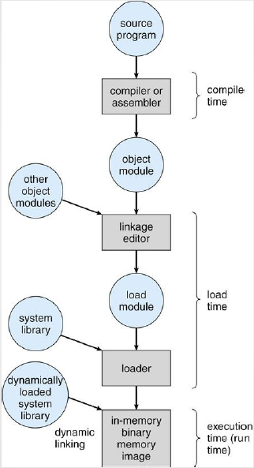

- 컴파일 시간

  - 논리 주소 생성
  - 프로세스가 메모리에 적재될 위치를 컴파일 시간에 알 수 있다면, 물리적 주소 생성 가능

- 적재 시간

  - 컴파일 시간에 알 수 없다면 컴파일러는 상대 주소 생성
  - 상대 주소는 시작 주소가 0으로, 최종 바인딩을 적재 시간까지 연기

- 실행 시간

  - 한 프로세스가 동일한 장소에서 작동한다면, 적재 시간 과정에서 바인딩 가능

  - 프로세스 실행 중 메모리 세그먼트에서 다른 세그먼트로 이동한다면 바인딩은 실행시간까지 연기

    

> - 컴파일러 : 원시코드를 컴파일하여 목적 파일 생성
>
> - 링커 : 목적 파일에 라이브러리나 다른 목적 파일 결합
>
> - 로더 : 지정 위치에서 시작하여 메모리에 프로그램을 배치.

#### 메모리 관리 용어

##### 동적 적재

- 바인딩을 최대한 늦춰 실행 직전 주소를 확정하면, 메모리를 효율적으로 운영할 수 있는 것
- 사용하지 않을 루틴을 적재하지 않으므로, 효율적임

##### 중첩

- 실행하려는 프로그램이 메모리 보다 클 때, 필요하지 않은 프로그램 일부는 중첩으로 해결

  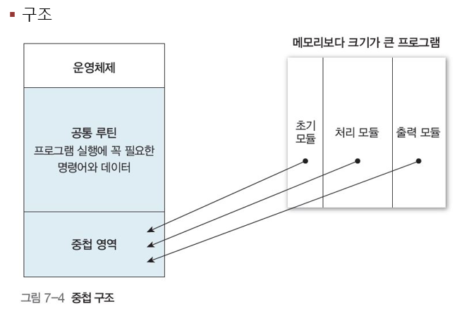

##### 스와핑(프로세스 교체)

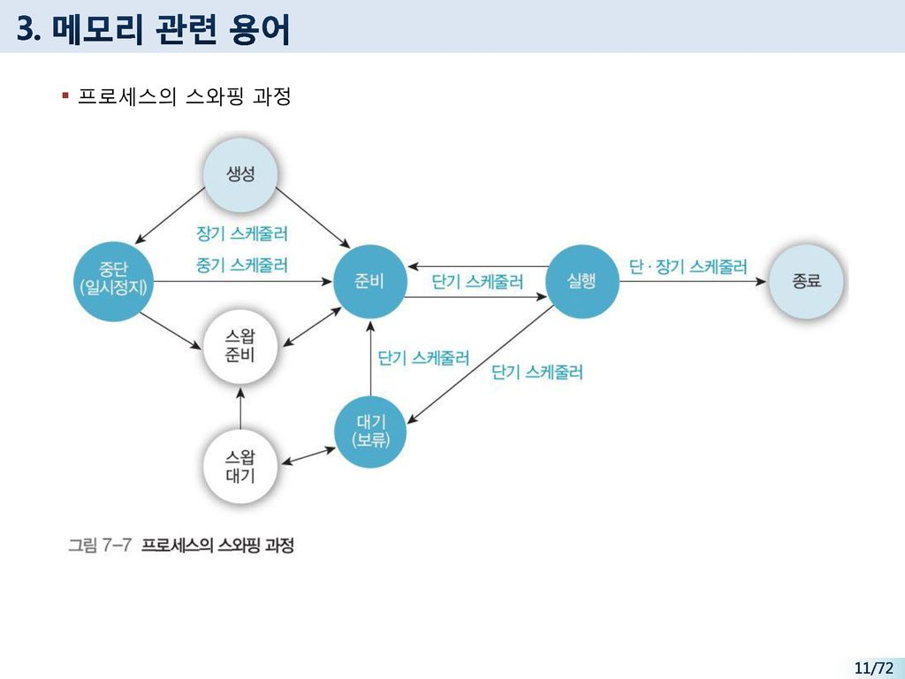

##### 메모리 적재 방법

- 메모리 할당
  - 연속 메모리 할당
    - 단일 프로그래밍
    - 다중 프로그래밍
      - 고정 분할
      - 가변 분할
  - 불연속 메모리 할당
    - 고정 분할 : 페이징
    - 가변 분할 : 세그먼테이션

## 2. 연속 메모리 할당

#### 1. 단일 프로그래밍

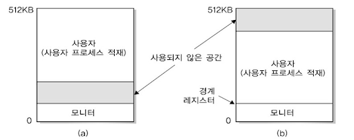

#### 2. 다중 프로그래밍

- 고정 분할
  - 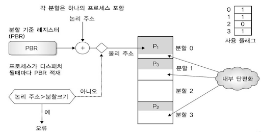
    - 여러개 고정된 크기로 분할
    - 각 메모리는 하나의 작업을 실행 할 수 있음
- 가변 분할
  - 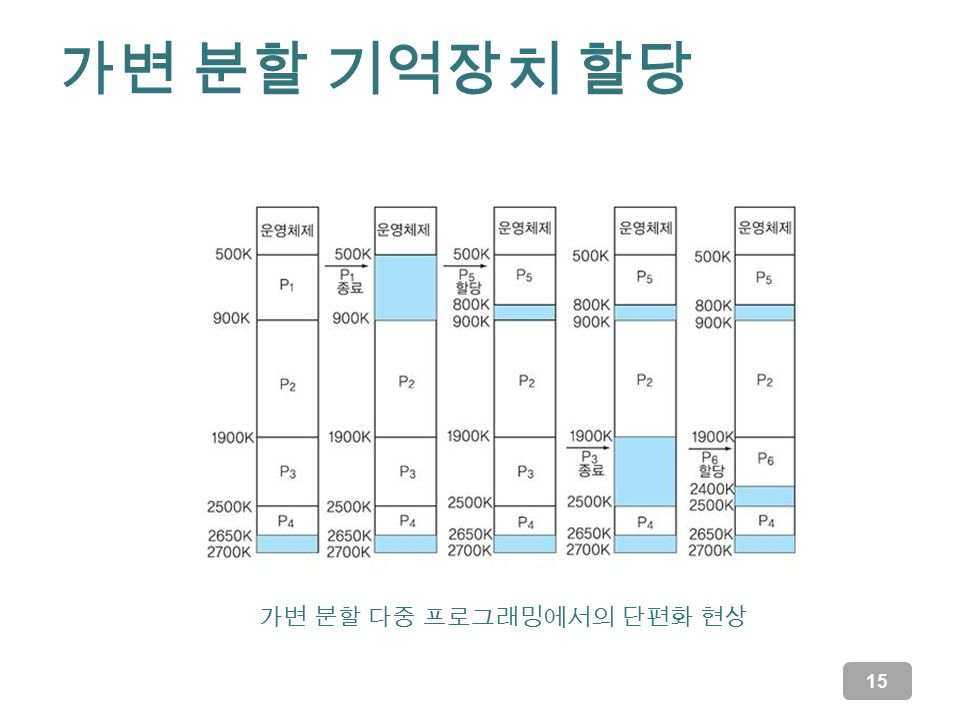
    - 최초 적합
    - 최적 적합
    - 최악 적합

## 3. 분산 메모리 할당 : 페이징

#### 페이징이란?

> 작업을 크기가 동일한 페이지로 나눠 처리하는 방법. 즉 프로세스 크기가 동일한 페이지로 나누고, 메인 메모리도 프레임이라는 고정 크기 블록으로 나눠, 이 프레임에 페이지를 적재하는 방법.

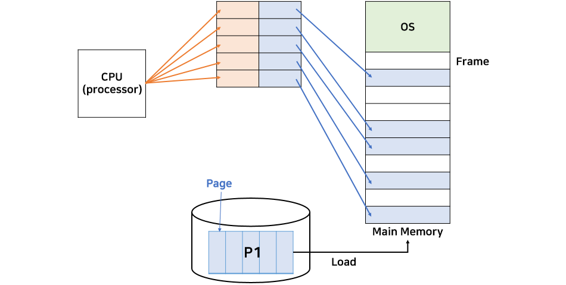

- 프로세스에 필요한 페이지 결정 -> 페이지 번호 부여

- 메모리의 빈 프레임을 조사 -> 프로세스를 적재할 위치 파악

- 프로세스의 페이지를 빈 프레임에 적재하도록 준비

  

#### 페이징 시스템의 하드웨어 구조, 원리

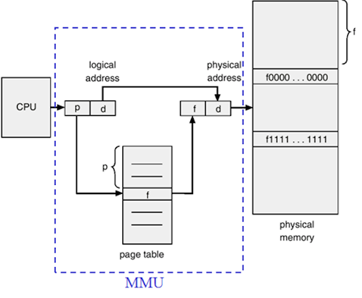

#### 페이징

- 1단계 페이징

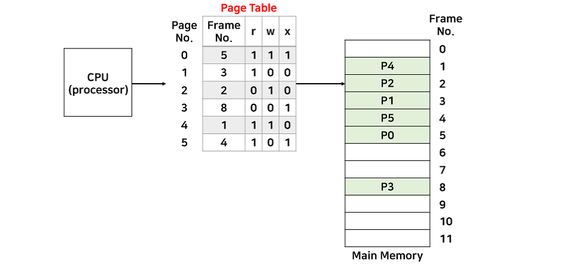

- 2단계 페이징

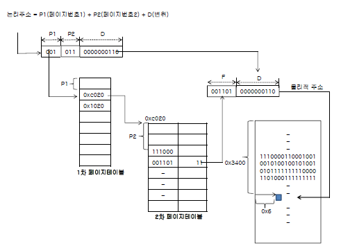

#### 페이지 테이블 구현

> 페이지 테이블은 크기가 커서 관리가 매우 중요하다. 가장 간단한 방법은 전용 레지스터를 사용하는 것이다.

#### 공유 페이지

- 페이징의 장점은 시분할 환경에서 중요한 공통 코드를 공유할 수 있다.

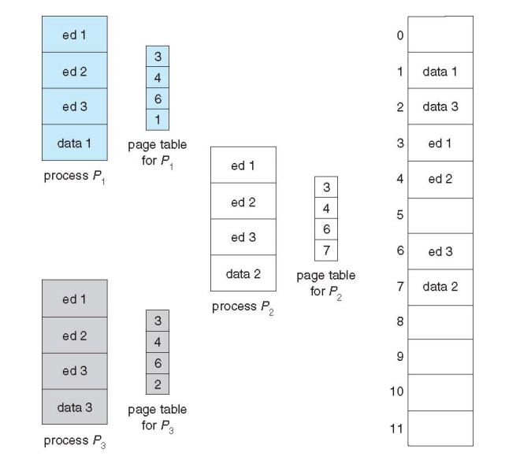

## 4. 분산 메모리 할당 : 세그멘테이션

- 너무 많아서.. 다음시간에..

