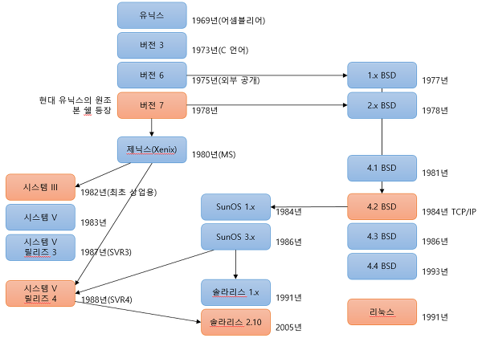
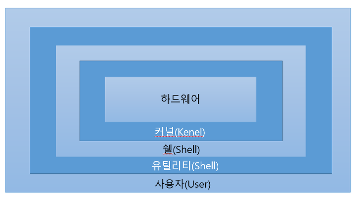
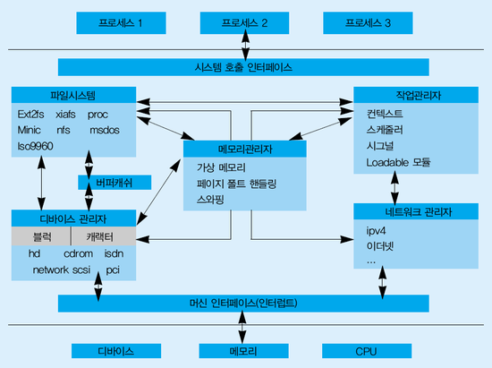
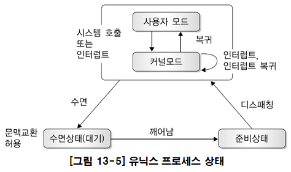
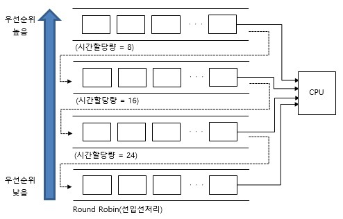
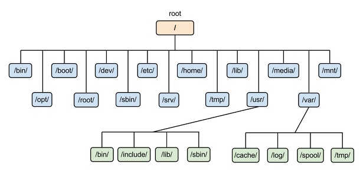
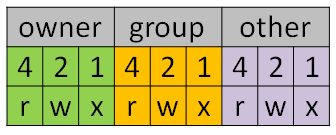

# 유닉스 운영체제

유닉스는 1969년 미국의 통신회사 AT&T 산하 Bell 연구소에서 켄 톰슨과 데니스 리치가 개발함. 대부분의 현대적 컴퓨터 운영체제의 원형이 되었다. 1973년에 어셈블리언어로 개발된 것을 C언어로 만들어 **고급 언어로 작성한 최초의 운영체제**가 되었다. 유닉스라는 이름은 Multics에 기반을 두고 있다.

리눅스, 안드로이드, macOS, iOS 등 많은 운영체제가 유닉스를 뿌리로 한다.




## 유닉스 특징

- 대화형 시스템 : User Interface, CLI, 명령어
- 다중 사용자 시스템 : 여러 사람이 같은 컴퓨터에 동시 접속 가능. 
- 다중 작업용 시스템 : 한 대에서 여러 작업을 동시에 수행함
- 높은 이식성과 확장성 : 다른 하드웨어를 이식해도 처음부터 다시 개발할 필요 없이 그대로 사용 가능. 
  - C언어로 개발된 운영체제. 
  - 각 기능을 모듈로 나눠 새로운 기능에 필요한 모듈만 추가하면 됨(이식성과 확장성이 높다)
- 계층적 트리 파일 시스템 : 루트 디렉터리를 정점으로 하위 디렉터리를 계층적으로 구성
- 다양한 부가 기능 제공 : 디버깅 도구, 편집도구, 출력도구 제공


## 유닉스 구성요소



- 커널

  - 프로세스 관리, 메모리관리, 파일 시스템 관리, 장치 관리 등 컴퓨터의 모든 자원을 초기화하고 제어
  - 최초 시스템 구동시, 커널은 메모리에 적재됨
  - 메모리에 상주하면서 하드웨어 자원을 모든 사용자에게 할당하고 제어함.
  - 응용 프로그램은 system call로 커널에 컴파일과 파일 조작 등을 함
    

- 쉘

  - 사용자와 커널 사이의 중간자 역할을 담당.
  - 사용자가 입력한 명령을 해석하여 커널에 넘겨줌
  - sh, bourne shell, csh, zsh, bash 등 다양함

- 유틸리티와 파일시스템

  - 일반 사용자가 작성한 응용프로그램을 처리하는데 사용함
  - 에디터, 컴파일러, 인터프리터, 디버거 등

  

## 유닉스의 프로세스 관리

#### 프로세스 종류

- 사용자 프로세스 : 사용자와 관련된 프로세스
- 커널 프로세스 : 커널 모드에서 실행, 프로세스 0이 해당, 커널 프로세스를 변경하려면 커널을 재 컴파일해야함
- 데몬 프로세스 : 네트워크 제어, 관리 등 시스템을 지원하는 프로세스

#### 프로세스 상태



#### 프로세스 스케줄링



- 다단계 피드백 스케줄링
  - 큐마다 서로 다른 CPU time 부여
  - 새로운 프로세스는 높은 우선순위
  - 프로세스의 실행 시간이 길어질수록 점점 낮은 우선순위 큐로 이동
  - 마지막 단계는 RR로 처리.


## 유닉스 파일 시스템

- 파일은 트리 구조의 디렉터리에서 생성
- /usr/local/font 에서 첫 번째 / 는 root, usr은 루트의 서브 디렉터리, local은 usr의 서브디렉터리
  - font가 파일인지 디렉터리인지는 경로명 형식으로 구별할 수 없음
- 절대 경로는 /usr/local/font
- 상대 경로는 ./font 



```
- creat : 주어진 경로에 파일 생성
- open : 파일을 사용할 수 있는 상태로 준비
- close : 파일 닫기
- read/write : 파일에서 정보 추출, 버퍼에서 자료를 외부파일로 복사
- cat : 파일 내용 화면에 표시
- rm : 파일 제거
- cp : 파일 복사
- mv : 파일 이름을 바꾸거나 파일을 옮김
```


## 유닉스 프로세스 제어

```
fork : 새로운 프로세스를 생성
exec : 새로운 프로세스를 수행
exit : 프로세스 수행을 종료
wait : fork 후 exec에 의해 실행되는 프로세스의 상위 프로세스가 하위 프로세스 종료 등을 기다림
kill : 프로세스를 제거
getpid : 자신의 프로세스 아이디
getppid : 부모 프로세스 아이디
& : 백그라운드 처리를 위해 명령의 끝에 입력
signal : 신호를 받았을 때 프로세스가 취할 동작을 지정
pipe : 프로세스 간 통신을 위한 경로를 설정
```


## Linux vs Unix

| 리눅스                                                       | 유닉스                                                       |
| :----------------------------------------------------------- | :----------------------------------------------------------- |
| LINUX는 컴퓨터 하드웨어 및 소프트웨어, 게임 개발, PC 등에 사용되는 오픈 소스 소프트웨어 개발 및 무료 운영 체제 | UNIX는 기본적으로 Intel, HP, 인터넷 서버 등에서 사용되는 운영 체제 |
| LINUX는 가격이 책정되었으며 무료 배포 및 다운로드 버전도 있음 | UNIX의 버전 / 종류에 따라 가격 구조가 다름                   |
| 이 운영 체제의 사용자는 가정 사용자, 개발자 등 누구나 될 수 있다 | 이 운영 체제는 기본적으로 누구나 사용할 수 있도록 설계된 OSX를 제외하고 메인 프레임, 서버 및 워크 스테이션 용으로 개발 |
| BASH (Bourne Again Shell)는 Linux 기본 셸, 즉 여러 명령 인터프리터를 지원하는 텍스트 모드 인터페이스 | Bourne 쉘은 이제 BASH를 포함한 많은 다른 것들과 호환되는 텍스트 모드 인터페이스 역할 |
| LINUX는 KDE와 Gnome의 두 가지 GUI를 제공한다                 | UNIX 용 GUI 역할을하는 공통 데스크탑 환경이 만들어졌다       |
| **예 :** Red Hat, Fedora, Ubuntu, Debian 등                  | **예 :** Solaris, 모든 Linux                                 |


## plus

```bash
$ cd
$ cd ~
$ cd -
$ history
$ !!
$ !2323
$ echo "ww" > tt.txt
$ touch new_file{1,2,3}
$ ls
new_file1 new_file2 new_file3
$ mkdir
$ kill -15 (SIGTERM 커밋되지않은 정보를 안전하게 저장)
$ kill -1 (SIGHUP 재시작)
$ kill -9 (SIGKILL 강제종료)
$ which (검색경로에 있는 디렉토리 검색)
$ chmod
$ chown
```

