# 파일 관리

## 파일 시스템

### 파일 시스템의 개념

- 컴퓨터 시스템의 다양한 파일은 하드디스크나 CD같은 저장장치에 보관
- 이러한 파일은 파일 관리자를 두어 저장장치의 전체 관리를 맡김 → 파일 시스템
- 파일 관리자는 파일 테이블을 사용하여 파일을 관리
- 파일을 사용하고자할 때 읽기, 쓰기, 실행과 같은 다양한 접근 방법 제공
- 이때 권한이 필요한 데, 이를 파일 디스크럽터라고 함   

### 파일 시스템의 기능

- 파일 시스템은 파일을 생성하고, 파일 관리를 쉽게하도록 디렉터리 구조 제공
- 여러 종류의 파일을 구분하기 위해 파일 이름과 확장자 제공
- 파일 이름, 파일 크기, 생성 날짜 등 다양한 파일 정보는 파일 헤더에 저장하여 관리
- 그 외에도 접근 권한 관리, 접근 방법 제공, 무결성 보장, 백업/복구, 암호화 기능 제공   

### 블록

- 데이터는 운영체제와 저장장치 간에 블록 단위로 전송
- 블록은 저장장치에서 사용하는 가장 작은 단위, 한 블록에 주소 하나가 할당
- 블록의 크기는 시스템마다 다름 (시스템이 정한 기본 크기를 사용하거나 직접 지정)
- 블록 크기를 너무 작게 설정하면 내부 단편화 현상이 줄어듦, 그러나 파일이 여러 블록으로 나뉘어 파일 입출력 속도가 느려짐 → 큰 파일을 사용할 때는 블록 크기를 크게   

## 파일

### 파일의 개념

- 파일은 논리적인 데이터의 집합으로 하드디스크나 CD같은 저장장치에 보관
- 모든 파일은 0과 1의 비트 패턴으로 이루어지고 크게 실행 파일과 데이터 파일
- 파일의 이름은 `파일 이름.확장자` 형태로 구성   

**실행 파일**

운영체제가 메모리로 가져와 CPU를 이용하여 작업을 하는 파일

사용자의 요청으로 프로세스가 된 파일)   

**데이터 파일**

실행 파일이 작업하는데 필요한 데이터를 모아놓은 파일

스스로 프로세스가 될 수 없고, 전송되거나 보관만 됨

ex) 이미지 뷰어 프로그램의 사진 파일, 뮤직 플레이어의 음악 파일 등   

### 파일 속성

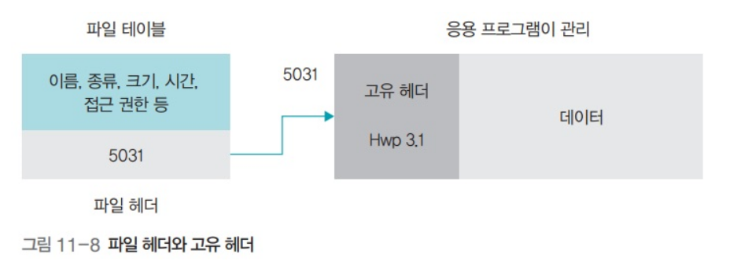

파일은 다음과 같은 속성을 가지고 있고, 이러한 파일 속성들은 각 파일 헤더에 기록되며, 운영체제는 이렇나 파일 헤더를 파일 테이블에서 관리

- name : 확장자를 포함한 전체 이름을 의미
- type : 실행 파일, 동영상 파일, 사진 파일 등 확장자로 구분
- size : 파일 용량을 의미
- time : 파일 접근 시간을 의미하며 만든 시간, 변경 시간, 최근 열어본 시간 등으로 세분화
- location : 파일의 위치, 이름과 확장자가 같은 두 파일은 한 디렉터리에 존재할 수 없음
- accessibility : 파일의 접근 권한을 의미
- owner : 파일의 소유자라는 의미, 윈도우에는 거의 없지만 유닉스에서는 자주 사용됨

운영체제가 관리하는 파일 헤더 외에 데이터 파일마다 자신에게 필요한 속성을 따로 정의할 때 고유 헤더를 사용합니다.   

### 파일 연산

- 파일 변경 == 파일 연산(작업)
- 파일 자체를 변경하는 작업과 파일 내용을 변경하는 작업으로 나뉨   

**파일 자체를 변경**

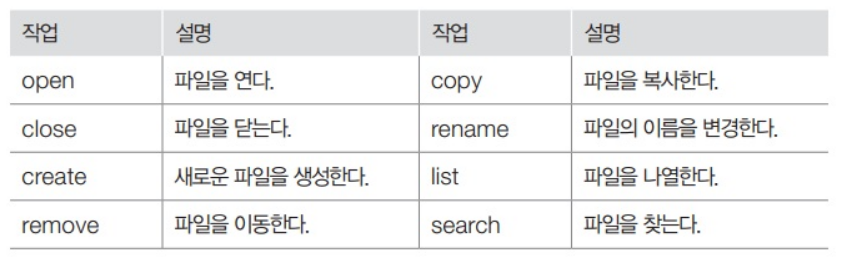   

**파일 내용을 변경**

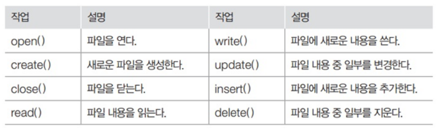   

## 파일 구조

### 순차 파일 구조

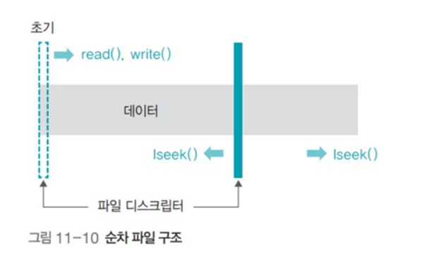

파일의 내용이 하나의 긴 줄로 늘어선 형태 (선형)

**장점**

모든 데이터가 순차적으로 기록되기 때문에 저장 공간에 낭비되는 부분이 없음

구조가 단순하여 테이프는 물론 플로피디스크나 메모리를 이용한 저장장치에 적용 가능

순서대로 데이터를 읽거나 저장할 때 매우 빠르게 처리됨

**단점**

파일에 새로운 데이터를 삽입하거나 삭제할 때 시간이 많이 걸림

특정 데이터로 이동할 때 직접 접근이 어려움, 데이터 검색에 적절하지 않음   

### 인덱스 파일 구조

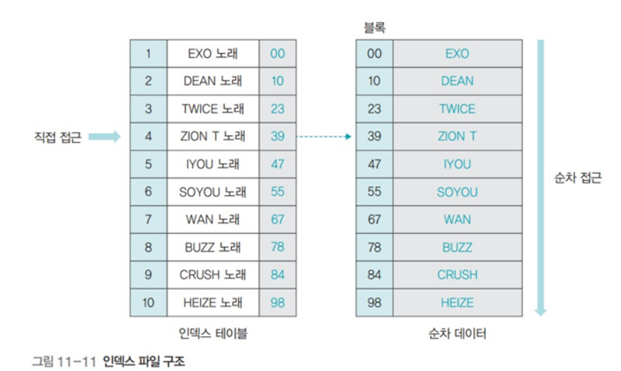

인덱스 테이블을 이용하여 순차 접근과 직접 접근이 가능

현대의 파일 시스템은 인덱스 파일 구조로, 파일을 저장할 땐 순차 파일 구조로 저장하고 파일에 접근할 때는 인덱스 테이블을 보고 파일에 직접 접근

**장점**

인덱스 테이블을 여러 개 만들면 다양한 접근이 가능

많은 양의 데이터를 처리할 때 효율적

**단점**

인덱스 영역을 저장하기 위해 추가 공간 필요

인덱스를 이용하여 참조하기 때문에 접근 시간이 직접 파일보다 느림   

### 직접 파일 구조

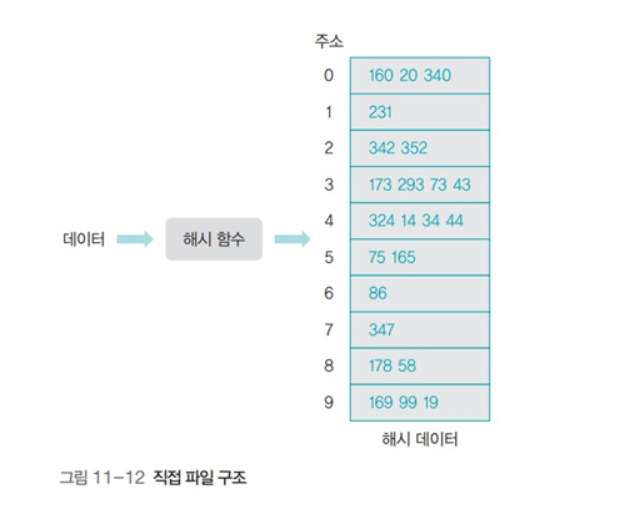

저장하려는 데이터의 특정 값에 어떤 관계를 정의하여 물리적인 주소로 바로 변환하는 파일 구조

해시 함수를 이용하여 직접 접근이 가능한 파일 구조

실제로 많이 쓰이진 않음

**장점**

해시 함수를 이용하여 주소를 변환하므로 데이터 접근이 매우 빠름

**단점**

전체 데이터가 고르게 저장될 수 있는 해시 함수를 찾기 어려움

해시 함수를 잘 찾았더라도 저장 공간이 낭비될 수 있음   

## 디렉터리

### 디렉터리의 개념

- 관련있는 파일을 하나로 모아놓은 곳
- 1개 이상의 자식 디렉터리를 가질 수 있고, 1개 이상의 파일을 가질 수 있음
- 디렉터리는 여러 층으로 구성되고 최상위에 루트 디렉터리가 있음   

### 디렉터리 파일

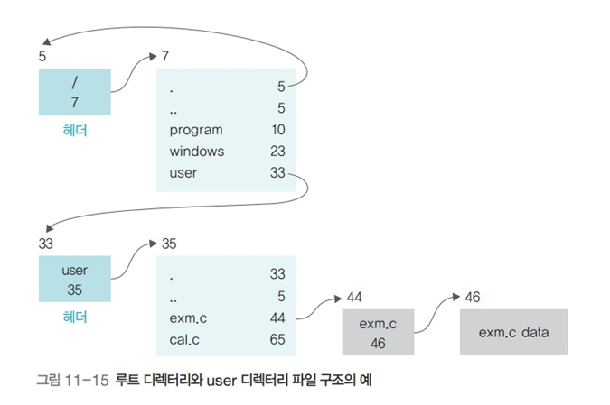

- 디렉터리도 파일임
- 일반 파일에는 데이터가 담기고 디렉터리에는 포함된 파일 정보가 담김
- 디렉터리 헤더에는 디렉터리의 이름, 만든 시간, 접근 권한 등의 정보가 기록됨
- 디렉터리 헤더에는 실제 내용이 담긴 블럭의 위치도 저장됨   

### 경로

절대 경로 : 루트 디렉토리를 기준으로 파일의 위치를 나타내는 방식

ex) /program/data/exam.c

상대 경로 : 현재 있는 위치를 기준으로 파일의 위치를 표시

ex) data/exam.c   

## 디렉터리 구조

### 1단계 디렉터리 구조

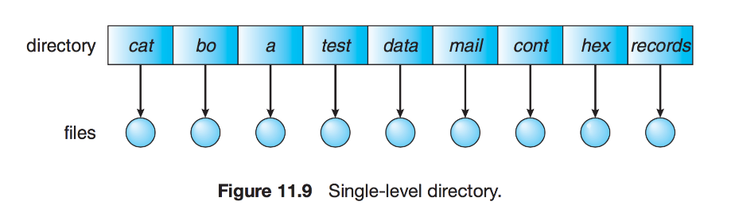   

### 2단계 디렉터리 구조

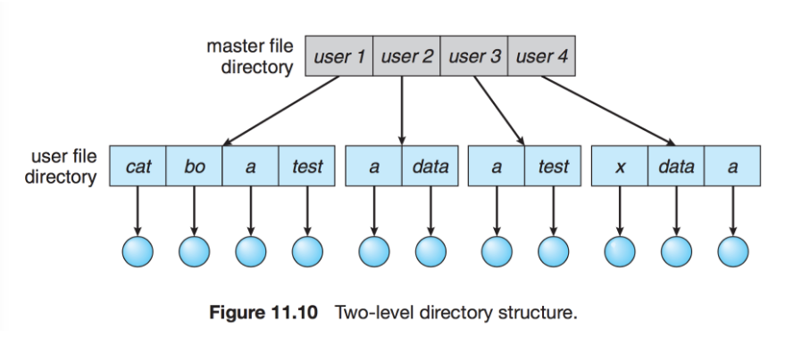   

### 트리 디렉터리 구조

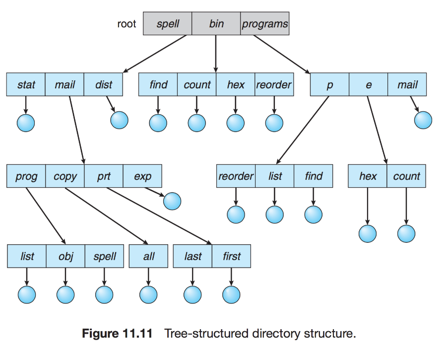   

### 그래프 디렉터리 구조

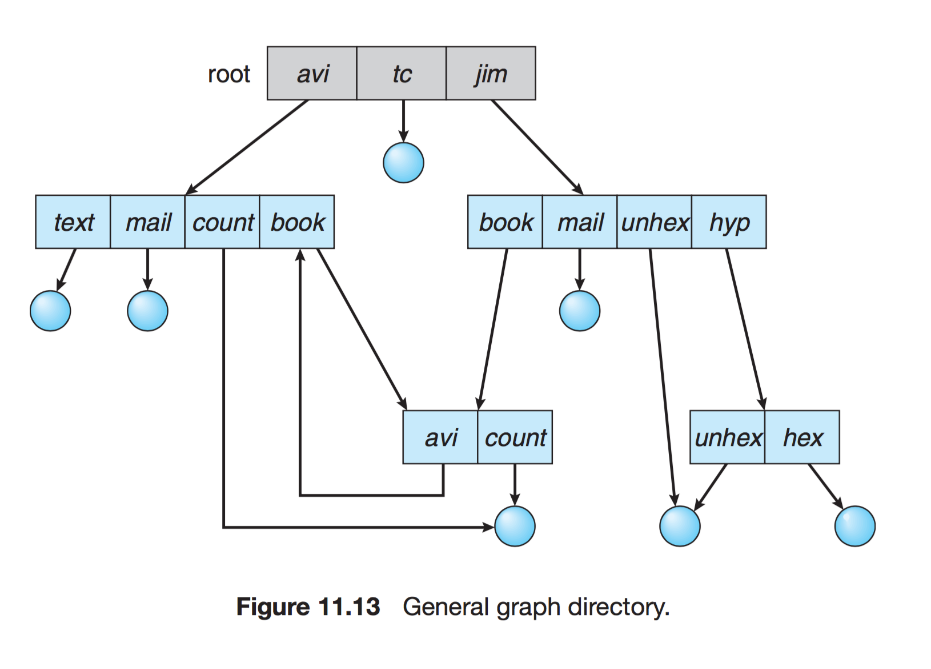   

## 마운트

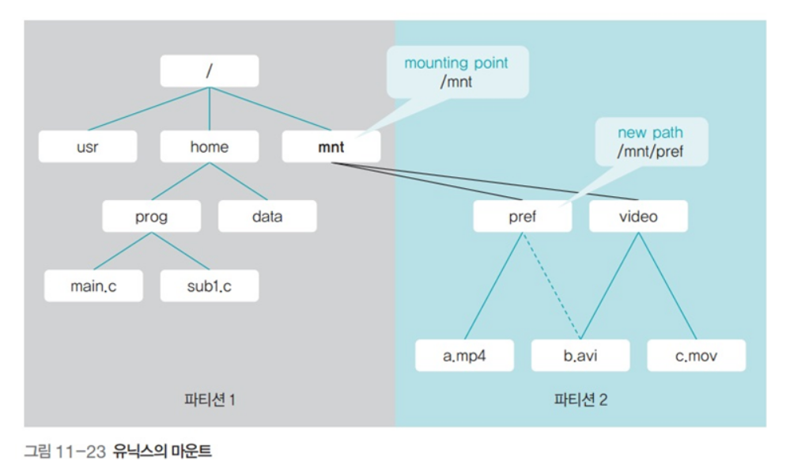

- 여러 개의 파티션을 통합하는 명령어
- 사용자는 파티션1과 파티션2가 하나의 파티션으로 알고있음
- 유닉스 운영체제에서 /dev 아래에 외부 저장장치를 마운트하여 사용   

## 디스크 파일 할당

### 연결 할당 방식

- 파일에 속한 데이터를 연결 리스트로 관리하는 방식
- 파일 테이블에는 시작 블록에 대한 정보만 저장
- 나머지 데이터는 시작 블록부터 연결 리스트를 이용해 연결하여 저장
- 연결리스트의 단점   

### 파일 테이블을 이용한 불연속 할당

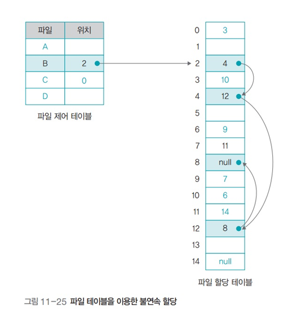

- 연결리스트에서 다음 블록을 가리키는 포인터 정보만 빼다가 테이블을 따로 만들었다고 생각하면 편함
- 하나의 파티션이 사용할 수 있는 디스크 용량이 테이블의 주소 크기로 제한된다는 단점
- ex) FAT16은 16bit 주소 → 32GB   

### 인덱스를 이용한 불연속 할당

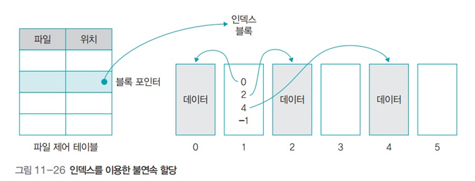

- 테이블의 블록 포인터가 데이터 블록을 연결하는 것이 아니라, 데이터의 인덱스를 담고 있는 **인덱스 블록**(**inode**)을 연결
- 인덱스 블록은 실제 데이터의 위치에 관한 정보를 순서대로 보관
- 테이블이 꽉 차서 더 이상 데이터를 연결할 수 없을 때는 인덱스 블록을 연결하는 간접 인덱스 블록(. index block)을 만들어 테이블을 확장할 수 있음
- 유닉스의 I-node가 이 방식을 사용   

### 유닉스 I-node

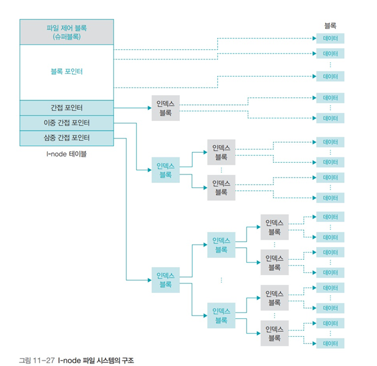

파일 크기가 작은 경우 블록을 직접 연결하여 빠르게 접근

파일 크기가 큰 경우 인덱스 블록과 이를 연결하는 간접 포인터를 이용하여 확장   

## 빈 공간 리스트

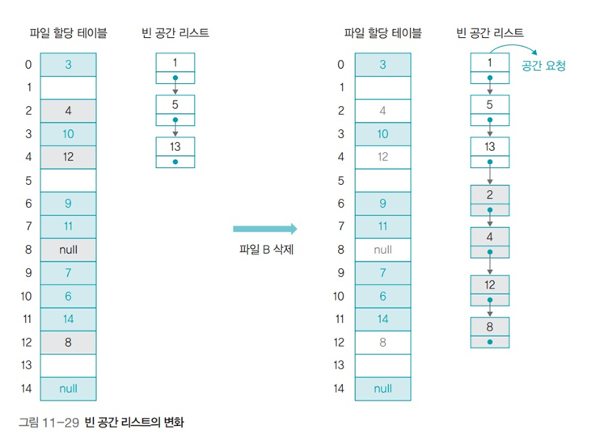

- 파일 시스템은 디스크의 빈 공간을 효율적으로 관리하기 위해 **빈 블록의 정보만 모아놓은 빈 공간 리스트**를 유지
- 파일 테이블의 헤더를 삭제하고 사용했던 블록을 빈 공간 리스트에 등록하는 것을 파일이 삭제된 것으로 간주
- 어떤 데이터를 지우고 새로운 데이터를 디스크에 넣을 때 방금 지워진 블록에 할당되는 것이 아니라 리스트에 있던 블록 중 맨 앞에 있는 블록에 할당   

## 접근 제어

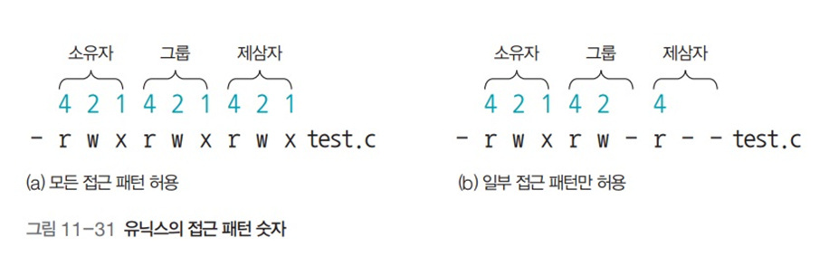

- r : read(읽기 권한) - 4
- w : write(쓰기 권한) - 2
- x : execute(실행 권한) - 1
- chmod 명령을 이용하여 권한을 부여   

> Reference
>
> - http://www.yes24.com/Product/Goods/62054527
> - https://github.com/gyoogle/tech-interview-for-developer/blob/master/Computer%20Science/Operating%20System/File%20System.md
> - https://blackjellybear.tistory.com/56
