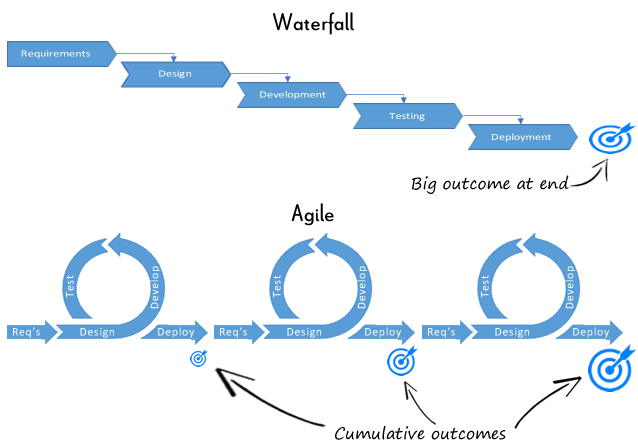
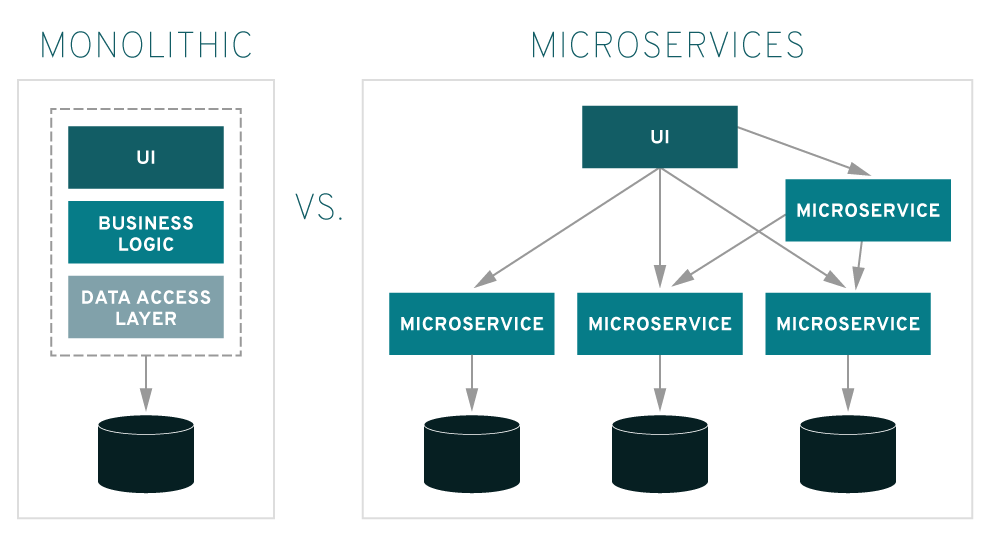

# 애자일, 객체 지향, 함수형 프로그래밍, 데브옵스, 서드 파티, MSA

## 애자일 방법론

### 애자일 방법론이란?

소프트웨어 개발 방법론 중 하나인 애자일 방법론이란 처음부터 끝까지 계획을 수립하고 개발하는 워터폴 방법론과 달리 개발과 함께 즉시 피드백을 받아 유동적으로 개발하는 방법이다.

> 애자일 소프트웨어 개발 선언
> 
> 우리는 소프트웨어를 개발하고, 또 다른 사람의 개발을 도와주면서 소프트웨어 개발의 더 나은 방법들을 찾아가고 있다.
> 
> 이 작업을 통해 우리는 다음을 가치 있게 여기게 되었다
> 
> 공정과 도구보다 **개인과 상호작용**을
>
> 포괄적인 문서보다 **작동하는 소프트웨어**를
> 
> 계약 협상보다 **고객과의 협력**을
> 
> 계획을 따르기보다 **변화에 대응하기**를
> 
> 가치 있게 여긴다.
>
> 이 말은, 왼쪽에 있는 것들도 가치가 있지만, 우리는 **오른쪽에 있는 것들에 더 높은 가치를 둔다**는 것이다.

### 애자일 12가지 원칙

**1. 초기부터 지속적으로 고객 만족**

우리의 최우선 순위는 가치(value) 있는 소프트웨어를 초기부터 지속적으로 제공(배포)함으로써 고객을 만족시키는 것입니다.

**2. 요구사항 변경 수용**

개발 후반부에 변화하는 요구 사항의 수용을 환영합니다. Agile 프로세스는 변화를 수용하며 고객의 경쟁력을 돕습니다.

**3. 짧은 배포 간격**

소프트웨어를 짧은 주기(2주에서 2달까지)로 동작하는 소프트웨어를 배포하되 더 짧은 주기를 선호합니다.

**4. 기획자/현업과 개발자는 함께 일하기**

비즈니스 담당자와 개발자는 프로젝트 전체 기간동안 매일 함께 일해야합니다.

**5. 동기부여된 팀원들로 프로젝트 만들기**

동기가 부여된 개인들 중심으로 프로젝트를 구축합니다. 그들에게 필요한 환경과 지원을 제공하고 업무를 완수 할 것을 믿습니다.

**6. 얼굴보고 대화하기**

개발 팀에 정보를 전달하는 가장 효율적이고 효과적인 방법은 대면 대화입니다.

**7. 동작되는 소프트웨어로 진도 측정**

작동하는 소프트웨어가 진척의 주요 척도입니다.

**8. 지속 가능한 개발 속도 유지**

Agile 프로세스는 지속 가능한 개발을 장려합니다. 스폰서, 개발자 및 사용자는 일정하게 일정한 속도를 유지할 수 있어야합니다.

**9. 좋은 기술, 설계에 관심**

우수한 기술과 우수한 디자인에 대한 지속적인 관심은 민첩성(agility)을 향상시킵니다.

**10. 단순성**

단순성(수행되지 않은 작업량을 최대화하는 기술)은 필수적입니다.

**11. 자기 조직화 팀**

최고의 아키텍처, 요구 사항 및 디자인은 자기 조직화 팀(Self-Organization Team)에서 나옵니다.

**12. 정기적으로 효율성 제고**

팀은 정기적으로 보다 효과적인 방법을 적용해보고, 그에 따라 행동을 조율하고 조정합니다.

### 애자일의 장점

- 프로젝트 계획에 걸리는 시간을 최소화
- 점진적으로 테스트할 수 있어 버그를 쉽고 빠르게 발견
- 계획 혹은 기능에 대한 수정과 변경에 유연
- 고객 요구사항에 대한 즉각적인 피드백에 유연

### "스크럼" 진행 방법

**1. 제품 기능 목록 작성**

개발할 제품에 대한 요구사항 목록 작성

**2. 스프린트 계획 회의**

스프린트 목표와 백로그를 계획하는 회의

각각의 목표에 도달하기 위해 필요한 작업 목록(백로그)을 작성
- 세부적으로 어떤 것을 구현해야 하는지
- 작업자
- 예상 작업 시간

**3. 스프린트**

반복적인 개발 주기. 작은 단위의 개발 업무를 단기간 내에 전력질주하여 개발한다. 보통 2주~4주

**4. 일일 스크럼 회의**

날마다 진행되는 미팅 (어제 한일, 오늘 할일, 장애 현상 등을 공유)

**5. 스프린트 검토 회의**

매회의 스프린트가 종료할 때마다, 스프린트 리뷰 미팅을 통해 만들어진 제품을 학습하고 이해한다.

**6. 스프린트 회고**

제품의 학습과 이해가 끝나면, 스프린트 회고를 통해 팀의 개발 프로세스에 대한 개선의 시간을 갖는다.

## 객체 지향 프로그래밍

### 객체 지향 프로그래밍이란?

객체 지향 프로그래밍은 컴퓨터 프로그래밍 패러다임중 하나로, **프로그래밍에서 필요한 데이터를 추상화시켜 상태와 행위를 가진 객체를 만들고 그 객체들 간의 유기적인 상호작용을 통해 로직을 구성하는 프로그래밍 방법**이다.

### 객체 지향의 특징

**1. 추상화**

- 객체들의 공통적인 특징(기능, 속성)을 묶어 이름을 붙이는 것

ex) 학생이라는 클래스가 있으면 그 안에 많은 학생 정보가 담겨있다. 학생을 추상화하기 위해 필요한 정보와 행위를 묶는다.

**2. 캡슐화**

- 데이터 구조와 데이터를 다루는 방법을 결합 시켜 묶는 것(변수와 함수를 하나로 묶음)
- 데이터를 외부에서 직접 접근을 금지하고 함수를 통해서만 접근하도록 제한(은닉화)

**3. 상속성**

- 부모 클래스가 가진 특징(함수, 데이터)을 자식 클래스가 물려받는 것
- 기존 코드를 재활용할 수 있어 객체 지향에서 중요한 방법 중 하나

**4. 다형성**

- 하나의 클래스나 함수가 다양한 방식으로 동작
- **오버라이딩**: 부모 클래스가 가지고 있는 메서드를 하위 클래스가 재정의해서 사용
- **오버로딩**: 같은 이름의 메서드를 여러개 가지면서 매개변수의 유형과 개수가 다르게 하는 기술

### 장점

- 코드 재사용이 용이: 다른 사람이 만든 모듈을 쉽게 가져다 쓸 수 있고 상속을 통해 확장 가능
- 유지 보수가 쉬움: 수정해야 할 부분을 쉽게 찾고 수정 가능
- 업무 부담에 용이: 클래스 단위로 모듈화 시켜서 개발하여 업무 분담이 쉬어 대형 프로젝트에 적합

### 단점

- 처리 속도가 상대적으로 느림
- 객체가 많으면 용량이 커질 수 있음
- 설계 시 많은 시간과 노력 필요

## 함수형 프로그래밍

순수 함수를 조합하여 소프트웨어를 만드는 방식

가변 데이터를 지양하며 함수의 출력 값은 그 함수에 입력된 인수에만 100% 의존한다.

### 함수형 프로그래밍의 특징

부수 효과가 없는 순수 함수를 1급 객체로 간주하여 파라미터로 넘기거나 반환값으로 사용할 수 있으며, 참조 투명성을 지킬 수 있다.

#### 1급 객체(First Object)

1급 객체란 다음과 같은 조건을 만족하는 객체를 말한다.

- 변수나 데이터 구조안에 담을 수 있음
- 파라미터로 전달 할 수 있음
- 반환 값(return value)으로 사용할 수 있음
- 할당에 사용된 이름과 관계없이 고유한 구별이 가능함

#### 고차 함수(High-Order Function)

- 함수에 함수를 파라미터로 전달할 수 있음
- 함수의 반환 값으로 함수를 사용할 수 있음

#### 불변성(Immutability)

- 데이터가 변할 수 없음
- 데이터 변경이 필요한 경우 원본 데이터를 변경하지 않고 그 데이터의 복사본을 만들어 변경 후 변경한 복사본을 사용해 작업을 진행

#### 순수 함수(Pure function)

- 동일한 입력에는 항상 같은 값을 반환
- 함수의 실행이 프로그램의 실행에 영향을 미치지 않음(Side effect가 없어야 함)

Side effect란

- 변수의 값이 변경됨
- 자료 구조를 제자리에서 수정함
- 객체의 필드값을 설정함
- 예외나 오류가 발생하며 실행이 중단됨
- 콘솔 또는 파일 I/O가 발생함

#### 지연 평가(Lazy evaluation)

- 계산의 결과값이 필요할 때 까지 계산을 늦추는 기법
- 불필요한 연산을 피하기 위해 연산을 지연 시킴

### 함수형 프로그래밍의 장점

- 코드가 간결해짐
- 모듈성과 재사용성을 높임
- 테스트가 하기 쉬움

## 데브옵스

데브옵스(DevOps)는 개발(Development)과 운영(Operations)의 합성어로서, 개발자와 운영을 담당하는 정보기술 전문가 사이의 소통, 협업, 통합 및 자동화를 강조하는 소프트웨어 개발 방법론이다.

### 데브옵스 환경을 구축하려면?

#### SCM(Source Code Management)

팀 단위로 개발되는 소스를 지속적으로 관리해준다. Git과 같은 버전 관리 시스템을 이용해 소스코드를 관리한다.

#### CI/CD

빌드와 배포 시간을 단축하기 위해 CI/CD를 구축한다.

##### CI(Continuous Integration)

지속적인 통합

어플리케이션의 새로운 코드 변경 사항이 정기적으로 빌드 및 테스트 되어 공유 레포지토리에 통합되는 것을 의미

##### CD(Continuous Deploy)

지속적인 배포

변경 사항이 레포지토리를 넘어, 프로덕션 단계까지 릴리즈 되는 것

#### 모니터링 및 로깅

배포 이후 모니터링 및 로깅을 하여 제품이 최종사용자 경험에 어떤 영향을 미치는지 확인

데이터에 대한 실시간 분석을 수행하거나 알림을 생성 할 수 있으며, 사용자 데이터를 모니터링하여 서비스 발전에 방향을 잡고 계획할 수 있음

### 데브옵스의 장점

- 속도

작업의 속도가 빨라지고 시장 변화에 더 잘 대응해 효율적인 비즈니스 성과를 창출할 수 있음

- 빠른 배포

신속하게 배포하여 새로운 기능의 릴리즈나 버그 수정에 용이함

- 안정성

애플리케이션 업데이트와 인프라 변경의 품질 보장, 지속적 통합 및 지속적 전달과 같은 방식을 통해 변경 사항이 제대로 안전하게 작동하는지 테스트 가능

- 확장 가능

복잡하거나 변화하는 시스템을 효율적으로 관리 가능

- 협업 가능

개발자와 운영팀 간의 협력을 통해 효율적으로 일할 수 있음

## 서드파티

서드파티란 프로그래밍을 도와주는 라이브러리를 만드는 외부 생산자를 뜻한다.

### ***개발자 측면으로 보면?***

- 하드웨어 생산자가 '직접' 소프트웨어를 개발하는 경우 : 퍼스트 파티 개발자
- 하드웨어 생산자인 기업과 자사간의 관계(또는 하청업체)에 속한 소프트웨어 개발자 : **세컨드 파티 개발자**
- 아무 관련없는 제3자 소프트웨어 개발자 : 서드 파티 개발자

편한 개발을 위해 플러그인이나 라이브러리 혹은 프레임워크를 사용하는데, 이처럼 제 3자로 중간 다리 역할로 도움을 주는 것이 서드 파티라고 볼 수 있고, 이런 것을 만드는 개발자가 서드 파티 개발자다.

## MSA

MSA는 소프트웨어 개발 기법 중 하나로, 하나의 큰 애플리케이션을 마이크로 단위의 모듈로 분리하고 API를 통해 서로 통신하도록 만든다.

### Monolithic vs. MSA

MSA가 도입되기 전에는 Monolithic 아키텍쳐 방식으로 개발이 이루어졌다.

Monolithic은 모든 기능을 하나의 어플리케이션에서 비즈니스 로직을 구성해 운영한다. 이는 처음 개발을 하거나 작은 프로젝트 사이즈에선 유리하지만, 시스템이 점점 확장되거나 큰 프로젝트에서는 단점이 존재한다.

- 빌드/테스트 시간의 증가: 하나를 수정해도 시스템 전체를 빌드해야함. 유지보수가 힘듬
- 작은 문제가 시스템 전체에 문제를 일으킴: 하나의 서비스 부분에 문제가 생기면 모든 서비스 이용이 불가능
- 확장성에 불리: 하나의 서비스를 확장하기 위해 전체 프로젝트를 확장해야 함

이러한 단점을 극복하기 위해 MSA를 사용한다.

기능(목적)별로 컴포넌트를 나누고 조합을 할 수 있도록 시스템을 구축하여 Monolithic의 문제를 해결할 수 있다.

### MSA의 장점

- 각 기능별로 모듈이 독립적이기 때문에 해당 모듈에 가장 효율적인 프로그래밍 언어 사용 가능
- 기능별로 해야 할 일을 나눠서 효율적으로 처리
- 중앙 집권적 데이터베이스가 아닌 각 서비스마다 알맞은 데이터베이스 선택 가능
- 새로 추가되거나 수정 사항이 있는 서비스만 빠르게 빌드, 배포 가능
- 서비스에 문제가 생기면 관련 부분 서비스만 빠르게 고쳐서 정상화 가능

### MSA의 단점

- 통신 에러시 문제가 생김
- 하나의 프로세스 내에서 진행되는게 아니라 속도 면에서 Monolithic에 비해 뒤쳐짐
- 각 마이크로 서비스끼리 자원을 공유하거나 접근하는데 어려움
- 각 서비스가 개별적으로 운영되기 때문에 트랜잭션으로 묶기 힘든 점이 있음

> Reference
> - https://medium.com/hgmin/agile-principles-%EC%95%A0%EC%9E%90%EC%9D%BC-12%EA%B0%80%EC%A7%80-%EC%9B%90%EC%B9%99-d3f386bd9839
> - https://simsimjae.medium.com/%EC%95%A0%EC%9E%90%EC%9D%BC-%EB%B0%A9%EB%B2%95%EB%A1%A0-753368aa3058
> - https://jeong-pro.tistory.com/95
> - http://www.incodom.kr/%EA%B0%9D%EC%B2%B4_%EC%A7%80%ED%96%A5
> - https://mangkyu.tistory.com/111
> - https://velog.io/@kyusung/%ED%95%A8%EC%88%98%ED%98%95-%ED%94%84%EB%A1%9C%EA%B7%B8%EB%9E%98%EB%B0%8D-%EC%9A%94%EC%95%BD
> - https://newrelic.com/kr/devops/what-is-devops
> - https://m.blog.naver.com/acornedu/221519913222
> - https://blog.sonim1.com/231
> - https://gyoogle.dev/blog/computer-science/software-engineering/3rd%20party.html
> - https://buble2.tistory.com/14