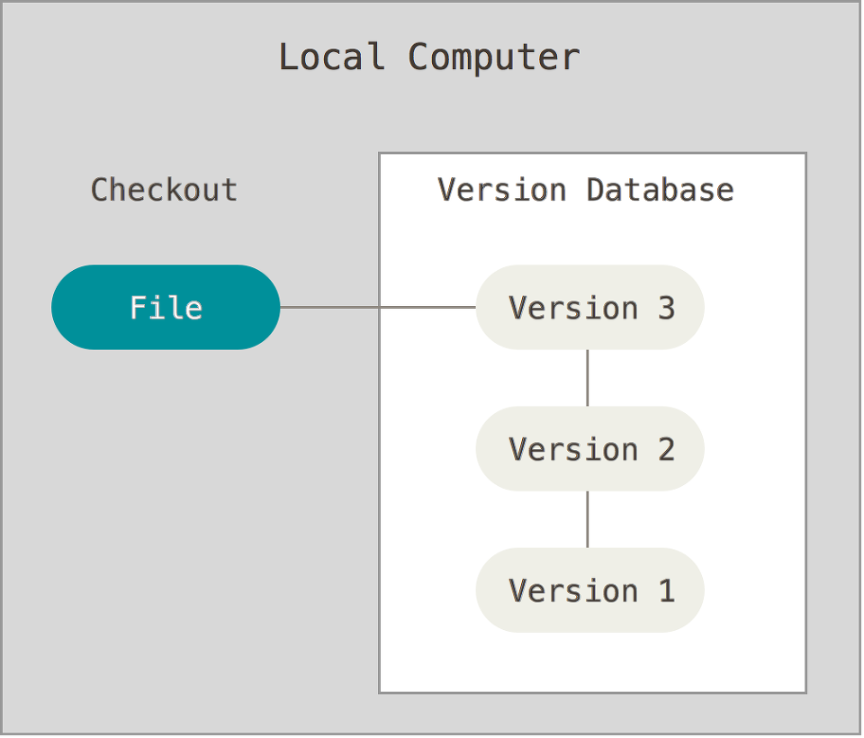
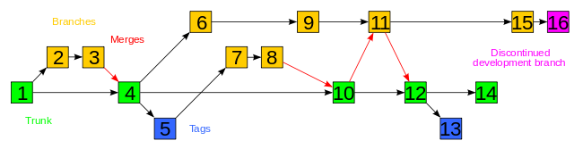
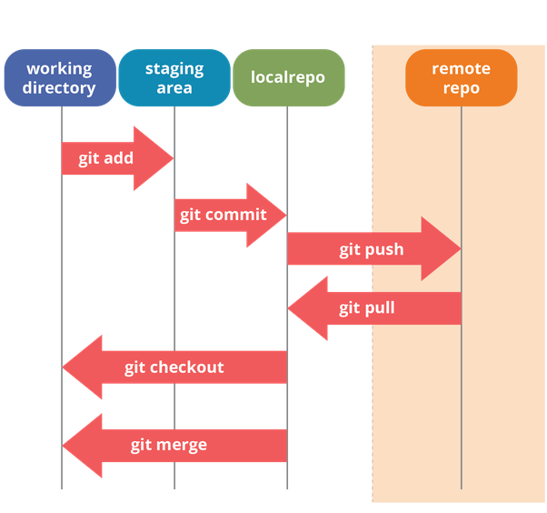
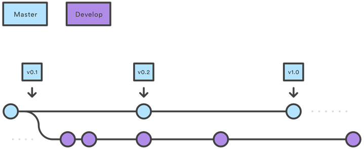
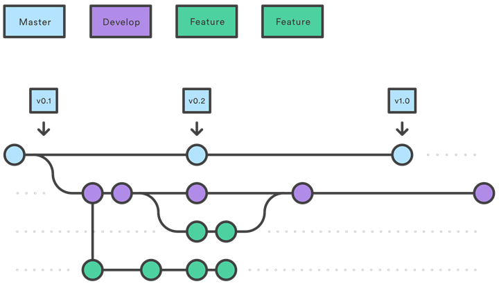
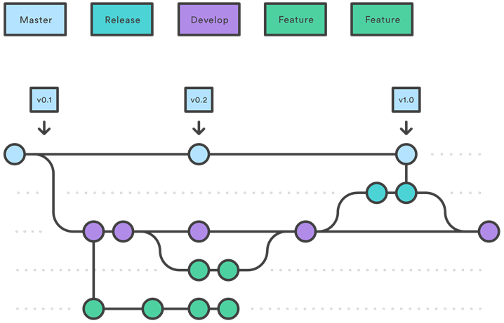
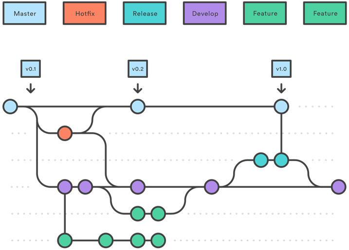
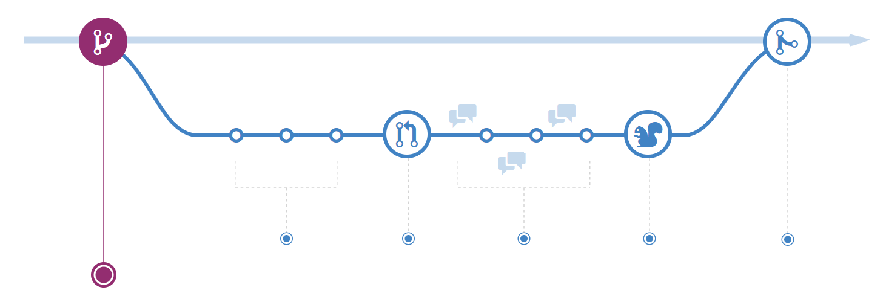
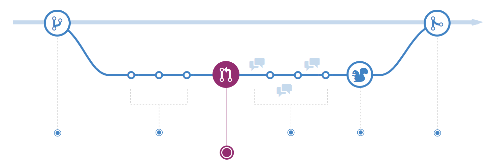

# Git 전략

Git 전략을 보기전 VCS를 먼저 알아봅시다.

## VCS

> Version Control System

- 내가 작성한 코드를 저장하는 곳
- 누가, 언제 어디서 무엇을 수정, 삭제했는지

### SVN

- 한 곳에 지정된 서버에 코드를 Commit
- 사용법, 세팅이 쉬움
- Tortoisesvn 등

### Git

- 분산 시스템(Distributed VCS)
- 개인별로 내부의 Local Repository가 존재 
- 내부에 저장된 후 Push

---

## Git 전략

> Git Branch 전략

- 어느 브랜치가 최신인지 알기 위함
- 수정 후 배포할 일이 생겼는데, 어떤 branch를 기준으로 개발, 배포를 해야 할까?

### Git Flow

> 5가지의 브랜치

- 메인 : 항상 유지
  - 메인 브랜치 (Main branch) : 제품으로 출시될 수 있음
  - 개발 브랜치(Develop branch) : 다음 출시 버전을 개발하는 브랜치
- 보조 : merge되면 사라짐
  - 피처 브랜치(Feature branch) : 기능을 개발
  - 릴리스 브랜치(Release branch) : 이번 출시 버전을 준비
  - 핫픽스 브랜치(Hotfix branch) : 출시 버전에서 발생한 버그를 수정

#### Git-Flow 개발 프로세스

1. 처음 개발할 때는 develop에서 개발하고, master에 출시
   
   - develop 브랜치는 통합 브랜치 역할
   - 데이터베이스를 prod, dev 두 가지로 나누는 경우가 많음
2. 기능 개발해야 할 게 많아지면 Develop에서 브랜치를 따서, Feature를 생성
   
   - feature 브랜치는 기능을 완성할 때까지 유지, 완성되면 develop 브랜치로 merge
   - feature 브랜치는 develop에만 머지
3. QA를 위해 develop 브랜치에서 Release 브랜치를 생성 후 테스팅
   
   - 배포를 위한 최종적인 버그 수정 등의 개발 수행
   - 배포 가능한 상태가 되면 Master로 Merge
   - Release 브랜치는 오직 bug-fix만 하고, develop, master 둘 다로 머지시켜줘야함
4. 배포를 했는데, 긴급하게 수정을 해야 할 필요가 있을 경우
   
   - master 브랜치에서 Branch를 따서 수정 후, master, develop 머지시켜줌
   - 오직 bug-fix만을 위한 브랜치, merge후 사라짐

#### 특징

- 주기적으로 배포를 하는 서비스에 적합
- 많은 IDE가 지원함

---

### Github Flow

- 제품이 릴리즈 되는 최신 버전인 master 브랜치만 존재
- 수시로 배포가 일어나며, CI/CD가 자동화된 프로젝트에 유용

#### Github-Flow 개발 프로세스

1. Master 브랜치는 언제든 배포가 가능

   

   - Master 브랜치는 항상 최신
   - Merge전 충분히 테스트(CI)

2. Master에서 브랜치를 딴다면, 이름을 명확하게
   

   - 항상 master 브랜치에서 브랜치를 땀
   - feature, develop 존재 x
   - 커밋 메시지도 명확히

3. 원격 브랜치로 수시로 Push

   - Git-Flow와 상반됨
   - 다른 사람들이 확인 가능

4. PR 을 활용
   

5. Master로 머지가 된다면 즉시 배포